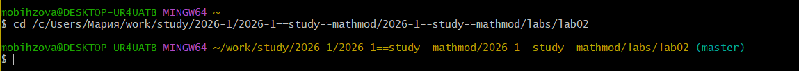
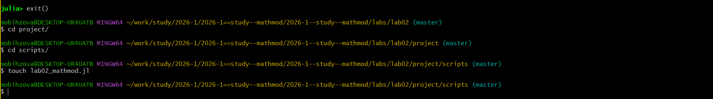
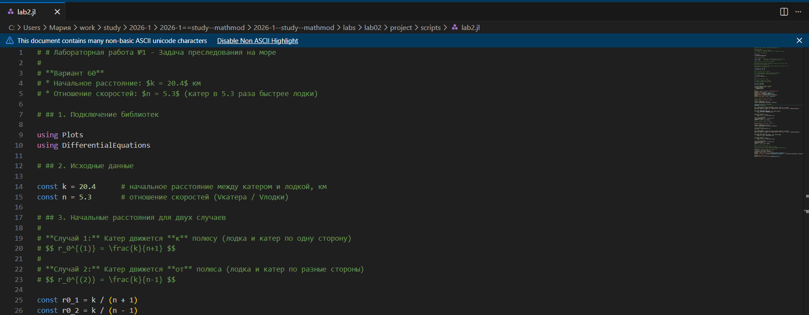
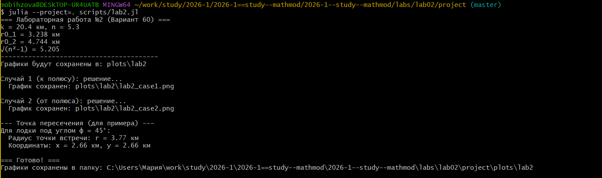
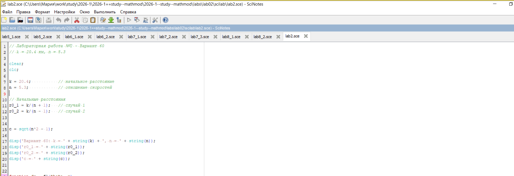

---
# Preamble

## Author
author:
  name: Бызова Мария Олеговна
## Title
title: Отчёт по лабораторной работе №2
subtitle: Математическое моделирование
license: CC BY
date: 2026-18-02

## Generic options
lang: ru-RU
crossref:
  lof-title: Список иллюстраций
  lot-title: Список таблиц
  lol-title: Листинги

## Fonts 
mainfont: PT Serif 
romanfont: PT Serif 
sansfont: PT Sans 
monofont: PT Mono 
mainfontoptions: Ligatures=TeX 
romanfontoptions: Ligatures=TeX 
sansfontoptions: Ligatures=TeX,Scale=MatchLowercase 
monofontoptions: Scale=MatchLowercase,Scale=0.9

## Formats
format:
### Pdf output format
  beamer:
    toc: true
    toc-title: Содержание
    number-sections: true
    colorlinks: false
    toc-depth: 2
    slide_level: 2
    aspectratio: 169
    section-titles: true
    theme: metropolis
    themeoptions: progressbar=frametitle,sectionpage=progressbar,numbering=fraction
    pdf-engine: xelatex
    fontenc: T2A
#### Language
    babel-lang: russian
    babel-otherlangs: english

### Html output
  revealjs:
    transition: slide
    margin: 0.2
    smaller: false
    output-ext: html
    theme: beige
    logo: _resources/image/logo_rudn.png
---

# Вводная часть

## Цель работы

Решить задачу о погоне, а также освоить навыки работы с Julia и Scilab для математического моделирования.

## Задание

1. Записать уравнение, описывающее движение катера, с начальными условиями для двух случаев (в зависимости от расположения катера относительно лодки в начальный момент времени).
2. Построить траекторию движения катера и лодки для двух случаев.
3. Найти точку пересечения траектории катера и лодки.

# Выполнение лабораторной работы

## Подготовка рабочего пространства

{#fig-001 width=70%}

## Подготовка рабочего пространства

{#fig-002 width=70%}

## Подготовка рабочего пространства

{#fig-003 width=70%}

## Подготовка рабочего пространства

{#fig-004 width=70%}

## Математическая постановка задачи для варианта 60

{#fig-005 width=70%}

## Моделирование на Julia и получение графиков

{#fig-006 width=70%}

## Случай 1: Катер движется к полюсу

{#fig-007 width=40%}

## Случай 2: Катер движется от полюса

{#fig-008 width=40%}

## Генерация отчетных материалов

{#fig-009 width=70%}

## Генерация отчетных материалов

{#fig-010 width=70%}

## Генерация отчетных материалов

{#fig-011 width=40%}

## Генерация отчетных материалов

{#fig-012 width=40%}

# Выводы

## Выводы

В ходе выполнения лабораторной работы была решена задача о погоне для варианта 60 с параметрами $k = 20.4$ и $n = 5.3$. Были построены траектории движения катера и лодки для двух сценариев начального движения катера (к полюсу и от полюса). Моделирование успешно выполнено в двух средах: Julia и Scilab, что позволило не только получить решение, но и визуально сравнить и подтвердить результаты. Также были освоены инструменты управления проектом (`DrWatson`) и литературного программирования (`Literate.jl`) в Julia.

# Список литературы

## Список литературы

1. Документация по Julia: https://docs.julialang.org/en/v1/
2. Документация по Scilab: https://www.scilab.org/
3. Королькова, А. В. Математическое моделирование. Практикум / А. В. Королькова, Д. С. Кулябов. — Москва, 2023.

