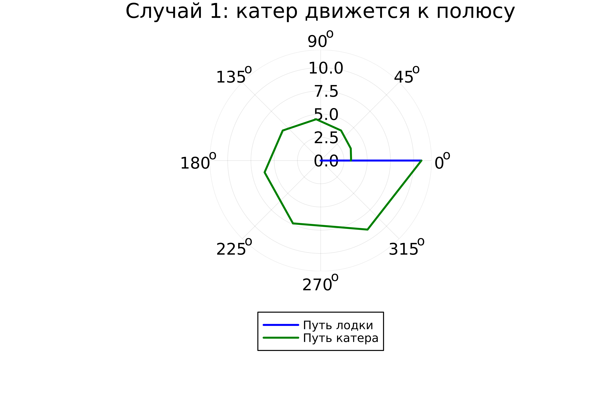
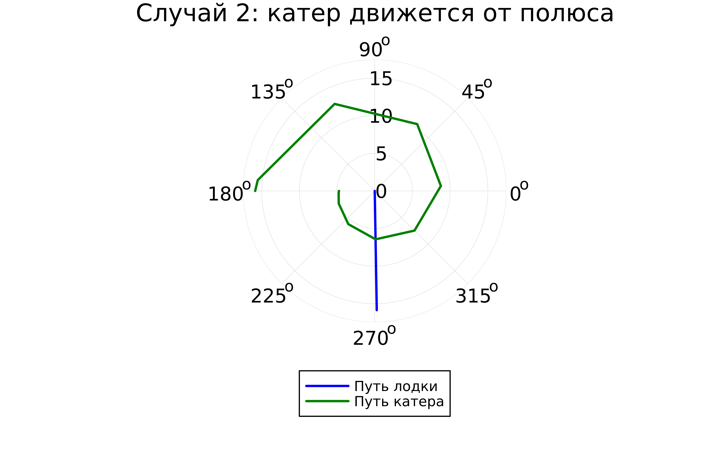
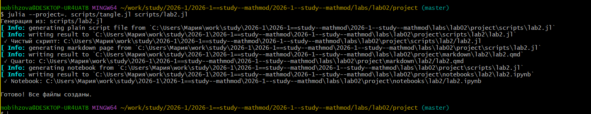
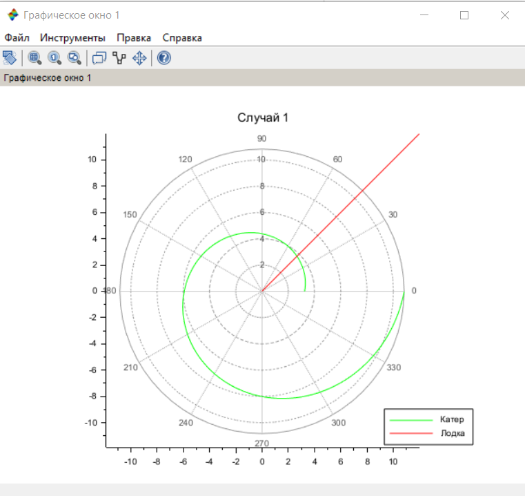
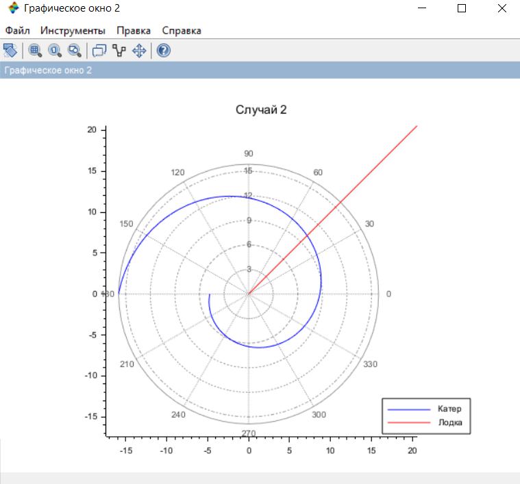

---
## Author
author: Бызова Мария Олеговна, НПИбд-01-23
## Title
title: "Отчёт по лабораторной работе №2"
subtitle: "Математическое моделирование"
license: "CC BY"
---

# Цель работы

Решить задачу о погоне, а также освоить навыки работы с Julia и Scilab для математического моделирования.

# Задание

1. Записать уравнение, описывающее движение катера, с начальными условиями для двух случаев (в зависимости от расположения катера относительно лодки в начальный момент времени).
2. Построить траекторию движения катера и лодки для двух случаев.
3. Найти точку пересечения траектории катера и лодки.

# Выполнение лабораторной работы

В ходе выполнения лабораторной работы мною был выполнен ряд последовательных шагов по созданию проекта, математическому моделированию и визуализации результатов для варианта 60.

## Подготовка рабочего пространства

Перед началом моделирования была подготовлена структура проекта. Сначала я перешла в директорию с лабораторными работами и создала проект, используя пакет `DrWatson` в Julia, указав свои данные ([рис. @fig-001] - [рис. @fig-003])

{#fig-001 width=70%}

{#fig-002 width=70%}

{#fig-003 width=70%}

После создания проекта я перешла в каталог `project` и создала внутри папки `scripts` файл `lab02_mathmod.jl` для будущего кода на Julia ([рис. @fig-004]).

{#fig-004 width=70%}

## Математическая постановка задачи для варианта 60

1.  На море в тумане катер береговой охраны преследует лодку браконьеров. Через определенный промежуток времени туман рассеивается, и лодка обнаруживается на расстоянии **k = 20,4 км** от катера. Затем лодка снова скрывается в тумане и уходит прямолинейно в неизвестном направлении. Известно, что скорость катера в **n = 5,3** раза больше скорости браконьерской лодки.

2.  Примем за момент отсчета времени момент первого рассеивания тумана. Введем полярные координаты с центром в точке нахождения лодки и полярной осью, проходящей через катер береговой охраны. Тогда начальные координаты катера: ($k$, 0) = (20,4; 0). Обозначим скорость лодки за $v$.

3.  Траектория катера должна быть такой, чтобы и катер, и лодка все время были на одном расстоянии от полюса. Только в этом случае траектория катера пересечется с траекторией лодки. Поэтому для начала катер береговой охраны должен двигаться некоторое время прямолинейно, пока не окажется на том же расстоянии $r_0$ от полюса, что и лодка браконьеров. После этого катер береговой охраны должен двигаться вокруг полюса, удаляясь от него с той же скоростью, что и лодка браконьеров.

4.  Пусть $t$ — время, через которое катер и лодка окажутся на одном расстоянии $x$ от начальной точки (полюса). За это время лодка пройдет расстояние $x$. Катеру, в зависимости от того, с какой стороны от полюса он находится, нужно пройти расстояние $k-x$ (движение к полюсу) или $k+x$ (движение от полюса). Так как время движения одинаково, составим уравнения:

    $$ t = \frac{x}{v} $$
    $$ t = \frac{k-x}{n v} = \frac{20,4 - x}{5,3 v} $$
    $$ t = \frac{x + k}{n v} = \frac{20,4 + x}{5,3 v} $$

    Из этих уравнений получаем систему для двух случаев:

    $$ \left[ \begin{array}{cl}
    \frac{x}{v} = \frac{20,4 - x}{5,3 v} \\
    \frac{x}{v} = \frac{20,4 + x}{5,3 v}
    \end{array} \right. $$

    Решая каждое из уравнений, находим два значения для $x$, которые и будут начальными расстояниями $r_0$ для двух сценариев:

    *   **Случай 1 (движение к полюсу):** $x = r_{0_1} = \frac{k}{n+1} = \frac{20,4}{5,3 + 1} = \frac{20,4}{6,3} \approx 3,238 \text{ км}$.
    *   **Случай 2 (движение от полюса):** $x = r_{0_2} = \frac{k}{n-1} = \frac{20,4}{5,3 - 1} = \frac{20,4}{4,3} \approx 4,744 \text{ км}$.

5.  После того, как катер окажется на одном расстоянии с лодкой, он должен двигаться вокруг полюса, удаляясь от него с радиальной скоростью, равной скорости лодки $v$.
    Разложим скорость катера ($n \cdot v = 5,3v$) на две составляющие (см. рис. 5.2 в методичке):
    *   $v_r$ — радиальная скорость (скорость удаления от полюса). По условию $v_r = \frac{dr}{dt} = v$.
    *   $v_\tau$ — тангенциальная скорость (линейная скорость вращения). Она связана с угловой скоростью $\frac{d\theta}{dt}$ соотношением $v_\tau = r \frac{d\theta}{dt}$.

    Из геометрии (рис. 5.2) видно, что эти скорости связаны с полной скоростью катера теоремой Пифагора:
    $$ (n v)^2 = v_r^2 + v_\tau^2 $$
    Подставляя $v_r = v$ и $n = 5,3$, находим тангенциальную скорость:
    $$ v_\tau = \sqrt{(5,3v)^2 - v^2} = \sqrt{(5,3^2 - 1) v^2} = v \sqrt{5,3^2 - 1} $$
    $$ \sqrt{5,3^2 - 1} = \sqrt{28,09 - 1} = \sqrt{27,09} $$
    Вычислим значение с точностью: $27,09 = 2709/100$, однако для красоты можно оставить как $\sqrt{27.09}$. В некоторых вариантах это значение упрощается, здесь же оставим его для подстановки.

6.  Таким образом, мы получаем систему дифференциальных уравнений, описывающих движение катера на втором этапе:

    $$ \left\{ \begin{array}{cl}
    \frac{dr}{dt} = v \\
    r\frac{d\theta}{dt} = v \sqrt{n^2 - 1} = v \sqrt{27,09}
    \end{array} \right. $$

    С начальными условиями для двух случаев:
    *   **Случай 1 (катер движется к полюсу):** 
        $$ \left\{ \begin{array}{cl}
        \theta_0 = 0 \\
        r_0 = r_{0_1} \approx 3,238
        \end{array} \right. $$
    *   **Случай 2 (катер движется от полюса):** 
        $$ \left\{ \begin{array}{cl}
        \theta_0 = -\pi \\
        r_0 = r_{0_2} \approx 4,744
        \end{array} \right. $$

7.  Чтобы получить уравнение траектории катера в полярных координатах (зависимость $r$ от $\theta$), исключим из системы время $dt$. Для этого разделим второе уравнение на первое:
    $$ \frac{r \frac{d\theta}{dt}}{\frac{dr}{dt}} = \frac{v \sqrt{n^2 - 1}}{v} $$
    $$ r \frac{d\theta}{dr} = \sqrt{n^2 - 1} $$
    Отсюда получаем искомое дифференциальное уравнение траектории:
    $$ \frac{dr}{d\theta} = \frac{r}{\sqrt{n^2 - 1}} $$
    Или, подставляя числовое значение для $\sqrt{n^2 - 1} = \sqrt{27,09} \approx 5,205$:
    $$ \frac{dr}{d\theta} = \frac{r}{\sqrt{27,09}} \approx \frac{r}{5,205} $$
    Решением этого уравнения является логарифмическая спираль.
Исходные данные и рассчитанные значения были зафиксированы в тексте программы на Julia ([рис. @fig-005]).

{#fig-005 width=70%}

## Моделирование на Julia и получение графиков

После запуска скрипта `lab2.jl` в Julia были получены численные решения и построены графики траекторий. В консоль вывелись рассчитанные значения начальных радиусов для двух случаев и другая служебная информация ([рис. @fig-006]).

{#fig-006 width=70%}

По полученным данным были построены траектории для двух случаев.

## Случай 1: Катер движется к полюсу

На этом графике ([рис. @fig-007]) показаны траектории: синяя линия — путь лодки (прямая), зеленая линия — путь катера (спираль). В точке, где они пересекаются, происходит встреча.

{#fig-007 width=70%}

## Случай 2: Катер движется от полюса

На втором графике ([рис. @fig-008]) показаны траектории для случая, когда катер начинает движение в противоположную от полюса сторону.

{#fig-008 width=70%}

## Генерация отчетных материалов

Для подготовки отчета я использовала инструмент `tangle.jl`, который позволяет конвертировать скрипты с литературным программированием в чистый код, Markdown и Jupyter Notebook. Процесс генерации файлов из моего скрипта `lab2.jl` показан на [рис. @fig-009]

{#fig-009 width=70%}

Также, для верификации результатов и сравнения, была выполнена реализация модели в среде Scilab. ([рис. @fig-010]).

{#fig-010 width=70%}

В результате работы скрипта в Scilab были построены аналогичные графики траекторий для двух случаев ([рис. @fig-011] - [рис. @fig-012]), что подтверждает корректность моделирования.

{#fig-011 width=70%}

{#fig-012 width=70%}

```{scilab}
// Лабораторная работа №2 - Вариант 60
// k = 20.4 км, n = 5.3

clear;
clc;

k = 20.4;           // начальное расстояние
n = 5.3;            // отношение скоростей

// Начальные расстояния
r0_1 = k/(n + 1);   // случай 1
r0_2 = k/(n - 1);   // случай 2


c = sqrt(n^2 - 1);

disp('Вариант 60: k = ' + string(k) + ', n = ' + string(n));
disp('r0_1 = ' + string(r0_1));
disp('r0_2 = ' + string(r0_2));
disp('c = ' + string(c));


function dr = f1(theta, r)
    dr = r/c;
endfunction

r0 = r0_1;
theta0 = 0;
theta = 0:0.01:2*%pi;
r = ode(r0, theta0, theta, f1);

// Лодка под углом 45°
function xt = boat(t)
    xt = tan(%pi/4)*t;
endfunction

t = 0:1:100;

scf(1);
clf();
polarplot(theta, r, style=color('green'));
plot2d(t, boat(t), style=color('red'));
xtitle('Случай 1');
legend(['Катер'; 'Лодка'], 4);

function dr = f2(theta, r)
    dr = r/c;
endfunction

r0 = r0_2;
theta0 = -%pi;
theta = -%pi:0.01:%pi;
r = ode(r0, theta0, theta, f2);

scf(2);
clf();
polarplot(theta, r, style=color('blue'));
plot2d(t, boat(t), style=color('red'));
xtitle('Случай 2');
legend(['Катер'; 'Лодка'], 4);
```



# Выводы

В ходе выполнения лабораторной работы была решена задача о погоне для варианта 60 с параметрами $k = 20.4$ и $n = 5.3$. Были построены траектории движения катера и лодки для двух сценариев начального движения катера (к полюсу и от полюса). Моделирование успешно выполнено в двух средах: Julia и Scilab, что позволило не только получить решение, но и визуально сравнить и подтвердить результаты. Также были освоены инструменты управления проектом (`DrWatson`) и литературного программирования (`Literate.jl`) в Julia.

# Список литературы

1. Документация по Julia: https://docs.julialang.org/en/v1/
2. Документация по Scilab: https://www.scilab.org/
3. Королькова, А. В. Математическое моделирование. Практикум / А. В. Королькова, Д. С. Кулябов. — Москва, 2023.
