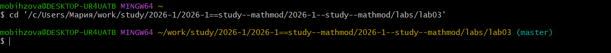
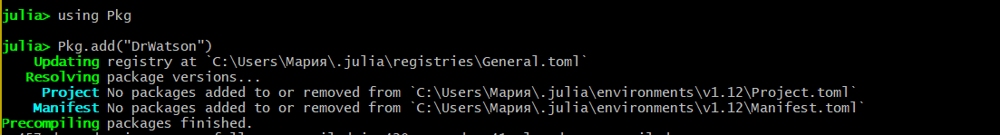
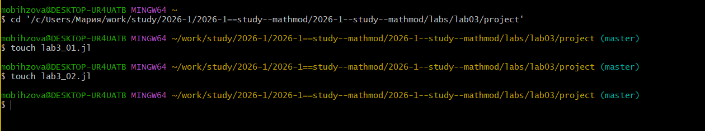
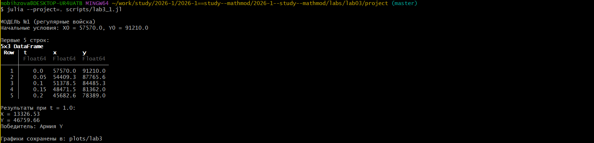
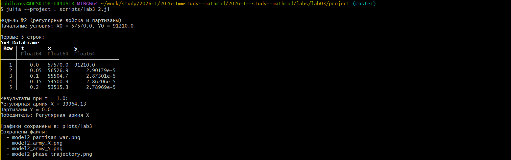
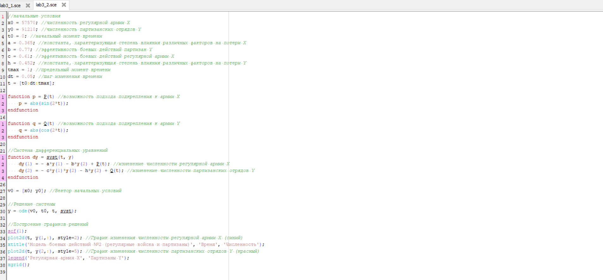
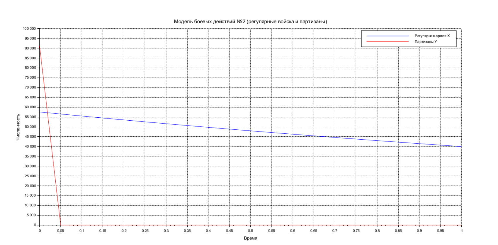

---
# Preamble

## Author
author:
  name: Бызова Мария Олеговна
## Title
title: Отчёт по лабораторной работе №3
subtitle: Математическое моделирование
license: CC BY
date: 2026-18-02

## Generic options
lang: ru-RU
crossref:
  lof-title: Список иллюстраций
  lot-title: Список таблиц
  lol-title: Листинги

## Fonts 
mainfont: PT Serif 
romanfont: PT Serif 
sansfont: PT Sans 
monofont: PT Mono 
mainfontoptions: Ligatures=TeX 
romanfontoptions: Ligatures=TeX 
sansfontoptions: Ligatures=TeX,Scale=MatchLowercase 
monofontoptions: Scale=MatchLowercase,Scale=0.9

## Formats
format:
### Pdf output format
  beamer:
    toc: true
    toc-title: Содержание
    number-sections: true
    colorlinks: false
    toc-depth: 2
    slide_level: 2
    aspectratio: 169
    section-titles: true
    theme: metropolis
    themeoptions: progressbar=frametitle,sectionpage=progressbar,numbering=fraction
    pdf-engine: xelatex
    fontenc: T2A
#### Language
    babel-lang: russian
    babel-otherlangs: english

### Html output
  revealjs:
    transition: slide
    margin: 0.2
    smaller: false
    output-ext: html
    theme: beige
    logo: _resources/image/logo_rudn.png
---

# Вводная часть

## Цель работы

Построить модели боевых действий (модели Ланчестера) для двух случаев: бой между регулярными войсками и бой с участием партизанских отрядов, а также освоить навыки работы с Julia и Scilab для математического моделирования.

# Задание

1.  Записать уравнения, описывающие изменение численности армий для двух случаев:
    *   Модель боевых действий между регулярными войсками (модель №1).
    *   Модель ведения боевых действий с участием регулярных войск и партизанских отрядов (модель №2).
2.  Построить графики изменения численности армии \( x(t) \) и \( y(t) \) для обоих случаев.
3.  Определить победителя для каждого случая.

# Выполнение лабораторной работы

## Подготовка рабочего пространства

{#fig-001 width=70%}

## Подготовка рабочего пространства

{#fig-002 width=70%}

## Подготовка рабочего пространства

{#fig-003 width=70%}

## Подготовка рабочего пространства

{#fig-004 width=70%}

## Математическая постановка задачи для варианта 60

{#fig-005 width=70%}

## Моделирование на Julia и получение графиков

{#fig-006 width=70%}

## Моделирование на Julia и получение графиков

{#fig-007 width=70%}

## Генерация отчетных материалов

{#fig-009 width=70%}

## Генерация отчетных материалов

{#fig-010 width=70%}

## Реализация в Scilab 

{#fig-011 width=70%}

## Реализация в Scilab 

{#fig-012 width=70%}

## Реализация в Scilab 

{#fig-013 width=30%}

## Реализация в Scilab 

{#fig-014 width=70%}

# Выводы

## Выводы

В ходе выполнения лабораторной работы была решена задача моделирования боевых действий для варианта 60. Были построены две модели Ланчестера:'

1.  **Модель боя между регулярными войсками:** В результате моделирования победа была присуждена армии Y.
2.  **Модель боя регулярной армии против партизан:** В этом сценарии победу одержала регулярная армия X.

Моделирование успешно выполнено в двух средах: Julia и Scilab, что позволило не только получить решение, но и визуально сравнить и подтвердить результаты. Также были освоены инструменты управления проектом (`DrWatson`) и литературного программирования (`Literate.jl`) в Julia.

# Список литературы

## Список литературы

1.  Документация по Julia: https://docs.julialang.org/en/v1/
2.  Документация по Scilab: https://www.scilab.org/
3.  Королькова, А. В. Математическое моделирование. Практикум / А. В. Королькова, Д. С. Кулябов. — Москва, 2023.
