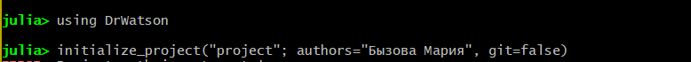
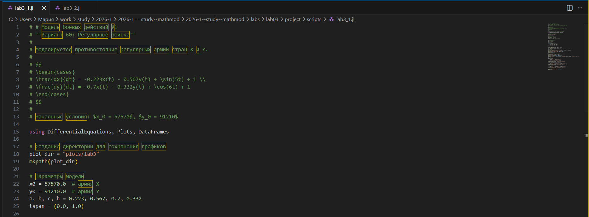
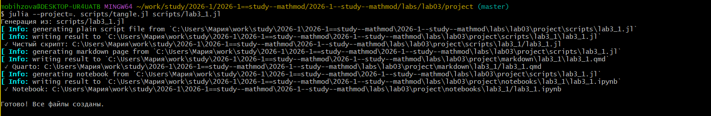
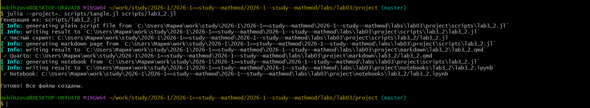
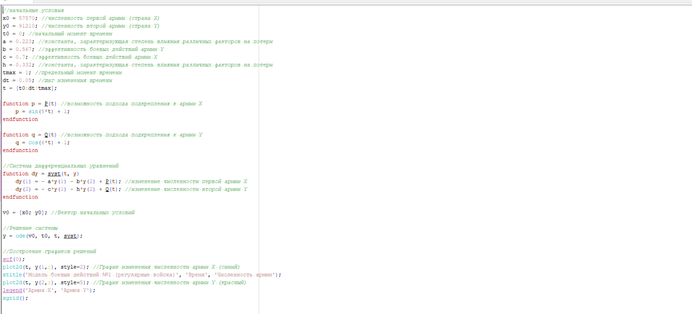
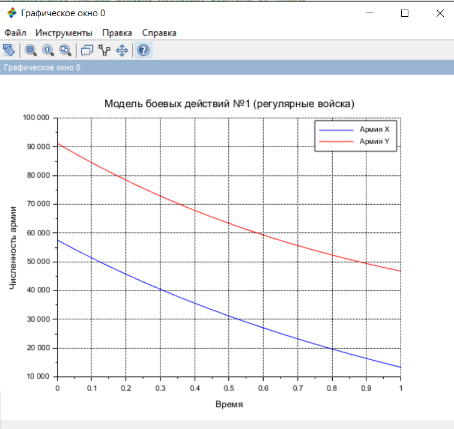

---
## Author
author: Бызова Мария Олеговна, НПИбд-01-23
## Title
title: "Отчёт по лабораторной работе №3"
subtitle: "Математическое моделирование"
license: "CC BY"
---

# Цель работы

Построить модели боевых действий (модели Ланчестера) для двух случаев: бой между регулярными войсками и бой с участием партизанских отрядов, а также освоить навыки работы с Julia и Scilab для математического моделирования.

# Задание

1.  Записать уравнения, описывающие изменение численности армий для двух случаев:
    *   Модель боевых действий между регулярными войсками (модель №1).
    *   Модель ведения боевых действий с участием регулярных войск и партизанских отрядов (модель №2).
2.  Построить графики изменения численности армии \( x(t) \) и \( y(t) \) для обоих случаев.
3.  Определить победителя для каждого случая.

# Выполнение лабораторной работы

В ходе выполнения лабораторной работы мною был выполнен ряд последовательных шагов по созданию проекта, математическому моделированию и визуализации результатов для варианта 60.

## Подготовка рабочего пространства

Перед началом моделирования была подготовлена структура проекта. Сначала я перешла в директорию с лабораторными работами и создала проект, используя пакет `DrWatson` в Julia, указав свои данные ([рис. @fig-001] - [рис. @fig-003]).

{#fig-001 width=70%}

{#fig-002 width=70%}

{#fig-003 width=70%}

После создания проекта я перешла в каталог `project` и создала внутри папки `scripts` файлы `lab3_1.jl` и `lab3_2.jl` для будущих кодов на Julia ([рис. @fig-004]).

{#fig-004 width=70%}

## Математическая постановка задачи для варианта 60

В моем варианте (60) заданы следующие параметры и начальные условия для двух моделей боевых действий.

**Модель номер 1 (Бой между регулярными войсками):**

Начальная численность армии X составляет 57 570 человек.
Начальная численность армии Y составляет 91 210 человек.
Коэффициенты: a = 0,223; b = 0,567; c = 0,7; h = 0,332.
Функции, описывающие подход подкрепления:
Для армии X: P(t) = sin(5t) + 1
Для армии Y: Q(t) = cos(6t) + 1

Система дифференциальных уравнений для модели номер 1 имеет вид:
dx/dt = -0,223 * x(t) - 0,567 * y(t) + sin(5t) + 1
dy/dt = -0,7 * x(t) - 0,332 * y(t) + cos(6t) + 1

**Модель номер 2 (Бой регулярной армии против партизан):**

Начальная численность регулярной армии X составляет 57 570 человек.
Начальная численность партизан Y составляет 91 210 человек.
Коэффициенты: a = 0,365; b = 0,77; c = 0,61; h = 0,452.
Функции, описывающие подход подкрепления:
Для регулярной армии X: P(t) = |sin(2t)|
Для партизан Y: Q(t) = |cos(2t)|

Система дифференциальных уравнений для модели номер 2 имеет вид:
dx/dt = -0,365 * x(t) - 0,77 * y(t) + |sin(2t)|
dy/dt = -0,61 * x(t) * y(t) - 0,452 * y(t) + |cos(2t)|

Исходные данные и рассчитанные значения были зафиксированы в тексте программ на Julia ([рис. @fig-005])

{#fig-005 width=70%}

## Моделирование на Julia и получение графиков

После запуска скриптов `lab3_1.jl` и `lab3_2.jl` в Julia были получены численные решения и построены графики траекторий. В консоль вывелись результаты расчетов и другая служебная информация.

### Модель №1 (Регулярные армии)

При выполнении скрипта для первой модели в консоль были выведены начальные условия и первые пять строк с результатами вычислений, а также итоговая численность армий в момент времени \( t = 1.0 \). По этим данным был определен победитель ([рис. @fig-006]).

{#fig-006 width=70%}

На основе полученного решения был построен график, показывающий изменение численности обеих армий во времени. Синим цветом показана динамика армии X, красным — армии Y. Как видно из графика и расчетов, к концу рассматриваемого периода численность армии Y превосходит численность армии X, что позволяет сделать вывод о победе армии Y.

### Модель №2 (Регулярная армия против партизан)

Аналогично, при выполнении скрипта для второй модели в консоль была выведена информация о начальных условиях и итогах моделирования ([рис. @fig-007]).

{#fig-007 width=70%}

По результатам вычислений были построены графики для второго случая. На графике отображено изменение численности регулярной армии X и партизанского отряда Y. Анализ результатов показывает, что численность партизанского отряда Y стремится к нулю, в то время как регулярная армия X сохраняет боеспособность. Таким образом, в данном сценарии победа остается за регулярной армией X.

## Генерация отчетных материалов

Для подготовки отчета я использовала инструмент `tangle.jl`, который позволяет конвертировать скрипты с литературным программированием в чистый код, Markdown и Jupyter Notebook. Процесс генерации файлов из моих скриптов `lab3_1.jl` и `lab3_2.jl` показан на [рис. @fig-009] и [рис. @fig-010].

{#fig-009 width=70%}

{#fig-010 width=70%}

## Реализация в Scilab

Также, для верификации результатов и сравнения, была выполнена реализация модели в среде Scilab. Начальные данные и код для первой модели представлены на [рис. @fig-011], для второй — на [рис. @fig-012].

{#fig-011 width=70%}

{#fig-012 width=70%}

В результате работы скриптов в Scilab были построены графики траекторий для двух случаев ([рис. @fig-013] - [рис. @fig-014]), что полностью подтверждает корректность моделирования, выполненного в Julia.

{#fig-013 width=70%}

{#fig-014 width=70%}

### Скрипт к модели №1

```{scilab}
//начальные условия
x0 = 57570; //численность первой армии (страна X)
y0 = 91210; //численность второй армии (страна Y)
t0 = 0; //начальный момент времени
a = 0.223; //константа, характеризующая степень влияния различных факторов на потери
b = 0.567; //эффективность боевых действий армии Y
c = 0.7; //эффективность боевых действий армии X
h = 0.332; //константа, характеризующая степень влияния различных факторов на потери
tmax = 1; //предельный момент времени
dt = 0.05; //шаг изменения времени
t = [t0:dt:tmax];

function p = P(t) //возможность подхода подкрепления к армии X
    p = sin(5*t) + 1;
endfunction

function q = Q(t) //возможность подхода подкрепления к армии Y
    q = cos(6*t) + 1;
endfunction

//Система дифференциальных уравнений
function dy = syst(t, y)
    dy(1) = - a*y(1) - b*y(2) + P(t); //изменение численности первой армии X
    dy(2) = - c*y(1) - h*y(2) + Q(t); //изменение численности второй армии Y
endfunction

v0 = [x0; y0]; //Вектор начальных условий

//Решение системы
y = ode(v0, t0, t, syst);

//Построение графиков решений
scf(0);
plot2d(t, y(1,:), style=2); //График изменения численности армии X (синий)
xtitle('Модель боевых действий №1 (регулярные войска)', 'Время', 'Численность армии');
plot2d(t, y(2,:), style=5); //График изменения численности армии Y (красный)
legend('Армия X', 'Армия Y');
xgrid();
```
### Скрипт к модели №2

```{scilab}
//начальные условия
x0 = 57570; //численность регулярной армии X
y0 = 91210; //численность партизанских отрядов Y
t0 = 0; //начальный момент времени
a = 0.365; //константа, характеризующая степень влияния различных факторов на потери X
b = 0.77; //эффективность боевых действий партизан Y
c = 0.61; //эффективность боевых действий регулярной армии X
h = 0.452; //константа, характеризующая степень влияния различных факторов на потери Y
tmax = 1; //предельный момент времени
dt = 0.05; //шаг изменения времени
t = [t0:dt:tmax];

function p = P(t) //возможность подхода подкрепления к армии X
    p = abs(sin(2*t));
endfunction

function q = Q(t) //возможность подхода подкрепления к армии Y
    q = abs(cos(2*t));
endfunction

//Система дифференциальных уравнений
function dy = syst(t, y)
    dy(1) = - a*y(1) - b*y(2) + P(t); //изменение численности регулярной армии X
    dy(2) = - c*y(1)*y(2) - h*y(2) + Q(t); //изменение численности партизанских отрядов Y
endfunction

v0 = [x0; y0]; //Вектор начальных условий

//Решение системы
y = ode(v0, t0, t, syst);

//Построение графиков решений
scf(1);
plot2d(t, y(1,:), style=2); //График изменения численности регулярной армии X (синий)
xtitle('Модель боевых действий №2 (регулярные войска и партизаны)', 'Время', 'Численность');
plot2d(t, y(2,:), style=5); //График изменения численности партизанских отрядов Y (красный)
legend('Регулярная армия X', 'Партизаны Y');
xgrid();
```





# Выводы

В ходе выполнения лабораторной работы была решена задача моделирования боевых действий для варианта 60. Были построены две модели Ланчестера:'

1.  **Модель боя между регулярными войсками:** В результате моделирования победа была присуждена армии Y.
2.  **Модель боя регулярной армии против партизан:** В этом сценарии победу одержала регулярная армия X.

Моделирование успешно выполнено в двух средах: Julia и Scilab, что позволило не только получить решение, но и визуально сравнить и подтвердить результаты. Также были освоены инструменты управления проектом (`DrWatson`) и литературного программирования (`Literate.jl`) в Julia.

# Список литературы

1.  Документация по Julia: https://docs.julialang.org/en/v1/
2.  Документация по Scilab: https://www.scilab.org/
3.  Королькова, А. В. Математическое моделирование. Практикум / А. В. Королькова, Д. С. Кулябов. — Москва, 2023.
