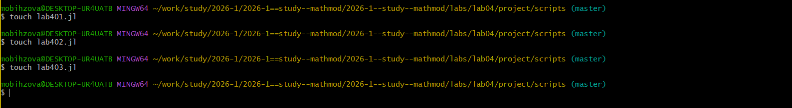
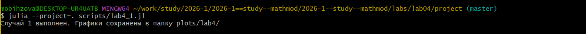
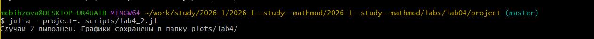
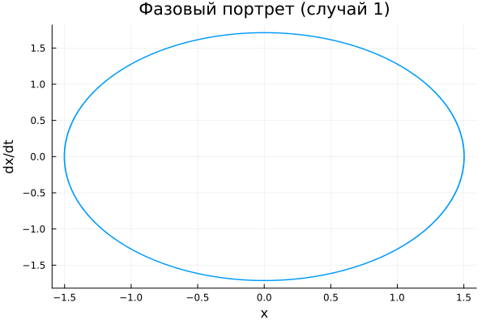
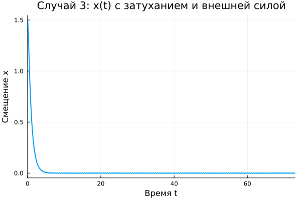
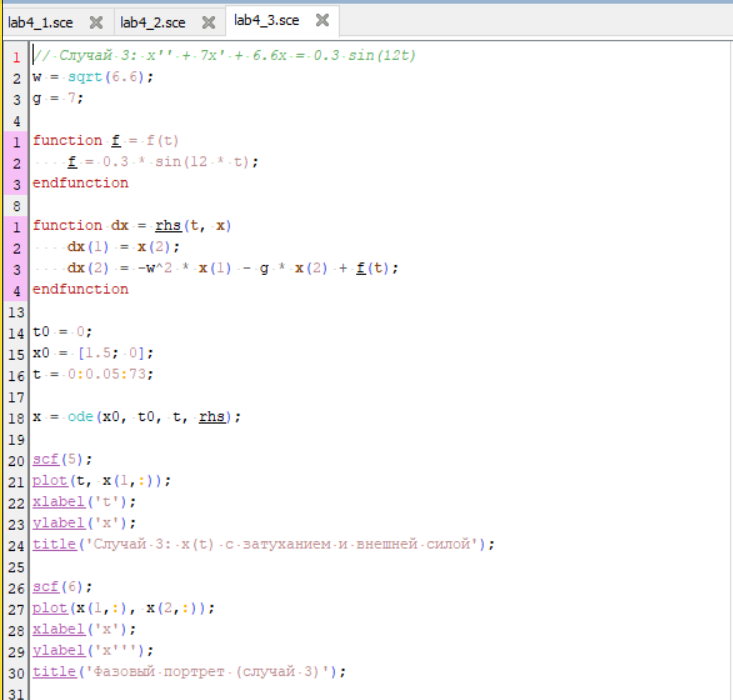
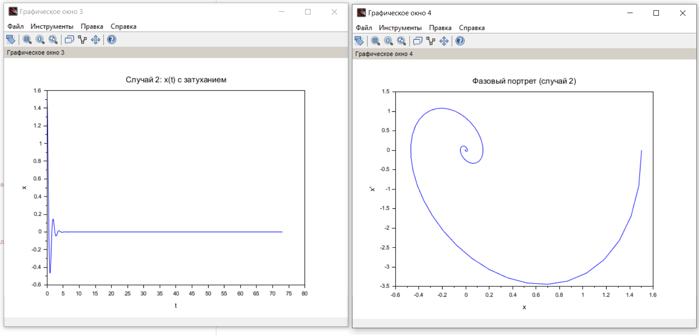

---
# Preamble

## Author
author:
  name: Бызова Мария Олеговна
## Title
title: Отчёт по лабораторной работе №4
subtitle: Математическое моделирование
license: CC BY
date: 2026-01-04

## Generic options
lang: ru-RU
crossref:
  lof-title: Список иллюстраций
  lot-title: Список таблиц
  lol-title: Листинги

## Fonts 
mainfont: PT Serif 
romanfont: PT Serif 
sansfont: PT Sans 
monofont: PT Mono 
mainfontoptions: Ligatures=TeX 
romanfontoptions: Ligatures=TeX 
sansfontoptions: Ligatures=TeX,Scale=MatchLowercase 
monofontoptions: Scale=MatchLowercase,Scale=0.9

## Formats
format:
### Pdf output format
  beamer:
    toc: true
    toc-title: Содержание
    number-sections: true
    colorlinks: false
    toc-depth: 2
    slide_level: 2
    aspectratio: 169
    section-titles: true
    theme: metropolis
    themeoptions: progressbar=frametitle,sectionpage=progressbar,numbering=fraction
    pdf-engine: xelatex
    fontenc: T2A
#### Language
    babel-lang: russian
    babel-otherlangs: english

### Html output
  revealjs:
    transition: slide
    margin: 0.2
    smaller: false
    output-ext: html
    theme: beige
    logo: _resources/image/logo_rudn.png
---

# Цель работы

## Цель работы

Построить решение уравнения гармонического осциллятора и его фазовые портреты для трех случаев: без затухания, с затуханием, и с затуханием под действием внешней силы, а также освоить навыки работы с Julia и Scilab для математического моделирования.

# Задание

## Задание

1.  Построить решение уравнения гармонического осциллятора без затухания.
2.  Записать уравнение свободных колебаний гармонического осциллятора с затуханием, построить его решение и фазовый портрет.
3.  Записать уравнение колебаний гармонического осциллятора с затуханием под действием внешней силы, построить его решение и фазовый портрет.

# Выполнение лабораторной работы

## Подготовка рабочего пространства

{#fig-001 width=70%}

## Подготовка рабочего пространства

{#fig-002 width=70%}

## Подготовка рабочего пространства

{#fig-003 width=70%}

## Подготовка рабочего пространства

{#fig-004 width=70%}

## Моделирование на Julia и получение графиков

{#fig-008 width=70%}

## Моделирование на Julia и получение графиков

{#fig-009 width=70%}

## Моделирование на Julia и получение графиков

{#fig-010 width=70%}

## Моделирование на Julia и получение графиков

{#fig-011 width=40%}

## Моделирование на Julia и получение графиков

{#fig-012 width=40%}

## Моделирование на Julia и получение графиков

{#fig-013 width=40%}

## Моделирование на Julia и получение графиков

{#fig-014 width=40%}

## Моделирование на Julia и получение графиков

{#fig-015 width=40%}

## Моделирование на Julia и получение графиков

{#fig-016 width=40%}

## Генерация отчетных материалов

{#fig-017 width=70%}

## Реализация в Scilab

{#fig-018 width=70%}

## Реализация в Scilab

{#fig-019 width=70%}

## Реализация в Scilab

{#fig-020 width=40%}

## Реализация в Scilab

{#fig-021 width=70%}

## Реализация в Scilab

{#fig-022 width=70%}

## Реализация в Scilab

{#fig-023 width=70%}

# Выводы

## Выводы

В ходе выполнения лабораторной работы была решена задача моделирования гармонического осциллятора для варианта 60. Были построены решения и фазовые портреты для трех случаев:

1.  **Случай 1 (без затухания):** Наблюдаются незатухающие гармонические колебания с постоянной амплитудой. Фазовый портрет — замкнутая кривая.
2.  **Случай 2 (с затуханием):** Колебания затухают со временем. Фазовый портрет — спираль, стягивающаяся в точку равновесия.
3.  **Случай 3 (с затуханием и внешней силой):** Колебания сначала носят переходный характер, а затем переходят в установившийся режим с частотой внешней силы. Фазовый портрет выходит на предельный цикл.

Моделирование успешно выполнено в двух средах: Julia и Scilab, что позволило не только получить решение, но и визуально сравнить и подтвердить результаты. 

# Список литературы

## Список литературы

1.  Документация по Julia: https://docs.julialang.org/en/v1/
2.  Документация по Scilab: https://www.scilab.org/
3.  Королькова, А. В. Математическое моделирование. Практикум / А. В. Королькова, Д. С. Кулябов. — Москва, 2023.
