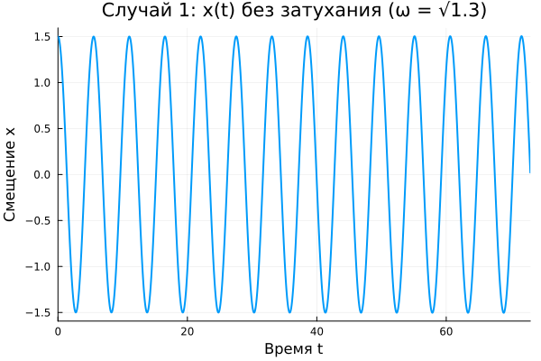
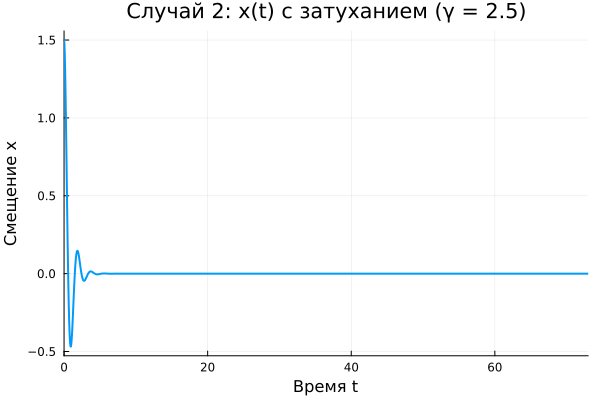
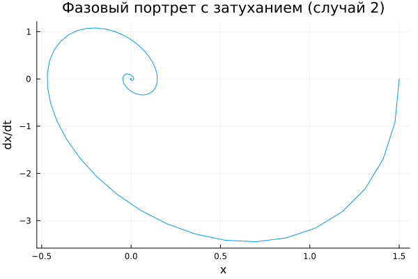
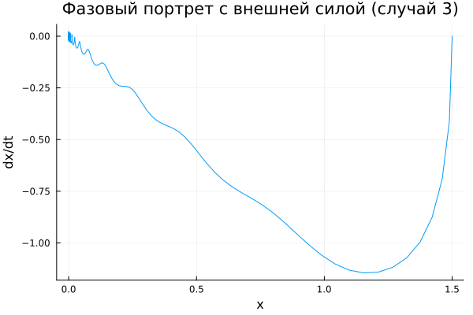
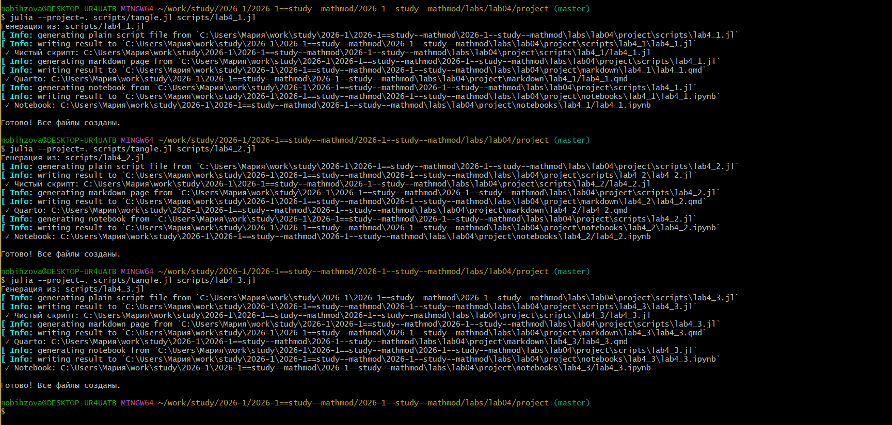
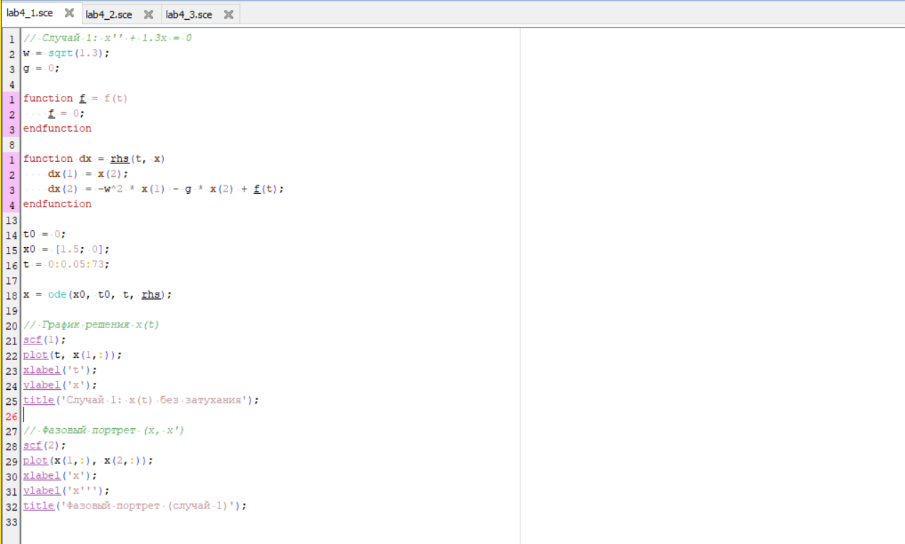
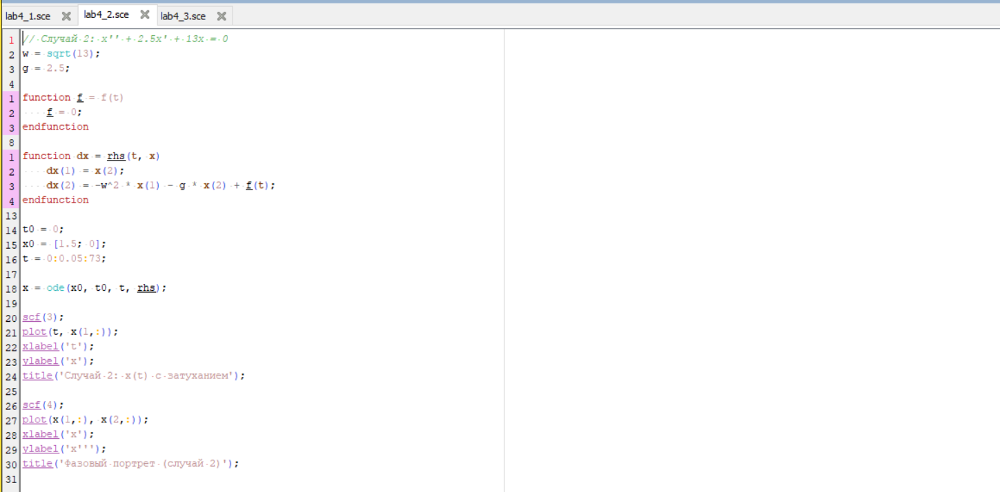
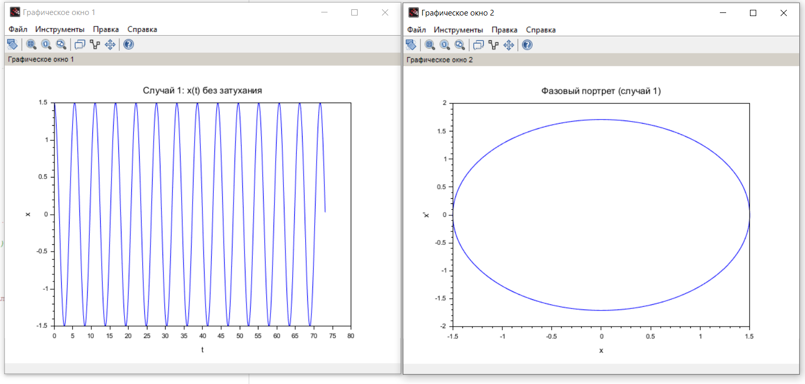
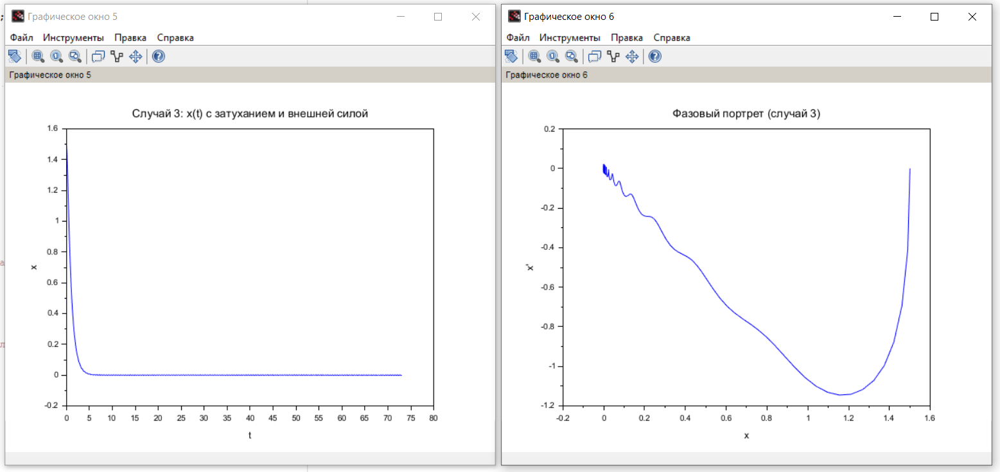

---
## Author
author: Бызова Мария Олеговна, НПИбд-01-23
## Title
title: "Отчёт по лабораторной работе №4"
subtitle: "Математическое моделирование"
license: "CC BY"
---

# Цель работы

Построить решение уравнения гармонического осциллятора и его фазовые портреты для трех случаев: без затухания, с затуханием, и с затуханием под действием внешней силы, а также освоить навыки работы с Julia и Scilab для математического моделирования.

# Задание

1.  Построить решение уравнения гармонического осциллятора без затухания.
2.  Записать уравнение свободных колебаний гармонического осциллятора с затуханием, построить его решение и фазовый портрет.
3.  Записать уравнение колебаний гармонического осциллятора с затуханием под действием внешней силы, построить его решение и фазовый портрет.

# Выполнение лабораторной работы

В ходе выполнения лабораторной работы мною был выполнен ряд последовательных шагов по созданию проекта, математическому моделированию и визуализации результатов для варианта 60.

## Подготовка рабочего пространства

Перед началом моделирования была подготовлена структура проекта. Сначала я перешла в директорию с лабораторными работами и создала проект, используя пакет `DrWatson` в Julia, указав свои данные ([рис. @fig-001] - [рис. @fig-003]).

{#fig-001 width=70%}

{#fig-002 width=70%}

{#fig-003 width=70%}

После создания проекта я перешла в каталог `project` и создала внутри папки `scripts` файлы `lab4_1.jl`, `lab4_2.jl` и `lab4_3.jl` для будущих кодов на Julia ([рис. @fig-004]).

{#fig-004 width=70%}

## Математическая постановка задачи для варианта 60

В моем варианте (60) заданы следующие параметры и начальные условия для трех моделей гармонического осциллятора.

**Модель номер 1 (Колебания без затухания и внешней силы):**

Уравнение имеет вид:
$$ \ddot{x} + 1.3x = 0 $$
Начальные условия: $x_0 = 1.5$, $y_0 = 0$.
Собственная частота: $\omega = \sqrt{1.3}$.

**Модель номер 2 (Колебания с затуханием без внешней силы):**

Уравнение имеет вид:
$$ \ddot{x} + 2.5\dot{x} + 13x = 0 $$
Начальные условия: $x_0 = 1.5$, $y_0 = 0$.
Параметры: $\gamma = 2.5$, $\omega = \sqrt{13}$.

**Модель номер 3 (Колебания с затуханием и внешней силой):**

Уравнение имеет вид:
$$ \ddot{x} + 7\dot{x} + 6.6x = 0.3 sin(12t) $$
Начальные условия: $x_0 = 1.5$, $y_0 = 0$.
Параметры: $\gamma = 7$, $\omega = \sqrt{6.6}$.

Для всех случаев интервал времени \( t \in [0; 73] \) с шагом 0.05.

## Моделирование на Julia и получение графиков

После запуска скриптов `lab4_1.jl`, `lab4_2.jl` и `lab4_3.jl` в Julia были получены численные решения и построены графики траекторий и фазовые портреты. В консоль вывелась информация о завершении моделирования ([рис. @fig-008] - [рис. @fig-010]).

{#fig-008 width=70%}

{#fig-009 width=70%}

{#fig-010 width=70%}

На основе полученных решений были построены графики.

**Для модели №1 (без затухания)** график решения показывает гармонические колебания с постоянной амплитудой ([рис. @fig-011]). Фазовый портрет представляет собой замкнутую кривую (эллипс), что соответствует сохранению энергии в системе ([рис. @fig-012]).

{#fig-011 width=70%}

{#fig-012 width=70%}

**Для модели №2 (с затуханием)** график решения демонстрирует затухание амплитуды колебаний со временем ([рис. @fig-013]). Фазовый портрет представляет собой спираль, стягивающуюся к точке равновесия, что указывает на потерю энергии в системе ([рис. @fig-014]).

{#fig-013 width=70%}

{#fig-014 width=70%}

**Для модели №3 (с внешней силой)** график решения показывает, что колебания сначала носят переходный характер, а затем переходят в установившийся режим с частотой внешней силы ([рис. @fig-015]). Фазовый портрет демонстрирует сложную траекторию, выходящую на предельный цикл ([рис. @fig-016]).

{#fig-015 width=70%}

{#fig-016 width=70%}

## Генерация отчетных материалов

Для подготовки отчета я использовала инструмент `tangle.jl`, который позволяет конвертировать скрипты с литературным программированием в чистый код, Markdown и Jupyter Notebook. Процесс генерации файлов из моих скриптов `lab4_1.jl`, `lab4_2.jl` и `lab4_3.jl` показан на [рис. @fig-017].

{#fig-017 width=70%}

## Реализация в Scilab

Также, для верификации результатов и сравнения, была выполнена реализация модели в среде Scilab. Код для первой модели представлен на [рис. @fig-018], для второй — на [рис. @fig-019], для третьей — на [рис. @fig-020].

{#fig-018 width=70%}

```Scilab
// Случай 1: x'' + 1.3x = 0
w = sqrt(1.3);
g = 0;

function f = f(t)
    f = 0;
endfunction

function dx = rhs(t, x)
    dx(1) = x(2);
    dx(2) = -w^2 * x(1) - g * x(2) + f(t);
endfunction

t0 = 0;
x0 = [1.5; 0];
t = 0:0.05:73;

x = ode(x0, t0, t, rhs);

// График решения x(t)
scf(1);
plot(t, x(1,:));
xlabel('t');
ylabel('x');
title('Случай 1: x(t) без затухания');

// Фазовый портрет (x, x')
scf(2);
plot(x(1,:), x(2,:));
xlabel('x');
ylabel('x''');
title('Фазовый портрет (случай 1)');
```

{#fig-019 width=70%}

```Scilab
// Случай 2: x'' + 2.5x' + 13x = 0
w = sqrt(13);
g = 2.5;

function f = f(t)
    f = 0;
endfunction

function dx = rhs(t, x)
    dx(1) = x(2);
    dx(2) = -w^2 * x(1) - g * x(2) + f(t);
endfunction

t0 = 0;
x0 = [1.5; 0];
t = 0:0.05:73;

x = ode(x0, t0, t, rhs);

scf(3);
plot(t, x(1,:));
xlabel('t');
ylabel('x');
title('Случай 2: x(t) с затуханием');

scf(4);
plot(x(1,:), x(2,:));
xlabel('x');
ylabel('x''');
title('Фазовый портрет (случай 2)');
```

{#fig-020 width=70%}

```Scilab
// Случай 3: x'' + 7x' + 6.6x = 0.3 sin(12t)
w = sqrt(6.6);
g = 7;

function f = f(t)
    f = 0.3 * sin(12 * t);
endfunction

function dx = rhs(t, x)
    dx(1) = x(2);
    dx(2) = -w^2 * x(1) - g * x(2) + f(t);
endfunction

t0 = 0;
x0 = [1.5; 0];
t = 0:0.05:73;

x = ode(x0, t0, t, rhs);

scf(5);
plot(t, x(1,:));
xlabel('t');
ylabel('x');
title('Случай 3: x(t) с затуханием и внешней силой');

scf(6);
plot(x(1,:), x(2,:));
xlabel('x');
ylabel('x''');
title('Фазовый портрет (случай 3)');
```

В результате работы скриптов в Scilab были построены графики траекторий и фазовые портреты для трех случаев ([рис. @fig-021] - [рис. @fig-023]), что полностью подтверждает корректность моделирования, выполненного в Julia.

{#fig-021 width=70%}

{#fig-022 width=70%}

{#fig-023 width=70%}








# Вопросы к лабораторной работе

1.  **Запишите простейшую модель гармонических колебаний.**
    Простейшая модель гармонических колебаний (без затухания и внешней силы) имеет вид: $\ddot{x} + \omega_0^2 x = 0$, где $\omega_0$ — собственная частота колебаний.

2.  **Дайте определение осциллятора.**
    Осциллятор — это система, совершающая колебания, то есть периодические или почти периодические изменения состояния (например, механический маятник, электрический контур). Гармонический осциллятор — это система, которая при малых отклонениях от положения равновесия описывается линейным дифференциальным уравнением второго порядка.

3.  **Запишите модель математического маятника.**
    Модель математического маятника (для малых углов отклонения) описывается уравнением: $\ddot{\theta} + \frac{g}{l} \theta = 0$, где $\theta$ — угол отклонения, $g$ — ускорение свободного падения, $l$ — длина маятника.

4.  **Запишите алгоритм перехода от дифференциального уравнения второго порядка к двум дифференциальным уравнениям первого порядка.**
    Для уравнения $\ddot{x} + 2\gamma\dot{x} + \omega_0^2 x = f(t)$ вводится замена переменной $y = \dot{x}$. Тогда исходное уравнение сводится к системе:
    $$ 
    \begin{cases}
    \dot{x} = y \\
    \dot{y} = -2\gamma y - \omega_0^2 x + f(t)
    \end{cases} 
    $$

5.  **Что такое фазовый портрет и фазовая траектория?**
    Фазовая траектория — это кривая в фазовом пространстве (на фазовой плоскости), которую описывает точка, изображающая состояние системы, при изменении времени. Фазовый портрет — это совокупность всех фазовых траекторий, соответствующих различным начальным условиям, которая дает наглядное представление о поведении системы.

# Выводы

В ходе выполнения лабораторной работы была решена задача моделирования гармонического осциллятора для варианта 60. Были построены решения и фазовые портреты для трех случаев:

1.  **Случай 1 (без затухания):** Наблюдаются незатухающие гармонические колебания с постоянной амплитудой. Фазовый портрет — замкнутая кривая.
2.  **Случай 2 (с затуханием):** Колебания затухают со временем. Фазовый портрет — спираль, стягивающаяся в точку равновесия.
3.  **Случай 3 (с затуханием и внешней силой):** Колебания сначала носят переходный характер, а затем переходят в установившийся режим с частотой внешней силы. Фазовый портрет выходит на предельный цикл.

Моделирование успешно выполнено в двух средах: Julia и Scilab, что позволило не только получить решение, но и визуально сравнить и подтвердить результаты. Также были освоены инструменты управления проектом (`DrWatson`) и литературного программирования (`Literate.jl`) в Julia.

# Список литературы

1.  Документация по Julia: https://docs.julialang.org/en/v1/
2.  Документация по Scilab: https://www.scilab.org/
3.  Королькова, А. В. Математическое моделирование. Практикум / А. В. Королькова, Д. С. Кулябов. — Москва, 2023.
