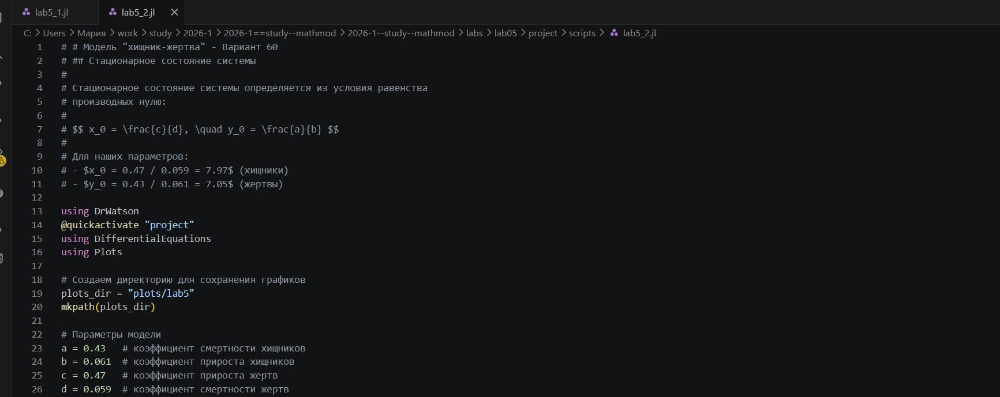
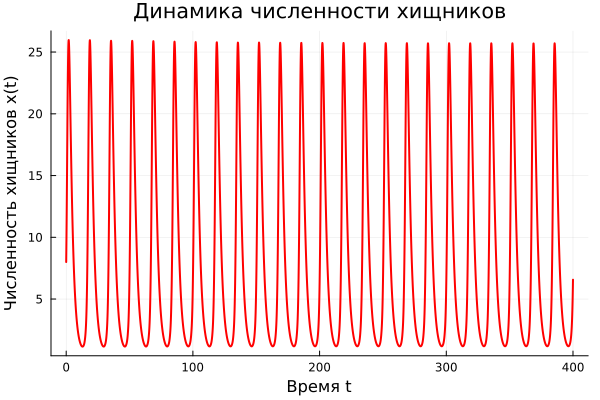
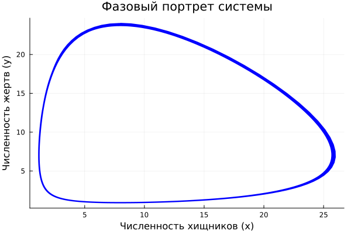
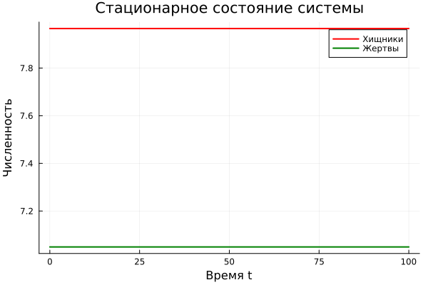
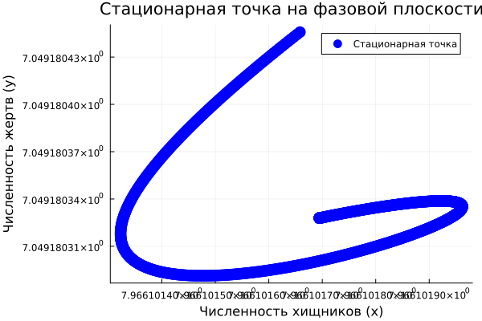
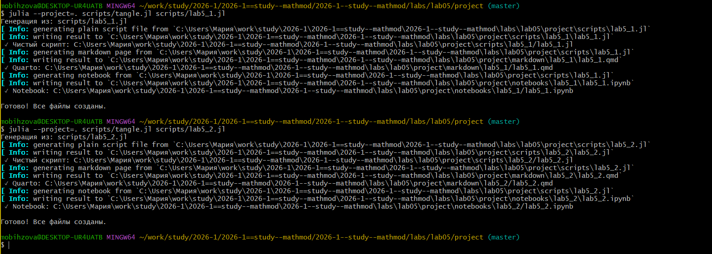
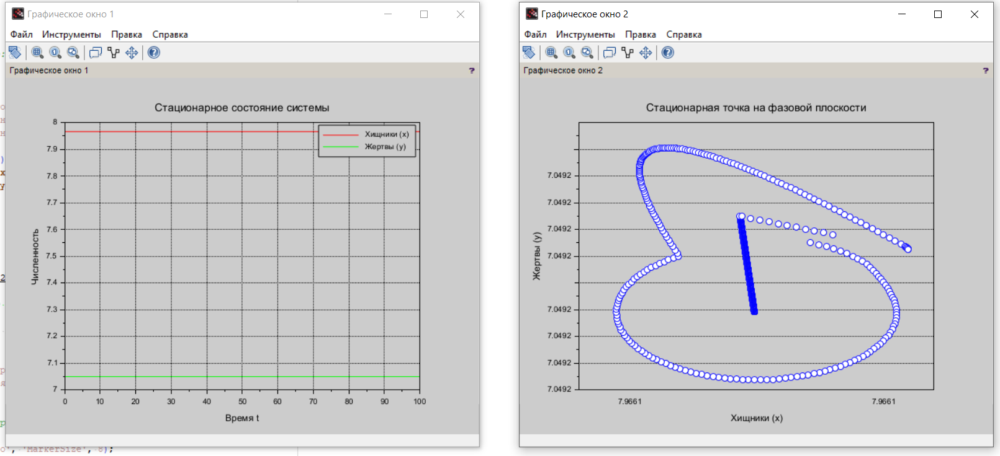

---
# Preamble

## Author
author:
  name: Бызова Мария Олеговна
## Title
title: Отчёт по лабораторной работе №5
subtitle: Математическое моделирование
license: CC BY
date: 2026-01-04

## Generic options
lang: ru-RU
crossref:
  lof-title: Список иллюстраций
  lot-title: Список таблиц
  lol-title: Листинги

## Fonts 
mainfont: PT Serif 
romanfont: PT Serif 
sansfont: PT Sans 
monofont: PT Mono 
mainfontoptions: Ligatures=TeX 
romanfontoptions: Ligatures=TeX 
sansfontoptions: Ligatures=TeX,Scale=MatchLowercase 
monofontoptions: Scale=MatchLowercase,Scale=0.9

## Formats
format:
### Pdf output format
  beamer:
    toc: true
    toc-title: Содержание
    number-sections: true
    colorlinks: false
    toc-depth: 2
    slide_level: 2
    aspectratio: 169
    section-titles: true
    theme: metropolis
    themeoptions: progressbar=frametitle,sectionpage=progressbar,numbering=fraction
    pdf-engine: xelatex
    fontenc: T2A
#### Language
    babel-lang: russian
    babel-otherlangs: english

### Html output
  revealjs:
    transition: slide
    margin: 0.2
    smaller: false
    output-ext: html
    theme: beige
    logo: _resources/image/logo_rudn.png
---

# Цель работы

## Цель работы

Изучить модель «хищник-жертва» (модель Лотки-Вольтерры), построить решение системы дифференциальных уравнений для варианта 60, визуализировать динамику изменения численности популяций хищников и жертв, найти стационарное состояние системы, а также освоить навыки работы с Julia и Scilab для математического моделирования.

# Задание

## Задание

Для модели «хищник-жертва», описываемой системой дифференциальных уравнений:

$$
\begin{cases}
\frac{dx}{dt} = -0.43x(t) + 0.061x(t)y(t) \\
\frac{dy}{dt} = 0.47y(t) - 0.059x(t)y(t)
\end{cases}
$$

где $x$ — численность хищников, $y$ — численность жертв

## Задание

1. Построить график зависимости численности хищников от численности жертв (фазовый портрет).
2. Построить графики изменения численности хищников и жертв во времени $x(t)$, $y(t)$ при начальных условиях $x_0 = 8$, $y_0 = 24$.
3. Найти стационарное состояние системы.

# Выполнение лабораторной работы

## Подготовка рабочего пространства

{#fig-001 width=70%}

## Подготовка рабочего пространства

{#fig-002 width=70%}

## Подготовка рабочего пространства

{#fig-003 width=70%}

## Подготовка рабочего пространства

{#fig-004 width=70%}

## Подготовка рабочего пространства

{#fig-005 width=70%}

## Моделирование на Julia и получение графиков

{#fig-006 width=70%}

## Моделирование на Julia и получение графиков

{#fig-007 width=70%}

## Моделирование на Julia и получение графиков

{#fig-008 width=40%}

## Моделирование на Julia и получение графиков

{#fig-009 width=40%}

## Моделирование на Julia и получение графиков

{#fig-010 width=40%}

## Моделирование на Julia и получение графиков

{#fig-011 width=40%}

## Моделирование на Julia и получение графиков

{#fig-012 width=40%}

## Моделирование на Julia и получение графиков

{#fig-013 width=40%}

## Генерация отчетных материалов

{#fig-014 width=70%}

## Реализация в Scilab

{#fig-015 width=30%}

## Реализация в Scilab

{#fig-016 width=70%}

## Реализация в Scilab

{#fig-017 width=30%}

## Реализация в Scilab

{#fig-018 width=70%}

# Выводы

## Выводы

В ходе лабораторной работы для варианта 60 построены графики динамики численности хищников и жертв, а также фазовый портрет, подтверждающий циклический характер колебаний. Найдено стационарное состояние системы: 7.97 (хищники) и 7.05 (жертвы), при котором численности популяций остаются неизменными. Моделирование успешно выполнено в средах Julia и Scilab с использованием инструментов DrWatson и tangle.jl.

# Список литературы

## Список литературы

1. Документация по Julia: https://docs.julialang.org/en/v1/
2. Документация по Scilab: https://www.scilab.org/
3. Королькова, А. В. Математическое моделирование. Практикум / А. В. Королькова, Д. С. Кулябов. — Москва, 2023.
