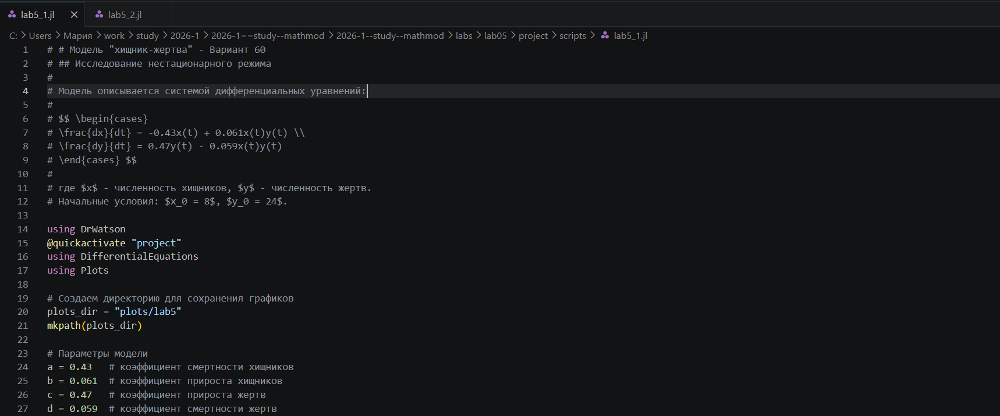
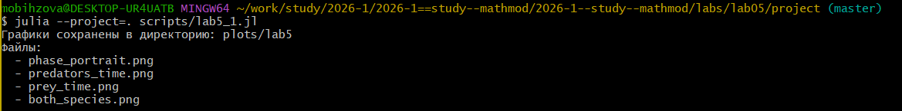
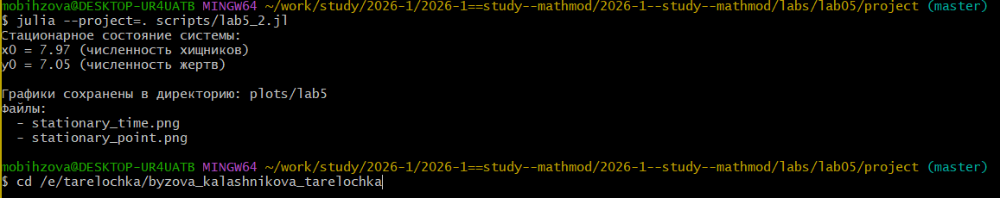
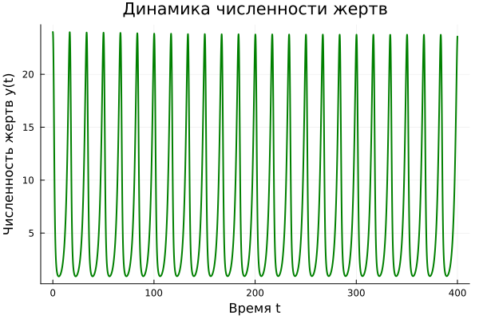
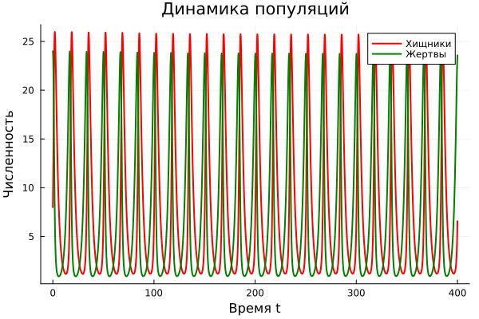
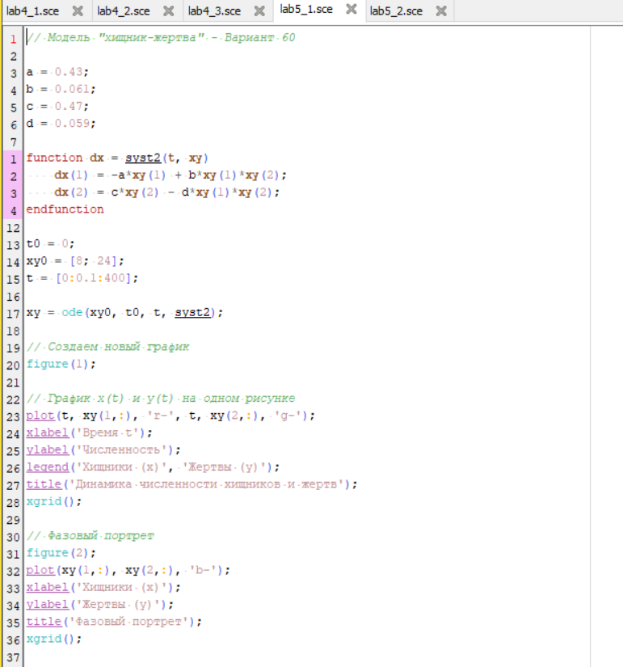
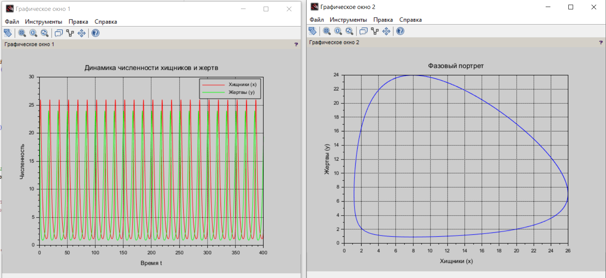
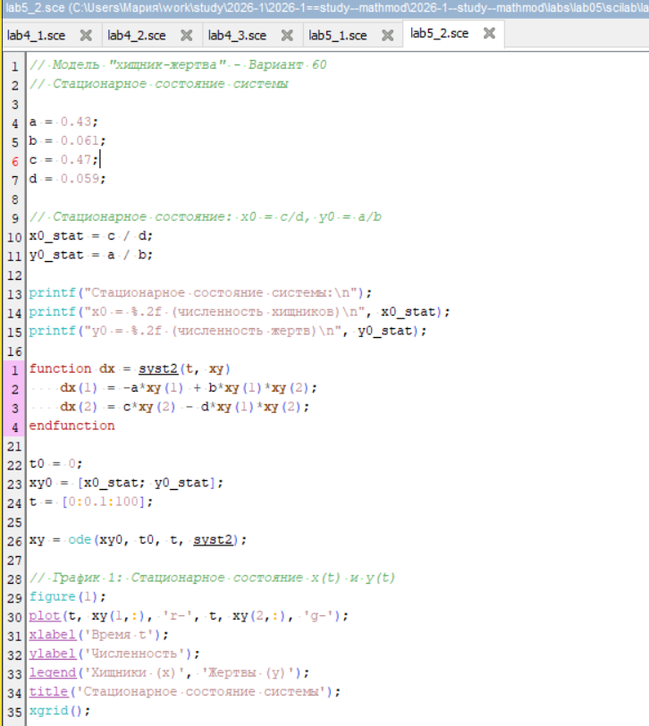

---
## Author
author: Бызова Мария Олеговна, НПИбд-01-23
## Title
title: "Отчёт по лабораторной работе №5"
subtitle: "Математическое моделирование"
license: "CC BY"
---

# Цель работы

Изучить модель «хищник-жертва» (модель Лотки-Вольтерры), построить решение системы дифференциальных уравнений для варианта 60, визуализировать динамику изменения численности популяций хищников и жертв, найти стационарное состояние системы, а также освоить навыки работы с Julia и Scilab для математического моделирования.

# Задание

Для модели «хищник-жертва», описываемой системой дифференциальных уравнений:

$$
\begin{cases}
\frac{dx}{dt} = -0.43x(t) + 0.061x(t)y(t) \\
\frac{dy}{dt} = 0.47y(t) - 0.059x(t)y(t)
\end{cases}
$$

где $x$ — численность хищников, $y$ — численность жертв, необходимо выполнить:

1. Построить график зависимости численности хищников от численности жертв (фазовый портрет).
2. Построить графики изменения численности хищников и жертв во времени $x(t)$, $y(t)$ при начальных условиях $x_0 = 8$, $y_0 = 24$.
3. Найти стационарное состояние системы.

# Выполнение лабораторной работы

## Подготовка рабочего пространства

Перед началом моделирования была подготовлена структура проекта. Я перешла в директорию с лабораторными работами ([рис. @fig-001]).

{#fig-001 width=70%}

Затем, в среде Julia, я установила пакет `DrWatson` для управления проектом ([рис. @fig-002]).

{#fig-002 width=70%}

С помощью команды `initialize_project` я создала новый проект с именем "project", указав своё авторство ([рис. @fig-003]).

{#fig-003 width=70%}

После создания проекта я подготовила файлы для написания кода. На [рис. @fig-004] показан код для Julia, описывающий параметры модели и начальные условия для первого задания (построение графиков).

{#fig-004 width=70%}

Далее я подготовила код для нахождения стационарного состояния системы ([рис. @fig-005]).

{#fig-005 width=70%}

## Моделирование на Julia и получение графиков

После запуска скрипта `lab5_1.jl` в консоли Julia отобразилась информация о сохранённых графиках: фазовый портрет, динамика хищников, динамика жертв и общий график ([рис. @fig-006]).

{#fig-006 width=70%}

Запуск скрипта `lab5_2.jl` для стационарного состояния вывел в консоль рассчитанные значения равновесной численности хищников и жертв ([рис. @fig-007]).

{#fig-007 width=70%}

На основе полученных решений были построены графики.

**Динамика численности жертв (`prey_time.png`):**  
График показывает, как меняется популяция жертв во времени. На начальном этапе наблюдается рост, затем следование циклическим колебаниям ([рис. @fig-008]).

{#fig-008 width=70%}

**Динамика численности хищников (`predators_time.png`):**  
Популяция хищников также совершает колебания, но со сдвигом относительно популяции жертв ([рис. @fig-009]).

{#fig-009 width=70%}

**Совместная динамика (`both_species.png`):**  
На одном графике представлены кривые $x(t)$ и $y(t)$, наглядно демонстрирующие противофазный характер колебаний численности хищников и жертв ([рис. @fig-010]).

{#fig-010 width=70%}

**Фазовый портрет (`phase_portrait.png`):**  
График зависимости численности хищников от численности жертв. Замкнутая кривая указывает на периодический характер колебаний системы ([рис. @fig-011]).

{#fig-011 width=70%}

**Стационарное состояние (`stationary_time.png`):**  
График показывает, что при задании начальных условий в стационарной точке численности обоих видов остаются постоянными во времени ([рис. @fig-012]).

{#fig-012 width=70%}

**Стационарная точка на фазовой плоскости (`stationary_point.png`):**  
Фазовый портрет при начальных условиях, равных стационарной точке, вырождается в точку, что соответствует положению равновесия ([рис. @fig-013]).

{#fig-013 width=70%}

## Генерация отчетных материалов

Для подготовки отчета я использовала инструмент `tangle.jl`, который позволяет конвертировать скрипты с литературным программированием в чистый код и Markdown. Процесс генерации файлов из моих скриптов `lab5_1.jl` и `lab5_2.jl` показан на [рис. @fig-014].

{#fig-014 width=70%}

## Реализация в Scilab

Также, для верификации результатов и сравнения, была выполнена реализация модели в среде Scilab. Код для моделирования нестационарного режима представлен на [рис. @fig-015].

{#fig-015 width=70%}

В результате выполнения скрипта в Scilab были построены два графических окна: с динамикой численности видов во времени и с фазовым портретом ([рис. @fig-016]).

{#fig-016 width=70%}

Код для нахождения и визуализации стационарного состояния в Scilab представлен на [рис. @fig-017].

{#fig-017 width=70%}

Результат выполнения скрипта для стационарного состояния в Scilab показал, что при равновесных начальных условиях численности популяций не изменяются ([рис. @fig-018]).

{#fig-018 width=70%}

# Теоретическое обоснование

Модель Лотки-Вольтерры описывает взаимодействие двух видов: хищников и жертв. В отсутствие хищников популяция жертв растет экспоненциально, а популяция хищников в отсутствие жертв вымирает. Взаимодействие приводит к периодическим колебаниям численности обоих видов.

## Стационарное состояние системы

Стационарное состояние определяется из условия равенства производных нулю:

$$
\begin{cases}
-ax + bxy = 0 \\
cy - dxy = 0
\end{cases}
$$

Решением системы являются две точки: $(0,0)$ и $\left(\frac{c}{d}, \frac{a}{b}\right)$.

Для моего варианта 60 параметры равны:
- $a = 0.43$ (коэффициент смертности хищников)
- $b = 0.061$ (коэффициент прироста хищников)
- $c = 0.47$ (коэффициент прироста жертв)
- $d = 0.059$ (коэффициент смертности жертв)

Таким образом, стационарное состояние (ненулевое) составляет:
- $x_0 = \frac{c}{d} = \frac{0.47}{0.059} \approx 7.97$ (численность хищников)
- $y_0 = \frac{a}{b} = \frac{0.43}{0.061} \approx 7.05$ (численность жертв)





# Выводы

В ходе лабораторной работы для варианта 60 построены графики динамики численности хищников и жертв, а также фазовый портрет, подтверждающий циклический характер колебаний. Найдено стационарное состояние системы: 7.97 (хищники) и 7.05 (жертвы), при котором численности популяций остаются неизменными. Моделирование успешно выполнено в средах Julia и Scilab с использованием инструментов DrWatson и tangle.jl.

# Список литературы

1. Документация по Julia: https://docs.julialang.org/en/v1/
2. Документация по Scilab: https://www.scilab.org/
3. Королькова, А. В. Математическое моделирование. Практикум / А. В. Королькова, Д. С. Кулябов. — Москва, 2023.
