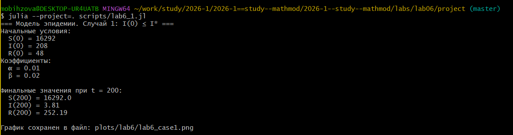
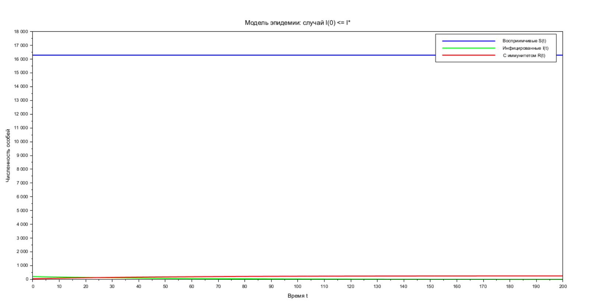

---
## Author
author: Бызова Мария Олеговна, НПИбд-01-23
## Title
title: "Отчёт по лабораторной работе №6"
subtitle: "Математическое моделирование"
license: "CC BY"
---

# Цель работы

## Цель работы

Изучить простейшую модель эпидемии, построить решение системы дифференциальных уравнений для варианта 60, визуализировать динамику изменения численности восприимчивых, инфицированных и выздоровевших особей для двух случаев (когда \(I(0) \leq I^*\) и когда \(I(0) > I^*\)), а также освоить навыки работы с Julia и Scilab для математического моделирования.

# Задание

## Задание

Для модели эпидемии, описываемой системой дифференциальных уравнений:

$$
\frac{dS}{dt} = \begin{cases} -\alpha S, & \text{если } I(t) > I^* \\ 0, & \text{если } I(t) \leq I^* \end{cases}
$$

$$
\frac{dI}{dt} = \begin{cases} \alpha S - \beta I, & \text{если } I(t) > I^* \\ -\beta I, & \text{если } I(t) \leq I^* \end{cases}
$$

$$
\frac{dR}{dt} = \beta I
$$

где \(S\) — восприимчивые особи, \(I\) — инфицированные особи, \(R\) — особи с иммунитетом.

Для варианта 60:
- Общая численность популяции \(N = 16548\)
- Начальное количество инфицированных \(I(0) = 208\)
- Начальное количество особей с иммунитетом \(R(0) = 48\)
- Начальное количество восприимчивых \(S(0) = N - I(0) - R(0)\)
- Коэффициент заболеваемости \(\alpha = 0.01\)
- Коэффициент выздоровления \(\beta = 0.02\)

Необходимо:
1. Построить графики изменения численности \(S(t)\), \(I(t)\), \(R(t)\) для случая \(I(0) \leq I^*\).
2. Построить графики изменения численности \(S(t)\), \(I(t)\), \(R(t)\) для случая \(I(0) > I^*\).
3. Проанализировать динамику эпидемии в обоих случаях.

# Выполнение лабораторной работы

## Подготовка рабочего пространства

Перед выполнением работы был создан каталог для лабораторной работы №6. На скриншоте показан переход в каталог `lab06/project` через командную строку MINGW64.

{#fig-001 width=70%}

## Подготовка рабочего пространства

Для работы в Julia был установлен пакет DrWatson, который позволяет организовать воспроизводимую структуру проекта. На скриншоте виден процесс добавления пакета с помощью команды `Pkg.add("DrWatson")`.

{#fig-002 width=70%}

## Подготовка рабочего пространства

После установки пакета была проведена инициализация проекта с указанием автора. Использована команда `initialize_project("project"; authors="Бызова Мария", git=false)`.

{#fig-003 width=70%}

## Подготовка рабочего пространства

На следующем скриншоте представлена часть кода на Julia для моделирования случая, когда \(I(0) \leq I^*\). В коде задаются параметры модели, начальные условия и система дифференциальных уравнений.

{#fig-004 width=70%}

## Подготовка рабочего пространства

На следующем скриншоте представлена часть кода для случая, когда \(I(0) > I^*\). Здесь больные способны заражать восприимчивых особей, поэтому в уравнениях присутствует слагаемое \(-\alpha S\).

{#fig-005 width=70%}

## Моделирование на Julia и получение графиков

После запуска скрипта `lab6_1.jl` (случай \(I(0) \leq I^*\)) в консоли были выведены начальные условия, коэффициенты и финишные значения при \(t = 200\). Видно, что численность восприимчивых \(S(200)\) осталась неизменной (\(16292.0\)), инфицированных \(I(200)\) снизилась до \(3.81\), а выздоровевших \(R(200)\) увеличилась до \(252.19\).

{#fig-006 width=70%}

## Моделирование на Julia и получение графиков

После запуска скрипта `lab6_2.jl` (случай \(I(0) > I^*\)) в консоли были выведены начальные условия, коэффициенты и значения при \(t = 200\). Численность восприимчивых \(S(200)\) снизилась до \(2204.88\), инфицированных \(I(200)\) выросла до \(1910.29\), а выздоровевших \(R(200)\) значительно увеличилась до \(12432.82\).

{#fig-007 width=70%}

## Моделирование на Julia и получение графиков

На следующем графике показана динамика численности восприимчивых, инфицированных и выздоровевших особей для случая \(I(0) \leq I^*\). Видно, что восприимчивые особи \(S(t)\) остаются постоянными (так как заражения нет), инфицированные \(I(t)\) экспоненциально убывают, а выздоровевшие \(R(t)\) растут.

{#fig-008 width=70%}

## Моделирование на Julia и получение графиков

На следующем графике показана динамика численности для случая \(I(0) > I^*\). Видно, что восприимчивые особи \(S(t)\) быстро убывают, инфицированные \(I(t)\) сначала растут, достигают пика, а затем убывают, а выздоровевшие \(R(t)\) монотонно растут, стремясь к общей численности популяции.

{#fig-009 width=70%}

## Генерация отчетных материалов

С помощью скрипта `tangle.jl` были сгенерированы отчетные материалы в форматах `.jl`, `.qmd` и `.ipynb`. На скриншоте показан процесс генерации для скрипта `lab6_1.jl`.

{#fig-010 width=70%}

## Генерация отчетных материалов

На следующем скриншоте показан процесс генерации отчетных материалов для скрипта `lab6_2.jl`. Все файлы были успешно созданы.

{#fig-011 width=70%}

## Реализация в Scilab

Для проверки результатов моделирование также было выполнено в среде Scilab. На скриншоте представлен код для случая \(I(0) \leq I^*\) с заданными начальными условиями.

{#fig-012 width=70%}

## Реализация в Scilab

На следующем скриншоте представлен код для случая \(I(0) > I^*\) в среде Scilab. Система уравнений решается с помощью встроенной функции `ode`.

{#fig-013 width=70%}

## Реализация в Scilab

После выполнения кода в Scilab были получены графические окна с результатами моделирования для обоих случаев. На скриншоте показан график для случая \(I(0) \leq I^*\).

{#fig-014 width=70%}

## Реализация в Scilab

На следующем скриншоте показан график для случая \(I(0) > I^*\), полученный в Scilab. Динамика полностью соответствует результатам, полученным в Julia.

{#fig-015 width=70%}

# Скрипты

## lab6_1.jl

```Julia
using Plots
using DifferentialEquations

N = 16548

I0 = 208   # инфицированные особи
R0 = 48    # особи с иммунитетом
S0 = N - I0 - R0  # восприимчивые, но здоровые особи

alpha = 0.01  # коэффициент заболеваемости
beta = 0.02   # коэффициент выздоровления

function ode_fn_case1(du, u, p, t)
    S, I, R = u
    du[1] = 0          # dS/dt
    du[2] = -beta * I  # dI/dt
    du[3] = beta * I   # dR/dt
end

v0 = [S0, I0, R0]

tspan = (0.0, 200.0)

prob = ODEProblem(ode_fn_case1, v0, tspan)
sol = solve(prob, dtmax = 0.1)

S = [u[1] for u in sol.u]
I = [u[2] for u in sol.u]
R = [u[3] for u in sol.u]
T = [t for t in sol.t]

plt = plot(
    dpi = 300,
    legend = :topright,
    title = "Модель эпидемии: случай I(0) ≤ I*",
    xlabel = "Время t",
    ylabel = "Численность особей",
    linewidth = 2
)

plot!(
    plt,
    T,
    S,
    label = "Восприимчивые особи S(t)",
    color = :blue
)

plot!(
    plt,
    T,
    I,
    label = "Инфицированные особи I(t)",
    color = :green
)

plot!(
    plt,
    T,
    R,
    label = "Особи с иммунитетом R(t)",
    color = :red
)

mkpath("plots/lab6")
savefig(plt, "plots/lab6/lab6_case1.png")

println("=== Модель эпидемии. Случай 1: I(0) ≤ I* ===")
println("Начальные условия:")
println("  S(0) = ", S0)
println("  I(0) = ", I0)
println("  R(0) = ", R0)
println("Коэффициенты:")
println("  α = ", alpha)
println("  β = ", beta)
println("\nФинальные значения при t = 200:")
println("  S(200) = ", round(S[end], digits=2))
println("  I(200) = ", round(I[end], digits=2))
println("  R(200) = ", round(R[end], digits=2))
println("\nГрафик сохранен в файл: plots/lab6/lab6_case1.png")
```

## lab6_2.jl

```Julia
using Plots
using DifferentialEquations

N = 16548

I0 = 208   # инфицированные особи
R0 = 48    # особи с иммунитетом
S0 = N - I0 - R0  # восприимчивые, но здоровые особи

alpha = 0.01  # коэффициент заболеваемости
beta = 0.02   # коэффициент выздоровления

function ode_fn_case2(du, u, p, t)
    S, I, R = u
    du[1] = -alpha * S          # dS/dt
    du[2] = alpha * S - beta * I # dI/dt
    du[3] = beta * I             # dR/dt
end

v0 = [S0, I0, R0]

tspan = (0.0, 200.0)

prob = ODEProblem(ode_fn_case2, v0, tspan)
sol = solve(prob, dtmax = 0.1)

S = [u[1] for u in sol.u]
I = [u[2] for u in sol.u]
R = [u[3] for u in sol.u]
T = [t for t in sol.t]

plt = plot(
    dpi = 300,
    legend = :topright,
    title = "Модель эпидемии: случай I(0) > I*",
    xlabel = "Время t",
    ylabel = "Численность особей",
    linewidth = 2
)

plot!(
    plt,
    T,
    S,
    label = "Восприимчивые особи S(t)",
    color = :blue
)

plot!(
    plt,
    T,
    I,
    label = "Инфицированные особи I(t)",
    color = :green
)

plot!(
    plt,
    T,
    R,
    label = "Особи с иммунитетом R(t)",
    color = :red
)

mkpath("plots/lab6")
savefig(plt, "plots/lab6/lab6_case2.png")

println("=== Модель эпидемии. Случай 2: I(0) > I* ===")
println("Начальные условия:")
println("  S(0) = ", S0)
println("  I(0) = ", I0)
println("  R(0) = ", R0)
println("Коэффициенты:")
println("  α = ", alpha)
println("  β = ", beta)
println("\nФинальные значения при t = 200:")
println("  S(200) = ", round(S[end], digits=2))
println("  I(200) = ", round(I[end], digits=2))
println("  R(200) = ", round(R[end], digits=2))
println("\nГрафик сохранен в файл: plots/lab6/lab6_case2.png")
```

## lab6_1.sce

```Scilab
// Начальные условия
N = 16548;          // общая численность популяции
I0 = 208;           // инфицированные особи в начальный момент времени
R0 = 48;            // особи с иммунитетом в начальный момент времени
S0 = N - I0 - R0;   // восприимчивые к болезни особи

// Коэффициенты
alpha = 0.01;       // коэффициент заболеваемости
beta = 0.02;        // коэффициент выздоровления
I_crit = 250;       // критическое значение I* (выбрано больше I0)

// Случай, когда I(0) <= I*
function dx = syst1(t, x)
    S = x(1);
    I = x(2);
    R = x(3);
    
    dx(1) = 0;              // dS/dt
    dx(2) = -beta * I;      // dI/dt
    dx(3) = beta * I;       // dR/dt
endfunction

// Начальные условия
x0 = [S0; I0; R0];
t0 = 0;
t = 0:0.1:200;

// Решение системы дифференциальных уравнений
y = ode(x0, t0, t, syst1);

// Построение графиков
plot(t, y(1,:), 'b-', 'LineWidth', 2);  // S(t) - синий
plot(t, y(2,:), 'g-', 'LineWidth', 2);  // I(t) - зеленый
plot(t, y(3,:), 'r-', 'LineWidth', 2);  // R(t) - красный

xlabel('Время t');
ylabel('Численность особей');
title('Модель эпидемии: случай I(0) <= I*');
legend(['Восприимчивые S(t)'; 'Инфицированные I(t)'; 'С иммунитетом R(t)']);
grid on;
```

## lab6_2.sce

```Scilab
// Начальные условия
N = 16548;          // общая численность популяции
I0 = 208;           // инфицированные особи в начальный момент времени
R0 = 48;            // особи с иммунитетом в начальный момент времени
S0 = N - I0 - R0;   // восприимчивые к болезни особи

// Коэффициенты
alpha = 0.01;       // коэффициент заболеваемости
beta = 0.02;        // коэффициент выздоровления
I_crit = 250;       // критическое значение I* (выбрано больше I0)

// Случай, когда I(0) <= I*
function dx = syst1(t, x)
    S = x(1);
    I = x(2);
    R = x(3);
    
    dx(1) = 0;              // dS/dt
    dx(2) = -beta * I;      // dI/dt
    dx(3) = beta * I;       // dR/dt
endfunction

// Начальные условия
x0 = [S0; I0; R0];
t0 = 0;
t = 0:0.1:200;

// Решение системы дифференциальных уравнений
y = ode(x0, t0, t, syst1);

// Построение графиков
plot(t, y(1,:), 'b-', 'LineWidth', 2);  // S(t) - синий
plot(t, y(2,:), 'g-', 'LineWidth', 2);  // I(t) - зеленый
plot(t, y(3,:), 'r-', 'LineWidth', 2);  // R(t) - красный

xlabel('Время t');
ylabel('Численность особей');
title('Модель эпидемии: случай I(0) <= I*');
legend(['Восприимчивые S(t)'; 'Инфицированные I(t)'; 'С иммунитетом R(t)']);
grid on;
```

# Выводы

## Выводы

В ходе лабораторной работы для варианта 60 были построены графики динамики численности восприимчивых (\(S(t)\)), инфицированных (\(I(t)\)) и выздоровевших (\(R(t)\)) особей для двух случаев.

В случае \(I(0) \leq I^*\) (когда больные изолированы) эпидемия не распространяется: восприимчивые особи не заражаются, инфицированные постепенно выздоравливают, и эпидемия затухает.

В случае \(I(0) > I^*\) (когда больные способны заражать здоровых) наблюдается типичная динамика эпидемии: восприимчивые особи быстро убывают, инфицированные проходят через пик, и в итоге большая часть популяции приобретает иммунитет.

Моделирование успешно выполнено в средах Julia и Scilab с использованием инструментов DrWatson и tangle.jl. Результаты, полученные в обеих средах, полностью совпадают, что подтверждает корректность реализации.

# Список литературы

## Список литературы

1. Документация по Julia: https://docs.julialang.org/en/v1/
2. Документация по Scilab: https://www.scilab.org/
3. Королькова, А. В. Математическое моделирование. Практикум / А. В. Королькова, Д. С. Кулябов. — Москва, 2023.
