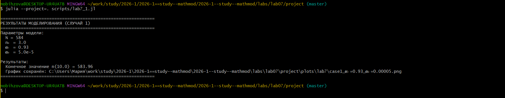
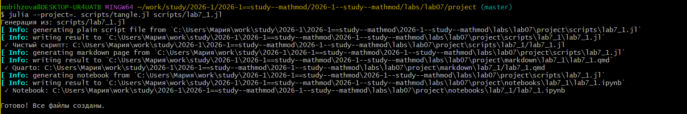
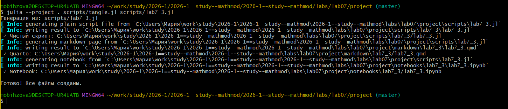
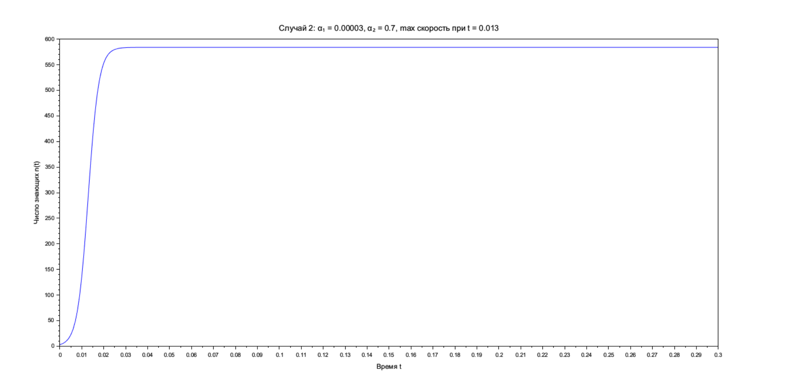
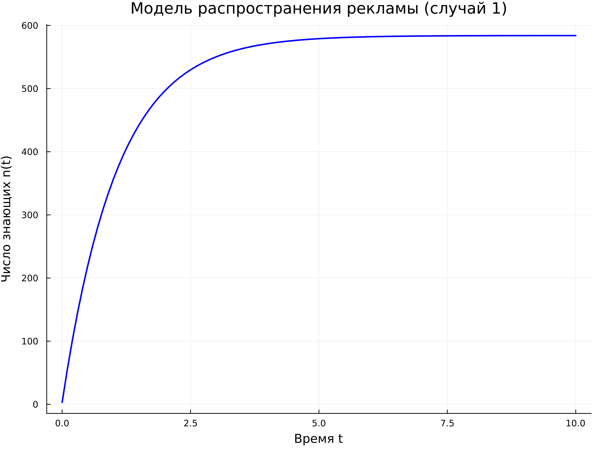
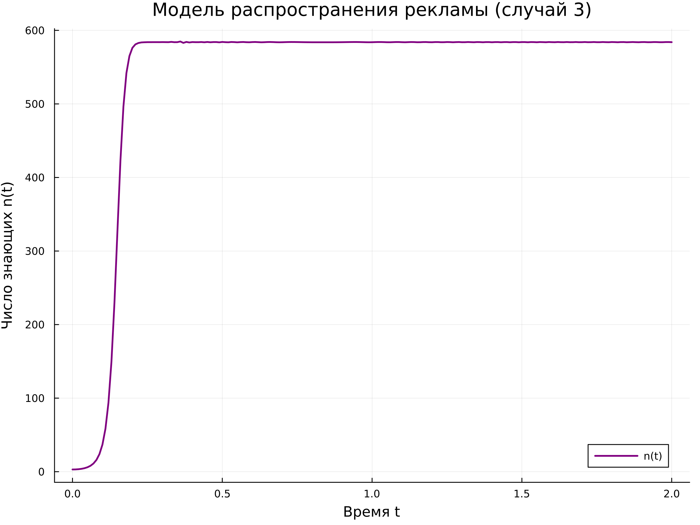

---
# Preamble

## Author
author:
  name: Бызова Мария Олеговна
## Title
title: Отчёт по лабораторной работе №6
subtitle: Математическое моделирование
license: CC BY
date: 2026-01-04

## Generic options
lang: ru-RU
crossref:
  lof-title: Список иллюстраций
  lot-title: Список таблиц
  lol-title: Листинги

## Fonts 
mainfont: PT Serif 
romanfont: PT Serif 
sansfont: PT Sans 
monofont: PT Mono 
mainfontoptions: Ligatures=TeX 
romanfontoptions: Ligatures=TeX 
sansfontoptions: Ligatures=TeX,Scale=MatchLowercase 
monofontoptions: Scale=MatchLowercase,Scale=0.9

## Formats
format:
### Pdf output format
  beamer:
    toc: true
    toc-title: Содержание
    number-sections: true
    colorlinks: false
    toc-depth: 2
    slide_level: 2
    aspectratio: 169
    section-titles: true
    theme: metropolis
    themeoptions: progressbar=frametitle,sectionpage=progressbar,numbering=fraction
    pdf-engine: xelatex
    fontenc: T2A
#### Language
    babel-lang: russian
    babel-otherlangs: english

### Html output
  revealjs:
    transition: slide
    margin: 0.2
    smaller: false
    output-ext: html
    theme: beige
    logo: _resources/image/logo_rudn.png
---

# Цель работы

## Цель работы

Изучить математическую модель распространения рекламы (модель Мальтуса и логистическую модель). Для заданного варианта №60 построить графики распространения рекламы в трёх различных случаях, описываемых дифференциальными уравнениями. Для второго случая определить момент времени, в который скорость распространения рекламы максимальна. Освоить навыки работы с Julia и Scilab для решения дифференциальных уравнений.

# Задание

## Задание

Для модели распространения рекламы, описываемой уравнением:

$$
\frac{dn}{dt} = (\alpha_1(t) + \alpha_2(t)n(t))(N - n(t))
$$

где $N = 584$ - общий объём аудитории, $n_0 = 3$ - начальное число знающих о товаре

## Задание

Необходимо выполнить:

1. **Случай 1:** Построить график $n(t)$ при $\alpha_1 = 0.93$, $\alpha_2 = 0.00005$.
2. **Случай 2:** Построить график $n(t)$ при $\alpha_1 = 0.00003$, $\alpha_2 = 0.7$. Определить момент времени $t_{max}$, когда скорость распространения рекламы $dn/dt$ максимальна.
3. **Случай 3:** Построить график $n(t)$ при $\alpha_1(t) = 0.7t$, $\alpha_2(t) = 0.8 sin(t)$ (функции зависят от времени). Построить график зависимости коэффициентов от времени.

# Выполнение лабораторной работы

## Выполнение лабораторной работы

{#fig-001 width=70%}

## Выполнение лабораторной работы

{#fig-002 width=70%}

## Выполнение лабораторной работы

{#fig-003 width=70%}

## Выполнение лабораторной работы

{#fig-004 width=70%}

## Выполнение лабораторной работы

{#fig-005 width=70%}

## Выполнение лабораторной работы

{#fig-006 width=70%}

## Выполнение лабораторной работы

{#fig-007 width=70%}

## Выполнение лабораторной работы

{#fig-008 width=70%}

## Выполнение лабораторной работы

{#fig-009 width=70%}

## Выполнение лабораторной работы

{#fig-010 width=70%}

## Выполнение лабораторной работы

{#fig-011 width=70%}

## Выполнение лабораторной работы

{#fig-012 width=70%}

## Выполнение лабораторной работы

{#fig-013 width=70%}

## Выполнение лабораторной работы

{#fig-014 width=70%}

## Выполнение лабораторной работы

{#fig-015 width=40%}

## Выполнение лабораторной работы

{#fig-016 width=70%}

## Выполнение лабораторной работы

{#fig-017 width=70%}

## Выполнение лабораторной работы

{#fig-018 width=70%}

## Выполнение лабораторной работы

{#fig-019 width=40%}

## Выполнение лабораторной работы

{#fig-020 width=40%}

## Выполнение лабораторной работы

{#fig-021 width=40%}

## Выполнение лабораторной работы

{#fig-022 width=40%}

## Выполнение лабораторной работы

{#fig-023 width=40%}

# Выводы

## Выводы

В ходе выполнения лабораторной работы была изучена математическая модель распространения рекламы. Для варианта №60 построены графики для трёх случаев:

1. Преобладание платной рекламы ($\alpha_1 = 0.93$, $\alpha_2 = 0.00005$) - модель Мальтуса.
2. Преобладание сарафанного радио ($\alpha_1 = 0.00003$, $\alpha_2 = 0.7$) - логистическая модель.
3. Коэффициенты, зависящие от времени ($\alpha_1(t) = 0.7t$, $\alpha_2(t) = 0.8 sin(t)$).

Для второго случая численно определён момент времени максимальной скорости распространения рекламы $t_{max} = 0.013$. Моделирование успешно выполнено в средах Julia и Scilab с использованием инструментов DrWatson и tangle.jl.

# Список литературы

## Список литературы

1. Документация по Julia: https://docs.julialang.org/en/v1/
2. Документация по Scilab: https://www.scilab.org/
3. Королькова, А. В. Математическое моделирование. Практикум / А. В. Королькова, Д. С. Кулябов. - Москва, 2023.
