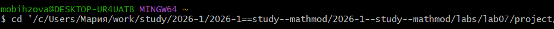
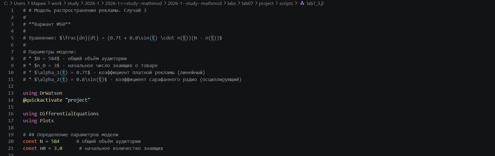
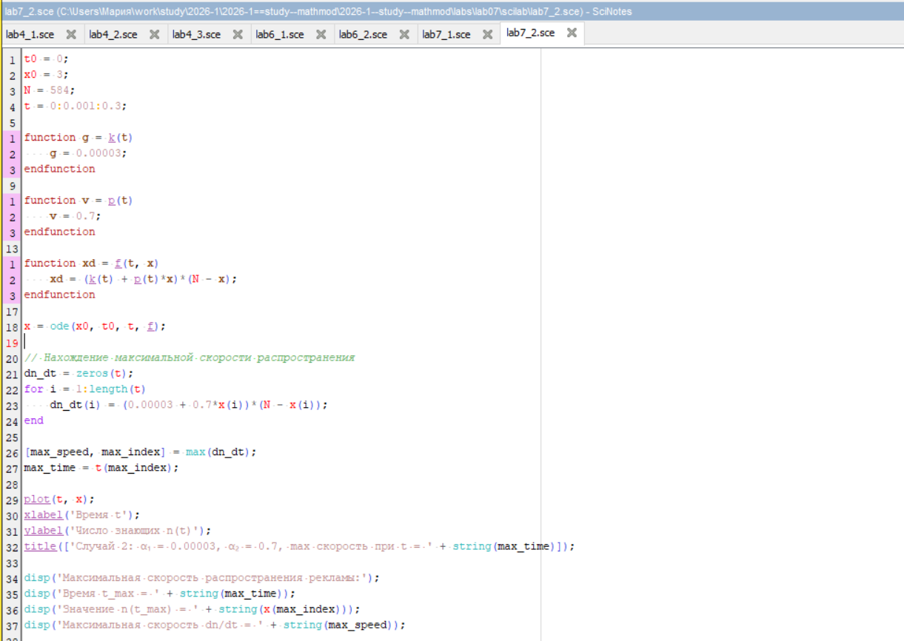
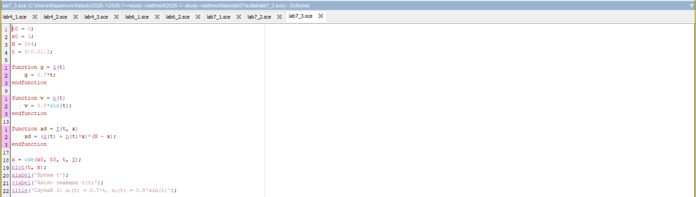
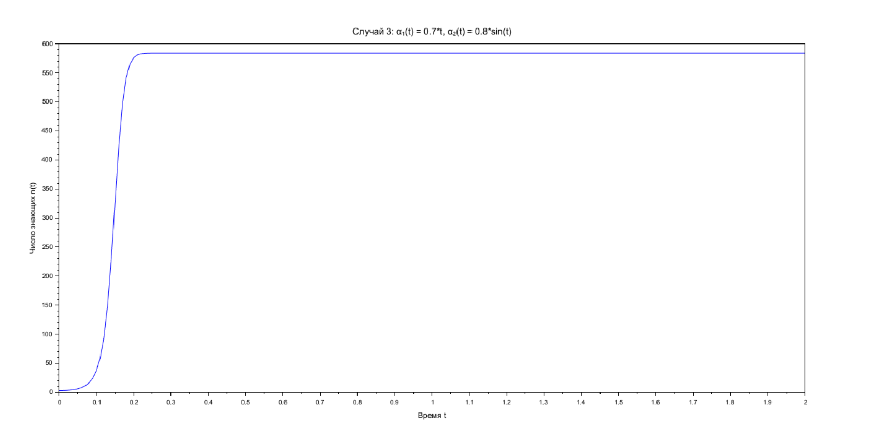
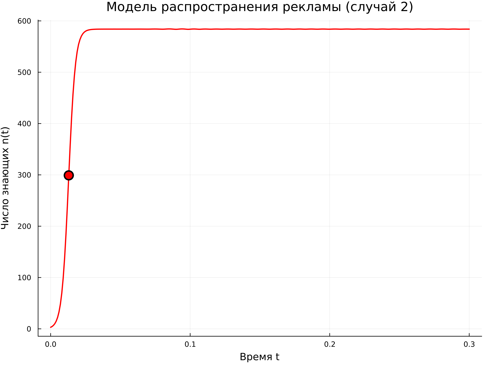
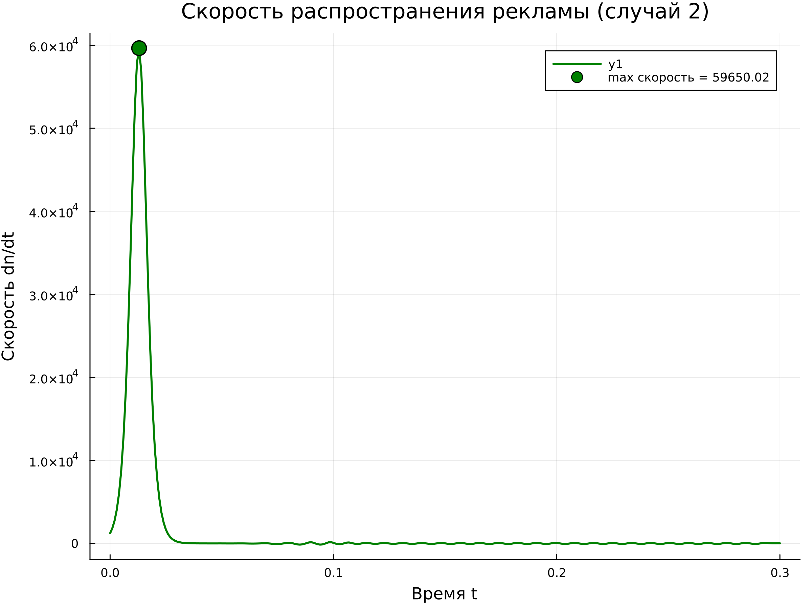
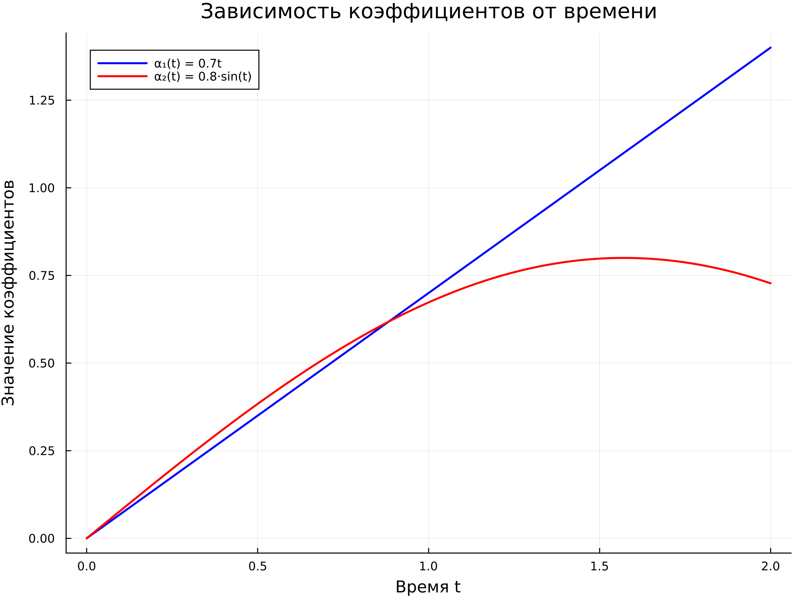

---
## Author
author: Бызова Мария Олеговна, НПИбд-01-23
## Title
title: "Отчёт по лабораторной работе №7"
subtitle: "Математическое моделирование"
license: "CC BY"
---

# Цель работы

Изучить математическую модель распространения рекламы (модель Мальтуса и логистическую модель). Для заданного варианта №60 построить графики распространения рекламы в трёх различных случаях, описываемых дифференциальными уравнениями. Для второго случая определить момент времени, в который скорость распространения рекламы максимальна. Освоить навыки работы с Julia и Scilab для решения дифференциальных уравнений.

# Задание

Для модели распространения рекламы, описываемой уравнением:

$$
\frac{dn}{dt} = (\alpha_1(t) + \alpha_2(t)n(t))(N - n(t))
$$

где $N = 584$ - общий объём аудитории, $n_0 = 3$ - начальное число знающих о товаре, необходимо выполнить:

1. **Случай 1:** Построить график $n(t)$ при $\alpha_1 = 0.93$, $\alpha_2 = 0.00005$.
2. **Случай 2:** Построить график $n(t)$ при $\alpha_1 = 0.00003$, $\alpha_2 = 0.7$. Определить момент времени $t_{max}$, когда скорость распространения рекламы $dn/dt$ максимальна.
3. **Случай 3:** Построить график $n(t)$ при $\alpha_1(t) = 0.7t$, $\alpha_2(t) = 0.8 sin(t)$ (функции зависят от времени). Построить график зависимости коэффициентов от времени.

# Выполнение лабораторной работы

## Подготовка рабочего пространства

Перед началом моделирования была подготовлена структура проекта. Я перешла в директорию с лабораторными работами ([рис. @fig-001]).

{#fig-001 width=70%}

Затем, в среде Julia, я установила пакет `DrWatson` для управления проектом ([рис. @fig-002]).

{#fig-002 width=70%}

С помощью команды `initialize_project` я создала новый проект с именем "project", указав своё авторство ([рис. @fig-003]).

{#fig-003 width=70%}

После создания проекта я подготовила файлы для написания кода.

## Случай 1: Моделирование на Julia

На [рис. @fig-004] показан код для Julia (`lab7_1.jl`), описывающий параметры модели для первого случая: $N=584$, $n_0=3$, $\alpha_1=0.93$, $\alpha_2=0.00005$.

{#fig-004 width=70%}

После запуска скрипта `lab7_1.jl` в консоли отобразилась информация о параметрах модели, конечном значении численности $n(10.0) = 583.96$ и пути сохранения графика ([рис. @fig-005]).

{#fig-005 width=70%}

## Случай 2: Моделирование на Julia

На [рис. @fig-006] представлен код для второго случая (`lab7_2.jl`), где $\alpha_1=0.00003$, $\alpha_2=0.7$.

{#fig-006 width=70%}

Запуск скрипта `lab7_2.jl` вывел в консоль время максимальной скорости распространения рекламы $t_{max} = 0.013$, соответствующее значение численности $n(t_{max}) = 299.05$ и максимальную скорость $dn/dt = 59650.02$. Также указано, что сохранены графики $n(t)$ и график скорости ([рис. @fig-007]).

{#fig-007 width=70%}

## Случай 3: Моделирование на Julia

На [рис. @fig-008] показан код для третьего случая (`lab7_3.jl`), где коэффициенты являются функциями времени: $\alpha_1(t) = 0.7t$, $\alpha_2(t) = 0.8 sin(t)$.

{#fig-008 width=70%}

Результат выполнения скрипта `lab7_3.jl` показал конечное значение $n(2.0) = 583.96$, минимальное и максимальное значения $n(t)$. Сохранены графики $n(t)$ и график зависимостей коэффициентов от времени ([рис. @fig-009]).

{#fig-009 width=70%}

## Генерация отчетных материалов

Для подготовки отчета я использовала инструмент `tangle.jl`. Процесс генерации файлов из моих скриптов `lab7_1.jl`, `lab7_2.jl` и `lab7_3.jl` в форматы Markdown, чистый код и Jupyter Notebook показан на [рис. @fig-010], [рис. @fig-011] и [рис. @fig-012].

{#fig-010 width=70%}

{#fig-011 width=70%}

{#fig-012 width=70%}

## Случай 1 (Scilab)  

Также была выполнена реализация модели в среде Scilab для верификации результатов. Код для первого случая представлен на [рис. @fig-013]. В коде заданы постоянные коэффициенты $\alpha_1=0.93$ и $\alpha_2=0.00005$ через функции $k(t)$ и $p(t)$.

{#fig-013 width=70%}

Результат выполнения скрипта в Scilab — график распространения рекламы, показывающий насыщение аудитории ([рис. @fig-014]).

{#fig-014 width=70%}

## Случай 2 (Scilab)

Код для второго случая представлен на [рис. @fig-015]. В дополнение к решению уравнения код включает вычисление массива скорости $dn/dt$ для поиска максимума.

{#fig-015 width=70%}

В результате выполнения скрипта получен график, где точкой отмечен момент максимальной скорости распространения рекламы ([рис. @fig-016]).

{#fig-016 width=70%}

## Случай 3 (Scilab)

Код для третьего случая представлен на [рис. @fig-017]. Здесь коэффициенты заданы как линейная и синусоидальная функции времени.

{#fig-017 width=70%}

Результат выполнения скрипта показал график $n(t)$ для случая с переменными коэффициентами ([рис. @fig-018]).

{#fig-018 width=70%}

## Анализ полученных графиков

**Случай 1:** 
 
На графике видно, что при большом значении $\alpha_1$ (платная реклама) и малом $\alpha_2$ (сарафанное радио) насыщение аудитории происходит плавно, по экспоненциальному закону ([рис. @fig-019]).

{#fig-019 width=70%}

**Случай 2:** 
 
При малом $\alpha_1$ и большом $\alpha_2$ (преобладание сарафанного радио) график принимает вид логистической кривой с очень крутым подъёмом. На графике скорости ([рис. @fig-020]) чётко виден пик, соответствующий максимальной скорости распространения. На графике $n(t)$ ([рис. @fig-021]) красной точкой отмечен момент $t=0.013$, соответствующий этому максимуму.

{#fig-020 width=70%}

{#fig-021 width=70%}

**Случай 3:**

На [рис. @fig-022] показана зависимость коэффициентов от времени. Видно, как $\alpha_1(t)$ линейно возрастает, а $\alpha_2(t)$ колеблется. График $n(t)$ ([рис. @fig-023]) демонстрирует, что при таких условиях насыщение аудитории происходит также очень быстро.

{#fig-022 width=70%}

{#fig-023 width=70%}

# Теоретическое обоснование

Модель распространения рекламы описывается уравнением:

$$
\frac{dn}{dt} = (\alpha_1(t) + \alpha_2(t)n(t))(N - n(t))
$$

где:
- $n(t)$ - число знающих о товаре в момент времени $t$;
- $N$ - общее число потенциальных покупателей;
- $\alpha_1(t)$ - коэффициент, характеризующий интенсивность платной рекламы;
- $\alpha_2(t)$ - коэффициент, характеризующий интенсивность «сарафанного радио».

При $\alpha_1(t) \gg \alpha_2(t)$ уравнение сводится к модели Мальтуса, решение которой имеет экспоненциальный вид. При $\alpha_1(t) \ll \alpha_2(t)$ уравнение сводится к логистической кривой, где рост ограничен насыщением рынка.

## Нахождение максимальной скорости для случая 2

Для случая 2:
- $N = 584$
- $n_0 = 3$
- $\alpha_1 = 0.00003$
- $\alpha_2 = 0.7$

Скорость изменения числа знающих определяется выражением:

$$
v(t) = \frac{dn}{dt} = (0.00003 + 0.7n(t))(584 - n(t))
$$

Максимум скорости достигается в момент времени $t_{max}$, когда производная скорости равна нулю. По результатам численного моделирования в Julia и Scilab:
- $t_{max} = 0.013$
- $n(t_{max}) = 299.05$
- $max(dn/dt) = 59650.02$

# Скрипты

## lab7_1.jl

```Julia
# # Модель распространения рекламы. Случай 1
#
# **Вариант №60**
#
# Уравнение: $\frac{dn}{dt} = (0.93 + 0.00005 \cdot n(t))(N - n(t))$
#
# Параметры модели:
# * $N = 584$ - общий объём аудитории
# * $n_0 = 3$ - начальное число знающих о товаре

using DrWatson
@quickactivate "project"

using DifferentialEquations
using Plots

# ## Определение параметров модели
const N = 584      # общий объём аудитории
const n0 = 3.0      # начальное количество знающих
const α₁ = 0.93     # коэффициент платной рекламы
const α₂ = 0.00005  # коэффициент сарафанного радио

# ## Определение дифференциального уравнения
#
# Правая часть уравнения: $(0.93 + 0.00005 \cdot n)(N - n)$

function advertising!(du, u, p, t)
    n = u[1]
    du[1] = (α₁ + α₂ * n) * (N - n)
end

# ## Решение ОДУ
#
# Задаём начальные условия и временной промежуток

u0 = [n0]
tspan = (0.0, 10.0)

prob = ODEProblem(advertising!, u0, tspan)
sol = solve(prob, Tsit5(), saveat = 0.1)

# ## Извлечение результатов
n_values = [u[1] for u in sol.u]
t_values = [t for t in sol.t]

# ## Построение графика
plt = plot(
    dpi = 300,
    title = "Модель распространения рекламы (случай 1)",
    xlabel = "Время t",
    ylabel = "Число знающих n(t)",
    legend = false,
    size = (800, 600)
)
plot!(plt, t_values, n_values, linewidth = 2, color = :blue)

# Сохраняем график в папку plots/lab7
mkpath(plotsdir("lab7"))
savefig(plt, plotsdir("lab7", "case1_α₁=0.93_α₂=0.00005.png"))

# ## Вывод результатов
println("\n" * "="^60)
println("РЕЗУЛЬТАТЫ МОДЕЛИРОВАНИЯ (СЛУЧАЙ 1)")
println("="^60)
println("Параметры модели:")
println("  N = $N")
println("  n₀ = $n0")
println("  α₁ = $α₁")
println("  α₂ = $α₂")
println("\nРезультаты:")
println("  Конечное значение n(10.0) = $(round(n_values[end], digits=2))")
println("  График сохранён: $(plotsdir("lab7", "case1_α₁=0.93_α₂=0.00005.png"))")
println("="^60)
```

## lab7_2.jl

```Julia
# # Модель распространения рекламы. Случай 2
#
# **Вариант №60**
#
# Уравнение: $\frac{dn}{dt} = (0.00003 + 0.7 \cdot n(t))(N - n(t))$
#
# Параметры модели:
# * $N = 584$ - общий объём аудитории
# * $n_0 = 3$ - начальное число знающих о товаре

using DrWatson
@quickactivate "project"

using DifferentialEquations
using Plots

# ## Определение параметров модели
const N = 584      # общий объём аудитории
const n0 = 3.0      # начальное количество знающих
const α₁ = 0.00003  # коэффициент платной рекламы
const α₂ = 0.7      # коэффициент сарафанного радио

# ## Определение дифференциального уравнения
#
# Правая часть уравнения: $(0.00003 + 0.7 \cdot n)(N - n)$

function advertising!(du, u, p, t)
    n = u[1]
    du[1] = (α₁ + α₂ * n) * (N - n)
end

# ## Решение ОДУ
#
# Задаём начальные условия и временной промежуток

u0 = [n0]
tspan = (0.0, 0.3)  # меньший интервал из-за быстрого роста

prob = ODEProblem(advertising!, u0, tspan)
sol = solve(prob, Tsit5(), saveat = 0.001)

# ## Извлечение результатов
n_values = [u[1] for u in sol.u]
t_values = [t for t in sol.t]

# ## Нахождение максимальной скорости распространения
#
# Вычисляем производную $\frac{dn}{dt}$ в каждой точке

dn_dt = zeros(length(t_values))
for i in eachindex(t_values)
    dn_dt[i] = (α₁ + α₂ * n_values[i]) * (N - n_values[i])
end

# Находим точку максимума
max_speed, max_idx = findmax(dn_dt)
max_time = t_values[max_idx]
max_n = n_values[max_idx]

# ## Построение графика
plt = plot(
    dpi = 300,
    title = "Модель распространения рекламы (случай 2)",
    xlabel = "Время t",
    ylabel = "Число знающих n(t)",
    legend = false,
    size = (800, 600)
)

# Основной график
plot!(plt, t_values, n_values, linewidth = 2, color = :red, label = "n(t)")

# Отмечаем точку максимальной скорости
scatter!(plt, [max_time], [max_n], 
    color = :red, 
    markersize = 8,
    markerstrokewidth = 2,
    label = "max скорость")

# Сохраняем график в папку plots/lab7
mkpath(plotsdir("lab7"))
savefig(plt, plotsdir("lab7", "case2_α₁=0.00003_α₂=0.7.png"))

# ## Построение дополнительного графика скорости
plt_speed = plot(
    dpi = 300,
    title = "Скорость распространения рекламы (случай 2)",
    xlabel = "Время t",
    ylabel = "Скорость dn/dt",
    size = (800, 600)
)
plot!(plt_speed, t_values, dn_dt, linewidth = 2, color = :green)
scatter!(plt_speed, [max_time], [max_speed], 
    color = :green, 
    markersize = 8,
    label = "max скорость = $(round(max_speed, digits=2))")
savefig(plt_speed, plotsdir("lab7", "case2_speed.png"))

# ## Вывод результатов
println("\n" * "="^60)
println("РЕЗУЛЬТАТЫ МОДЕЛИРОВАНИЯ (СЛУЧАЙ 2)")
println("="^60)
println("Параметры модели:")
println("  N = $N")
println("  n₀ = $n0")
println("  α₁ = $α₁")
println("  α₂ = $α₂")
println("\n" * "="^40)
println("МАКСИМАЛЬНАЯ СКОРОСТЬ РАСПРОСТРАНЕНИЯ")
println("="^40)
println("  Время t_max = $(round(max_time, digits=4))")
println("  Значение n(t_max) = $(round(max_n, digits=2))")
println("  Максимальная скорость dn/dt = $(round(max_speed, digits=2))")
println("\nСохранённые файлы:")
println("  График n(t): $(plotsdir("lab7", "case2_α₁=0.00003_α₂=0.7.png"))")
println("  График скорости: $(plotsdir("lab7", "case2_speed.png"))")
println("="^60)
```

## lab7_3.jl

```Julia
# # Модель распространения рекламы. Случай 3
#
# **Вариант №60**
#
# Уравнение: $\frac{dn}{dt} = (0.7t + 0.8\sin(t) \cdot n(t))(N - n(t))$
#
# Параметры модели:
# * $N = 584$ - общий объём аудитории
# * $n_0 = 3$ - начальное число знающих о товаре
# * $\alpha_1(t) = 0.7t$ - коэффициент платной рекламы (линейный)
# * $\alpha_2(t) = 0.8\sin(t)$ - коэффициент сарафанного радио (осциллирующий)

using DrWatson
@quickactivate "project"

using DifferentialEquations
using Plots

# ## Определение параметров модели
const N = 584      # общий объём аудитории
const n0 = 3.0      # начальное количество знающих

# ## Определение дифференциального уравнения с переменными коэффициентами
#
# Правая часть уравнения: $(0.7t + 0.8\sin(t) \cdot n)(N - n)$
#
# Коэффициенты зависят от времени:
# * $\alpha_1(t) = 0.7t$
# * $\alpha_2(t) = 0.8\sin(t)$

function advertising!(du, u, p, t)
    n = u[1]
    α₁_t = 0.7 * t
    α₂_t = 0.8 * sin(t)
    du[1] = (α₁_t + α₂_t * n) * (N - n)
end

# ## Решение ОДУ
#
# Задаём начальные условия и временной промежуток

u0 = [n0]
tspan = (0.0, 2.0)  # интервал для наблюдения осцилляций

prob = ODEProblem(advertising!, u0, tspan)
sol = solve(prob, Tsit5(), saveat = 0.01)

# ## Извлечение результатов
n_values = [u[1] for u in sol.u]
t_values = [t for t in sol.t]

# ## Вычисление коэффициентов для визуализации
α₁_values = 0.7 .* t_values
α₂_values = 0.8 .* sin.(t_values)

# ## Построение графика n(t)
plt1 = plot(
    dpi = 300,
    title = "Модель распространения рекламы (случай 3)",
    xlabel = "Время t",
    ylabel = "Число знающих n(t)",
    size = (800, 600)
)
plot!(plt1, t_values, n_values, linewidth = 2, color = :purple, label = "n(t)")

# Сохраняем график
mkpath(plotsdir("lab7"))
savefig(plt1, plotsdir("lab7", "case3_n(t).png"))

# ## Построение графиков коэффициентов
plt2 = plot(
    dpi = 300,
    title = "Зависимость коэффициентов от времени",
    xlabel = "Время t",
    ylabel = "Значение коэффициентов",
    size = (800, 600)
)
plot!(plt2, t_values, α₁_values, linewidth = 2, color = :blue, label = "α₁(t) = 0.7t")
plot!(plt2, t_values, α₂_values, linewidth = 2, color = :red, label = "α₂(t) = 0.8·sin(t)")
savefig(plt2, plotsdir("lab7", "case3_coefficients.png"))

# ## Вывод результатов
println("\n" * "="^60)
println("РЕЗУЛЬТАТЫ МОДЕЛИРОВАНИЯ (СЛУЧАЙ 3)")
println("="^60)
println("Параметры модели:")
println("  N = $N")
println("  n₀ = $n0")
println("  α₁(t) = 0.7t")
println("  α₂(t) = 0.8·sin(t)")
println("\nРезультаты:")
println("  Конечное значение n(2.0) = $(round(n_values[end], digits=2))")
println("  Минимальное значение n(t) = $(round(minimum(n_values), digits=2))")
println("  Максимальное значение n(t) = $(round(maximum(n_values), digits=2))")
println("\nСохранённые файлы:")
println("  График n(t): $(plotsdir("lab7", "case3_n(t).png"))")
println("  График коэффициентов: $(plotsdir("lab7", "case3_coefficients.png"))")
println("="^60)
```

## lab6_7.sce

```Scilab
t0 = 0;
x0 = 3;
N = 584;
t = 0:0.1:10;

function g = k(t)
    g = 0.93;
endfunction

function v = p(t)
    v = 0.00005;
endfunction

function xd = f(t, x)
    xd = (k(t) + p(t)*x)*(N - x);
endfunction

x = ode(x0, t0, t, f);
plot(t, x);
xlabel('Время t');
ylabel('Число знающих n(t)');
title('Случай 1: α₁ = 0.93, α₂ = 0.00005');
```

## lab7_2.sce

```Scilab
t0 = 0;
x0 = 3;
N = 584;
t = 0:0.001:0.3;

function g = k(t)
    g = 0.00003;
endfunction

function v = p(t)
    v = 0.7;
endfunction

function xd = f(t, x)
    xd = (k(t) + p(t)*x)*(N - x);
endfunction

x = ode(x0, t0, t, f);

// Нахождение максимальной скорости распространения
dn_dt = zeros(t);
for i = 1:length(t)
    dn_dt(i) = (0.00003 + 0.7*x(i))*(N - x(i));
end

[max_speed, max_index] = max(dn_dt);
max_time = t(max_index);

plot(t, x);
xlabel('Время t');
ylabel('Число знающих n(t)');
title(['Случай 2: α₁ = 0.00003, α₂ = 0.7, max скорость при t = ' + string(max_time)]);

disp('Максимальная скорость распространения рекламы:');
disp('Время t_max = ' + string(max_time));
disp('Значение n(t_max) = ' + string(x(max_index)));
disp('Максимальная скорость dn/dt = ' + string(max_speed));
```

## lab7_3.sce

```Scilab
t0 = 0;
x0 = 3;
N = 584;
t = 0:0.01:2;

function g = k(t)
    g = 0.7*t;
endfunction

function v = p(t)
    v = 0.8*sin(t);
endfunction

function xd = f(t, x)
    xd = (k(t) + p(t)*x)*(N - x);
endfunction

x = ode(x0, t0, t, f);
plot(t, x);
xlabel('Время t');
ylabel('Число знающих n(t)');
title('Случай 3: α₁(t) = 0.7*t, α₂(t) = 0.8*sin(t)');
```

# Выводы

В ходе выполнения лабораторной работы была изучена математическая модель распространения рекламы. Для варианта №60 построены графики для трёх случаев:
1. Преобладание платной рекламы ($\alpha_1 = 0.93$, $\alpha_2 = 0.00005$) - модель Мальтуса.
2. Преобладание сарафанного радио ($\alpha_1 = 0.00003$, $\alpha_2 = 0.7$) - логистическая модель.
3. Коэффициенты, зависящие от времени ($\alpha_1(t) = 0.7t$, $\alpha_2(t) = 0.8 sin(t)$).

Для второго случая численно определён момент времени максимальной скорости распространения рекламы $t_{max} = 0.013$. Моделирование успешно выполнено в средах Julia и Scilab с использованием инструментов DrWatson и tangle.jl.

# Ответы на вопросы к лабораторной работе

## 1. Записать модель Мальтуса (дать пояснение, где используется данная модель)

**Модель Мальтуса** (модель экспоненциального роста) описывается дифференциальным уравнением:

$$
\frac{dx}{dt} = rx(t)
$$

где $r$ - коэффициент прироста (постоянная величина).

**Пояснение:** Данная модель используется для описания процессов, где скорость роста пропорциональна текущему значению (например, рост населения в неограниченной среде, размножение бактерий, распространение информации при отсутствии ограничений). В контексте рекламы модель Мальтуса применима, когда влияние сарафанного радио пренебрежимо мало ($\alpha_2 \approx 0$) и информация распространяется только через платную рекламу с постоянной интенсивностью.

## 2. Записать уравнение логистической кривой (дать пояснение, что описывает данное уравнение)

**Логистическое уравнение** имеет вид:

$$
\frac{dx}{dt} = rx(1 - \frac{x}{K})
$$

где $r$ - коэффициент роста, $K$ - ёмкость среды (максимально возможное значение).

**Пояснение:** Логистическая кривая описывает процесс роста, ограниченный внешними факторами (ресурсами). В отличие от модели Мальтуса, здесь рост замедляется по мере приближения к максимальному значению $K$. В рекламной модели логистическая кривая получается при $\alpha_1(t) \ll \alpha_2(t)$, когда основной вклад даёт «сарафанное радио», и рост числа знающих ограничивается общим числом потенциальных покупателей $N$.

## 3. На что влияет коэффициент $\alpha_1(t)$ и $\alpha_2(t)$ в модели распространения рекламы

- **$\alpha_1(t)$** - коэффициент, характеризующий интенсивность платной рекламы (реклама по радио, телевидению, в интернете). Он определяет скорость, с которой люди узнают о товаре из внешних источников (независимо от уже знающих). Чем больше $\alpha_1$, тем быстрее идёт распространение на начальном этапе.
- **$\alpha_2(t)$** - коэффициент, характеризующий интенсивность «сарафанного радио» (передача информации от уже знающих потребителей к незнающим). Он определяет вклад в скорость изменения числа знающих, который пропорционален количеству уже информированных людей. Чем больше $\alpha_2$, тем сильнее эффект самоускорения процесса.

## 4. Как ведет себя рассматриваемая модель при $\alpha_1(t) \ge \alpha_2(t)$

При $\alpha_1(t) \ge \alpha_2(t)$ преобладает влияние платной рекламы над сарафанным радио. В этом случае модель приближается к модели Мальтуса (экспоненциальный рост). Уравнение принимает вид:

$$
\frac{dn}{dt} \approx \alpha_1(t)(N - n(t))
$$

График $n(t)$ представляет собой плавную экспоненциальную кривую, выходящую на насыщение (приближающуюся к $N$). Это соответствует **Случаю 1** в лабораторной работе ($\alpha_1 = 0.93$, $\alpha_2 = 0.00005$).

## 5. Как ведет себя рассматриваемая модель при $\alpha_1(t) \le \alpha_2(t)$

При $\alpha_1(t) \le \alpha_2(t)$ преобладает влияние сарафанного радио над платной рекламой. В этом случае модель приближается к логистической кривой. Уравнение принимает вид:

$$
\frac{dn}{dt} \approx \alpha_2(t)n(t)(N - n(t))
$$

График $n(t)$ представляет собой S-образную кривую с очень крутым подъёмом в средней части (где скорость максимальна) и быстрым выходом на насыщение. Это соответствует **Случаю 2** в лабораторной работе ($\alpha_1 = 0.00003$, $\alpha_2 = 0.7$). В этом случае скорость распространения рекламы вначале растёт (за счёт увеличения числа знающих), достигает максимума при $n = N/2$, а затем падает до нуля при насыщении рынка.

# Список литературы

1. Документация по Julia: https://docs.julialang.org/en/v1/
2. Документация по Scilab: https://www.scilab.org/
3. Королькова, А. В. Математическое моделирование. Практикум / А. В. Королькова, Д. С. Кулябов. - Москва, 2023.
