---
# Preamble

## Author
author:
  name: Бызова Мария Олеговна
## Title
title: Отчёт по лабораторной работе №8
subtitle: Математическое моделирование
license: CC BY
date: 2026-01-04

## Generic options
lang: ru-RU
crossref:
  lof-title: Список иллюстраций
  lot-title: Список таблиц
  lol-title: Листинги

## Fonts 
mainfont: PT Serif 
romanfont: PT Serif 
sansfont: PT Sans 
monofont: PT Mono 
mainfontoptions: Ligatures=TeX 
romanfontoptions: Ligatures=TeX 
sansfontoptions: Ligatures=TeX,Scale=MatchLowercase 
monofontoptions: Scale=MatchLowercase,Scale=0.9

## Formats
format:
### Pdf output format
  beamer:
    toc: true
    toc-title: Содержание
    number-sections: true
    colorlinks: false
    toc-depth: 2
    slide_level: 2
    aspectratio: 169
    section-titles: true
    theme: metropolis
    themeoptions: progressbar=frametitle,sectionpage=progressbar,numbering=fraction
    pdf-engine: xelatex
    fontenc: T2A
#### Language
    babel-lang: russian
    babel-otherlangs: english

### Html output
  revealjs:
    transition: slide
    margin: 0.2
    smaller: false
    output-ext: html
    theme: beige
    logo: _resources/image/logo_rudn.png
---

# Цель работы

## Цель работы

Изучить модель конкуренции двух фирм, производящих взаимозаменяемые товары, построить решение системы дифференциальных уравнений для варианта 60, визуализировать динамику изменения оборотных средств для двух случаев конкуренции, а также освоить навыки работы с Julia и Scilab для математического моделирования.

# Задание

## Задание

Для модели конкуренции двух фирм, описываемой системой дифференциальных уравнений, необходимо выполнить:

1. Построить графики изменения оборотных средств фирмы 1 и фирмы 2 без учета постоянных издержек и с введенной нормировкой для случая 1 (конкуренция только рыночными методами).
2. Построить графики изменения оборотных средств фирмы 1 и фирмы 2 без учета постоянных издержек и с введенной нормировкой для случая 2 (с учетом социально-психологических факторов).
3. Найти стационарное состояние системы для первого случая.

# Выполнение лабораторной работы

## Подготовка рабочего пространства

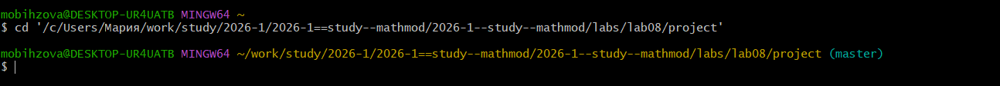{#fig-001 width=70%}

## Подготовка рабочего пространства

{#fig-002 width=70%}

## Подготовка рабочего пространства

{#fig-003 width=70%}

## Подготовка рабочего пространства

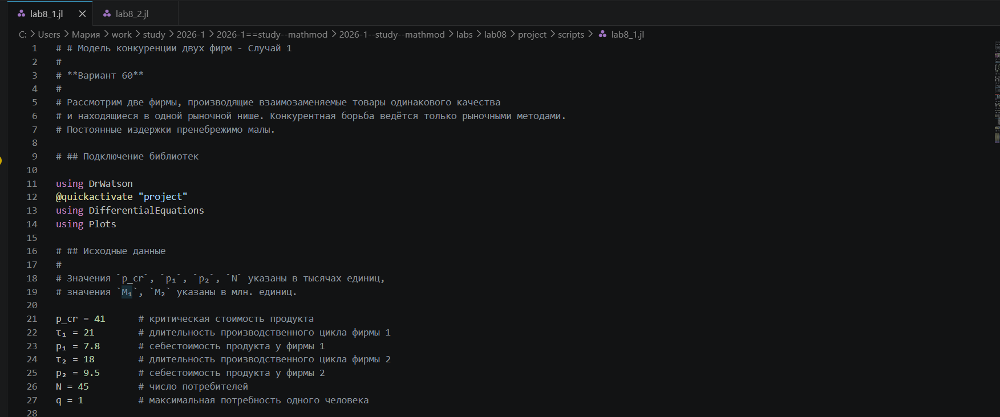{#fig-004 width=70%}

## Подготовка рабочего пространства

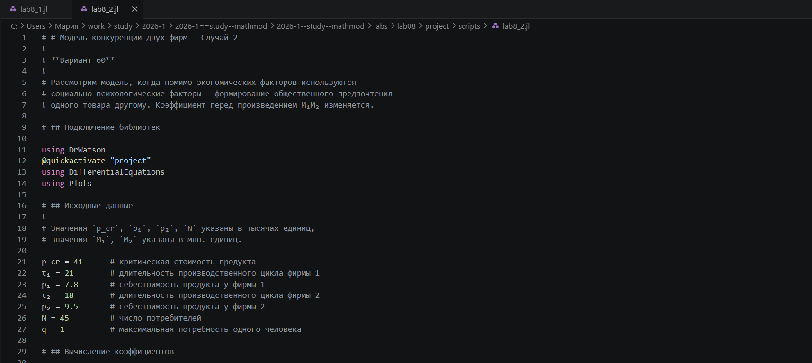{#fig-005 width=70%}

## Моделирование на Julia и получение графиков

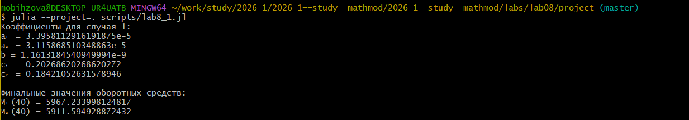{#fig-006 width=70%}

## Моделирование на Julia и получение графиков

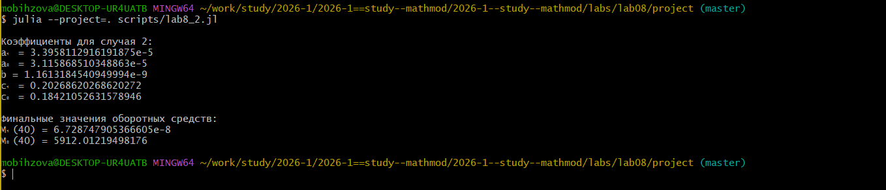{#fig-007 width=70%}

## Моделирование на Julia и получение графиков

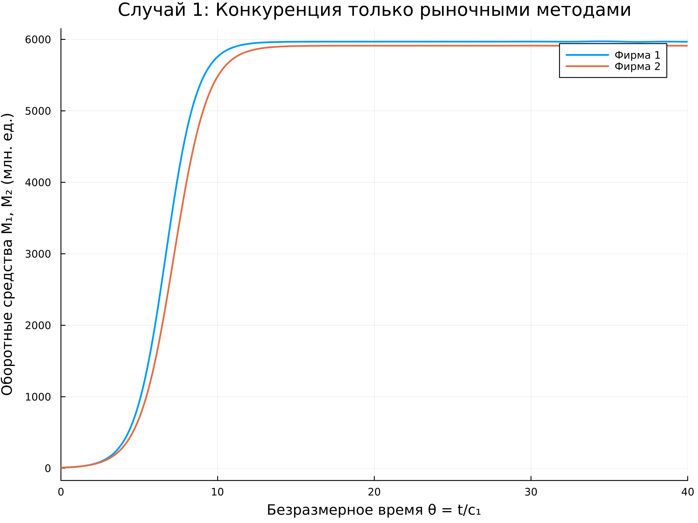{#fig-008 width=70%}

## Моделирование на Julia и получение графиков

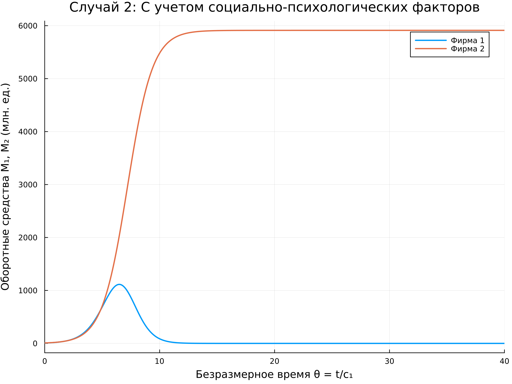{#fig-009 width=70%}

## Генерация отчетных материалов

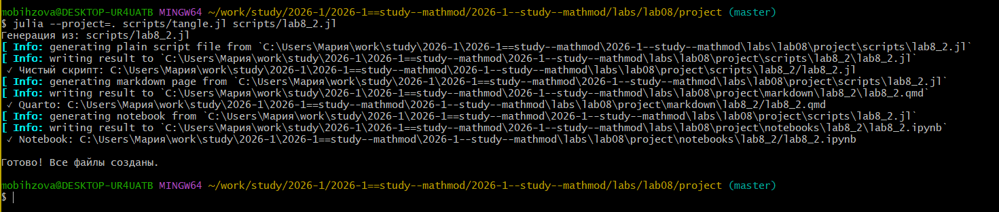{#fig-010 width=70%}

## Генерация отчетных материалов

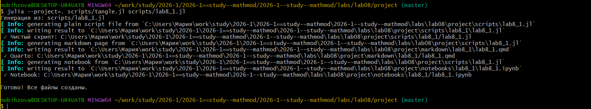{#fig-011 width=70%}

## Реализация в Scilab

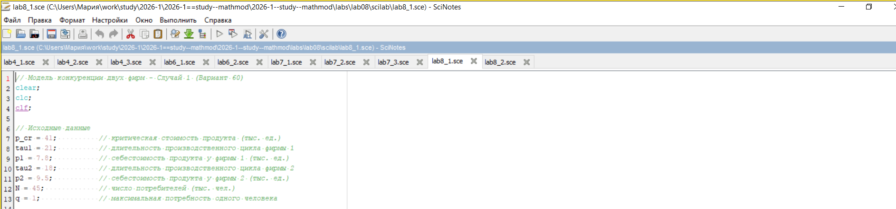{#fig-012 width=70%}

## Реализация в Scilab

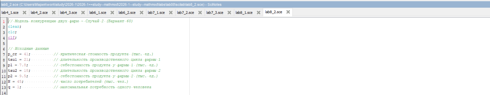{#fig-013 width=70%}

## Реализация в Scilab

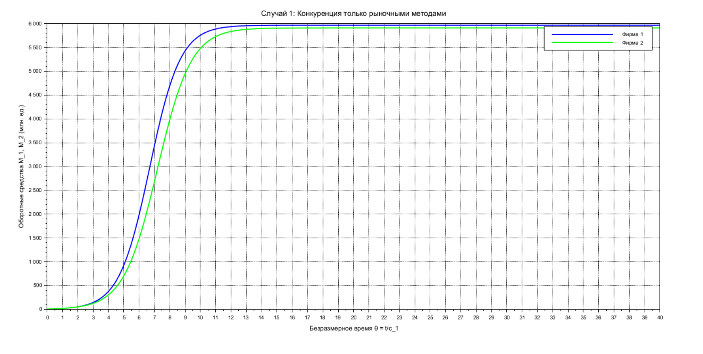{#fig-014 width=70%}

## Реализация в Scilab

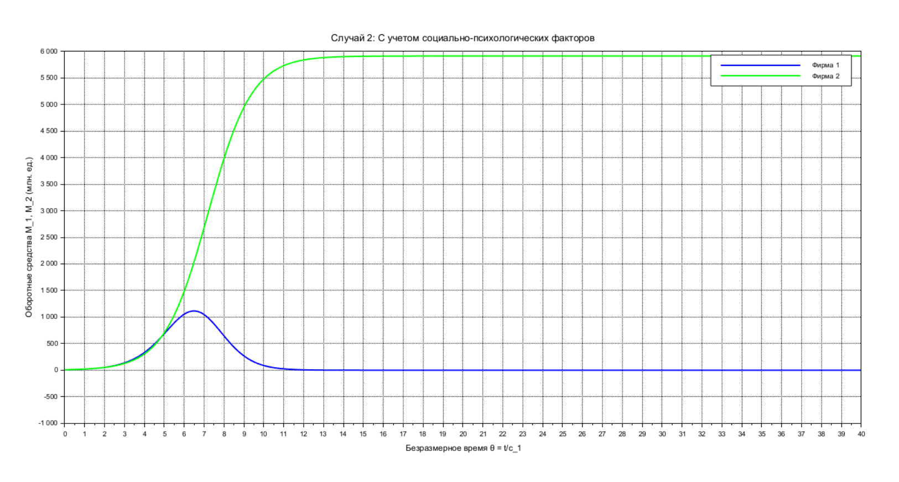{#fig-015 width=70%}

# Выводы

В ходе лабораторной работы для варианта 60 построены графики динамики изменения оборотных средств для двух случаев конкуренции. Для случая 1 (конкуренция только рыночными методами) обе фирмы стабильно функционируют, достигая максимальных значений оборотных средств и захватывая свои части рынка. Для случая 2 (с учетом социально-психологических факторов) первая фирма, несмотря на начальный рост, терпит банкротство, в то время как вторая фирма успешно закрепляется на рынке. Найдено стационарное состояние системы для случая 1: $\tilde{M}_1 \approx 5967.23$ млн. ед., $\tilde{M}_2 \approx 5911.59$ млн. ед. Моделирование успешно выполнено в средах Julia и Scilab с использованием инструментов DrWatson и tangle.jl.

# Список литературы

1. Документация по Julia: https://docs.julialang.org/en/v1/
2. Документация по Scilab: https://www.scilab.org/
3. Королькова, А. В. Математическое моделирование. Практикум / А. В. Королькова, Д. С. Кулябов. — Москва, 2023.
