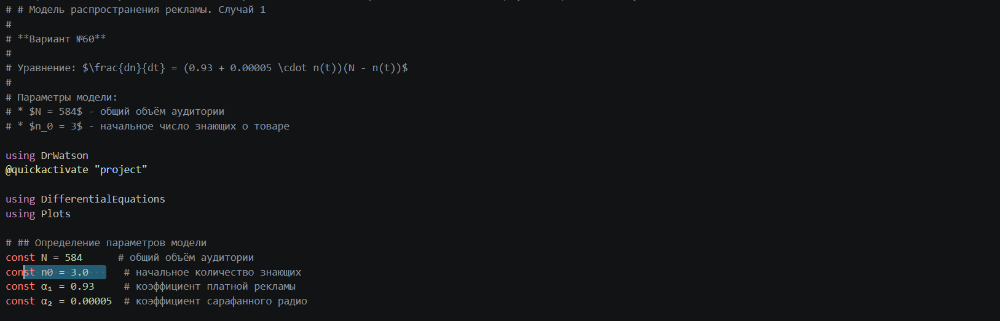
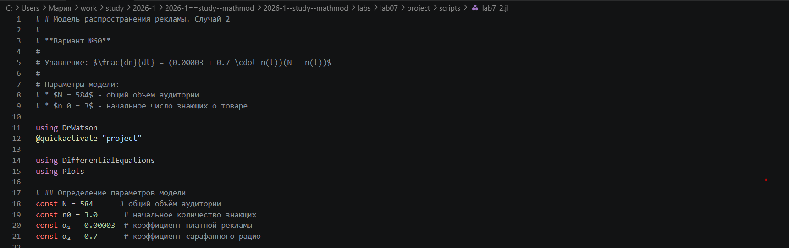
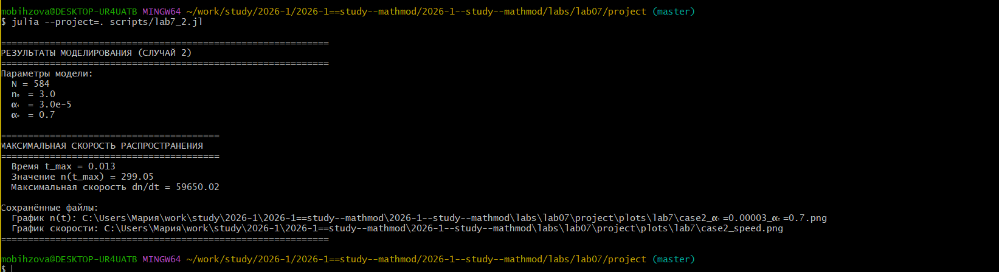
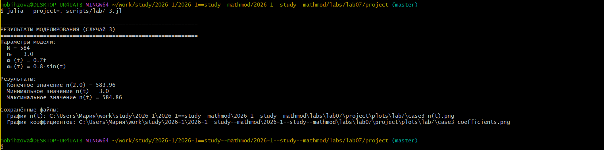
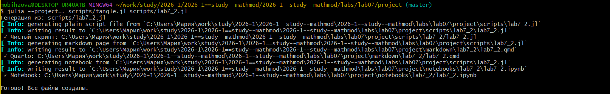
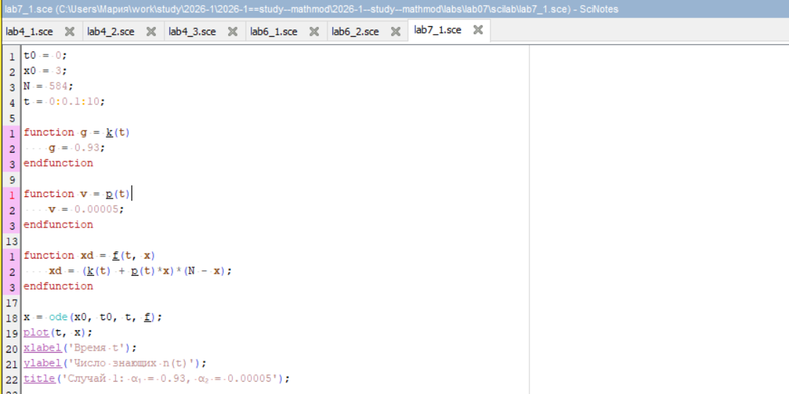
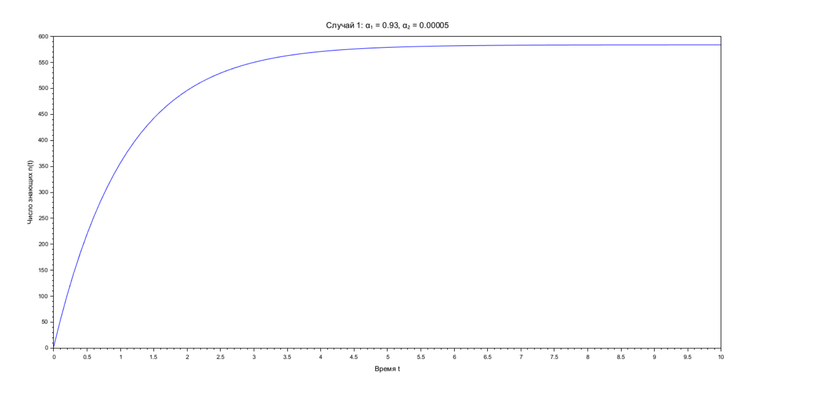

---
## Author
author: Бызова Мария Олеговна, НПИбд-01-23
## Title
title: "Отчёт по лабораторной работе №8"
subtitle: "Математическое моделирование"
license: "CC BY"
---

# Цель работы

Изучить модель конкуренции двух фирм, производящих взаимозаменяемые товары, построить решение системы дифференциальных уравнений для варианта 60, визуализировать динамику изменения оборотных средств для двух случаев конкуренции, а также освоить навыки работы с Julia и Scilab для математического моделирования.

# Задание

Для модели конкуренции двух фирм, описываемой системой дифференциальных уравнений, необходимо выполнить:

1. Построить графики изменения оборотных средств фирмы 1 и фирмы 2 без учета постоянных издержек и с введенной нормировкой для случая 1 (конкуренция только рыночными методами).
2. Построить графики изменения оборотных средств фирмы 1 и фирмы 2 без учета постоянных издержек и с введенной нормировкой для случая 2 (с учетом социально-психологических факторов).
3. Найти стационарное состояние системы для первого случая.

Параметры для варианта 60: 

- $p_{cr} = 41$
- $\tau_1 = 21$
- $\tilde{p}_1 = 7.8$
- $\tau_2 = 18$
- $\tilde{p}_2 = 9.5$
- $N = 45$
- $q = 1$
- $M_{0}^{1} = 7.4$
- $M_{0}^{2} = 8.5$

# Выполнение лабораторной работы

## Подготовка рабочего пространства

Перед началом моделирования была подготовлена структура проекта. Я перешла в директорию с лабораторными работами ([рис. @fig-001]).

{#fig-001 width=70%}

Затем, в среде Julia, я установила пакет DrWatson для управления проектом ([рис. @fig-002]).

{#fig-002 width=70%}

С помощью команды `initialize_project` я создала новый проект с именем "project", указав своё авторство ([рис. @fig-003]).

{#fig-003 width=70%}

После создания проекта я подготовила файлы для написания кода. На [рис. @fig-004] показан код для Julia, описывающий параметры модели и начальные условия для первого случая.

{#fig-004 width=70%}

На [рис. @fig-005] показан код для Julia для случая 2, где учитываются социально-психологические факторы.

{#fig-005 width=70%}

## Моделирование на Julia и получение графиков

После запуска скрипта `lab8_1.jl` в консоли Julia отобразилась информация о коэффициентах для случая 1 и финальных значениях оборотных средств ([рис. @fig-006]).

{#fig-006 width=70%}

Запуск скрипта `lab8_2.jl` для случая 2 вывел в консоль рассчитанные коэффициенты и финальные значения оборотных средств ([рис. @fig-007]).

{#fig-007 width=70%}

На основе полученных решений были построены графики.

**Случай 1: Конкуренция только рыночными методами (график в Julia):**  

На [рис. @fig-008] представлен график изменения оборотных средств фирмы 1 (синий) и фирмы 2 (оранжевый) для случая 1. Обе фирмы достигают своих максимальных значений и остаются на рынке, захватывая свои части рыночной ниши.

{#fig-008 width=70%}

**Случай 2: С учетом социально-психологических факторов (график в Julia):**  

На [рис. @fig-009] представлен график для случая 2. Фирма 1, несмотря на начальный рост, достигает максимума и затем терпит банкротство, в то время как фирма 2 успешно закрепляется на рынке.

{#fig-009 width=70%}

## Генерация отчетных материалов

Для подготовки отчета я использовала инструмент `tangle.jl`, который позволяет конвертировать скрипты с литературным программированием в чистый код и Markdown. Процесс генерации файлов из моих скриптов `lab8_1.jl` и `lab8_2.jl` показан на [рис. @fig-010].

{#fig-010 width=70%}

На [рис. @fig-011] показан процесс генерации для второго скрипта.

{#fig-011 width=70%}

## Реализация в Scilab

Также, для верификации результатов и сравнения, была выполнена реализация модели в среде Scilab. Код для моделирования случая 1 представлен на [рис. @fig-012].

{#fig-012 width=70%}

Код для моделирования случая 2 в Scilab представлен на [рис. @fig-013].

{#fig-013 width=70%}

В результате выполнения скриптов в Scilab были построены графики.

**Случай 1: Конкуренция только рыночными методами (Scilab):**  

На [рис. @fig-014] представлен график изменения оборотных средств для случая 1, построенный в Scilab. Как видно, обе фирмы выходят на стабильные значения.

{#fig-014 width=70%}

**Случай 2: С учетом социально-психологических факторов (Scilab):**  

На [рис. @fig-015] представлен график для случая 2 в Scilab. Фирма 1 (синий) после начального роста банкротится, фирма 2 (зеленый) стабилизируется.

{#fig-015 width=70%}

# Теоретическое обоснование

Модель конкуренции двух фирм описывает взаимодействие двух предприятий, производящих взаимозаменяемые товары одинакового качества и находящихся в одной рыночной нише. В зависимости от условий конкуренции, модель может учитывать только рыночные методы (цена, себестоимость, производственный цикл) или включать социально-психологические факторы (формирование общественного предпочтения).

## Система уравнений для случая 1

Для случая конкуренции только рыночными методами динамика оборотных средств описывается системой:

$$
\begin{cases}
\dfrac{dM_1}{d\theta} = M_1 - \dfrac{b}{c_1} M_1 M_2 - \dfrac{a_1}{c_1} M_1^2 \\[10pt]
\dfrac{dM_2}{d\theta} = \dfrac{c_2}{c_1} M_2 - \dfrac{b}{c_1} M_1 M_2 - \dfrac{a_2}{c_1} M_2^2
\end{cases}
$$

где коэффициенты определяются по формулам:

$$
a_1 = \frac{p_{cr}}{\tau_1^2 \tilde{p}_1^2 N q}, \quad 
a_2 = \frac{p_{cr}}{\tau_2^2 \tilde{p}_2^2 N q}, \quad 
b = \frac{p_{cr}}{\tau_1^2 \tilde{p}_1^2 \tau_2^2 \tilde{p}_2^2 N q}, \quad 
c_1 = \frac{p_{cr} - \tilde{p}_1}{\tau_1 \tilde{p}_1}, \quad 
c_2 = \frac{p_{cr} - \tilde{p}_2}{\tau_2 \tilde{p}_2}
$$

## Система уравнений для случая 2

Для случая с учетом социально-психологических факторов, взаимодействие фирм усиливается, и коэффициент перед $M_1 M_2$ изменяется:

$$
\begin{cases}
\dfrac{dM_1}{d\theta} = M_1 - \left( \dfrac{b}{c_1} + 0.0004 \right) M_1 M_2 - \dfrac{a_1}{c_1} M_1^2 \\[10pt]
\dfrac{dM_2}{d\theta} = \dfrac{c_2}{c_1} M_2 - \dfrac{b}{c_1} M_1 M_2 - \dfrac{a_2}{c_1} M_2^2
\end{cases}
$$

## Стационарное состояние для случая 1

Стационарное состояние системы определяется из условия равенства производных нулю. Для случая 1 стационарные значения $\tilde{M}_1$ и $\tilde{M}_2$ находятся из решения системы алгебраических уравнений:

$$
\begin{cases}
M_1 - \dfrac{b}{c_1} M_1 M_2 - \dfrac{a_1}{c_1} M_1^2 = 0 \\[10pt]
\dfrac{c_2}{c_1} M_2 - \dfrac{b}{c_1} M_1 M_2 - \dfrac{a_2}{c_1} M_2^2 = 0
\end{cases}
$$

Для моего варианта 60 параметры равны:

- $p_{cr} = 41$
- $\tau_1 = 21$
- $\tilde{p}_1 = 7.8$
- $\tau_2 = 18$
- $\tilde{p}_2 = 9.5$
- $N = 45$
- $q = 1$

Рассчитанные коэффициенты:

- $a_1 = 3.3958 \times 10^{-5}$
- $a_2 = 3.1157 \times 10^{-5}$
- $b = 1.1613 \times 10^{-9}$
- $c_1 = 0.2029$
- $c_2 = 0.1842$

Стационарные значения оборотных средств для случая 1:

- $\tilde{M}_1 \approx 5967.23$ млн. ед.
- $\tilde{M}_2 \approx 5911.59$ млн. ед.

# Скрипты

## lab8_1.jl

```Julia
# # Модель конкуренции двух фирм - Случай 1
# 
# **Вариант 60**
# 
# Рассмотрим две фирмы, производящие взаимозаменяемые товары одинакового качества
# и находящиеся в одной рыночной нише. Конкурентная борьба ведётся только рыночными методами.
# Постоянные издержки пренебрежимо малы.

# ## Подключение библиотек

using DrWatson
@quickactivate "project"
using DifferentialEquations
using Plots

# ## Исходные данные
# 
# Значения `p_cr`, `p₁`, `p₂`, `N` указаны в тысячах единиц,
# значения `M₁`, `M₂` указаны в млн. единиц.

p_cr = 41      # критическая стоимость продукта
τ₁ = 21        # длительность производственного цикла фирмы 1
p₁ = 7.8       # себестоимость продукта у фирмы 1
τ₂ = 18        # длительность производственного цикла фирмы 2
p₂ = 9.5       # себестоимость продукта у фирмы 2
N = 45         # число потребителей
q = 1          # максимальная потребность одного человека

# ## Вычисление коэффициентов

a₁ = p_cr / (τ₁^2 * p₁^2 * N * q)
a₂ = p_cr / (τ₂^2 * p₂^2 * N * q)
b = p_cr / (τ₁^2 * p₁^2 * τ₂^2 * p₂^2 * N * q)
c₁ = (p_cr - p₁) / (τ₁ * p₁)
c₂ = (p_cr - p₂) / (τ₂ * p₂)

# ## Система дифференциальных уравнений
# 
# Уравнения для первого случая:
# ```math
# \frac{dM₁}{dθ} = M₁ - \frac{b}{c₁}M₁M₂ - \frac{a₁}{c₁}M₁²
# ```
# ```math
# \frac{dM₂}{dθ} = \frac{c₂}{c₁}M₂ - \frac{b}{c₁}M₁M₂ - \frac{a₂}{c₁}M₂²
# ```

function system!(du, u, p, t)
    M₁, M₂ = u
    du[1] = (c₁/c₁)*M₁ - (a₁/c₁)*M₁^2 - (b/c₁)*M₁*M₂
    du[2] = (c₂/c₁)*M₂ - (a₂/c₁)*M₂^2 - (b/c₁)*M₁*M₂
end

# ## Начальные условия и интервал времени

u₀ = [7.4, 8.5]          # начальные оборотные средства
tspan = (0.0, 40.0)      # интервал времени
prob = ODEProblem(system!, u₀, tspan)

# ## Решение системы

sol = solve(prob, Tsit5(), saveat=0.1)

# ## Визуализация результатов

gr(size=(800, 600), dpi=300)
plot(sol, 
     xlabel="Безразмерное время θ = t/c₁",
     ylabel="Оборотные средства M₁, M₂ (млн. ед.)",
     title="Случай 1: Конкуренция только рыночными методами",
     label=["Фирма 1" "Фирма 2"],
     linewidth=2,
     legend=:topright,
     grid=true)

# Сохранение графика
mkpath("plots/lab8")
savefig("plots/lab8/lab8_julia_case1.png")

# ## Вывод результатов

println("Коэффициенты для случая 1:")
println("a₁ = ", a₁)
println("a₂ = ", a₂)
println("b = ", b)
println("c₁ = ", c₁)
println("c₂ = ", c₂)
println("\nФинальные значения оборотных средств:")
println("M₁(40) = ", sol[end][1])
println("M₂(40) = ", sol[end][2])
```
## lab8_2.jl

```Julia
# # Модель конкуренции двух фирм - Случай 2
# 
# **Вариант 60**
# 
# Рассмотрим модель, когда помимо экономических факторов используются
# социально-психологические факторы — формирование общественного предпочтения
# одного товара другому. Коэффициент перед произведением M₁M₂ изменяется.

# ## Подключение библиотек

using DrWatson
@quickactivate "project"
using DifferentialEquations
using Plots

# ## Исходные данные
# 
# Значения `p_cr`, `p₁`, `p₂`, `N` указаны в тысячах единиц,
# значения `M₁`, `M₂` указаны в млн. единиц.

p_cr = 41      # критическая стоимость продукта
τ₁ = 21        # длительность производственного цикла фирмы 1
p₁ = 7.8       # себестоимость продукта у фирмы 1
τ₂ = 18        # длительность производственного цикла фирмы 2
p₂ = 9.5       # себестоимость продукта у фирмы 2
N = 45         # число потребителей
q = 1          # максимальная потребность одного человека

# ## Вычисление коэффициентов

a₁ = p_cr / (τ₁^2 * p₁^2 * N * q)
a₂ = p_cr / (τ₂^2 * p₂^2 * N * q)
b = p_cr / (τ₁^2 * p₁^2 * τ₂^2 * p₂^2 * N * q)
c₁ = (p_cr - p₁) / (τ₁ * p₁)
c₂ = (p_cr - p₂) / (τ₂ * p₂)

# ## Система дифференциальных уравнений
# 
# Уравнения для второго случая (с изменённым коэффициентом):
# ```math
# \frac{dM₁}{dθ} = M₁ - \left(\frac{b}{c₁} + 0.0004\right)M₁M₂ - \frac{a₁}{c₁}M₁²
# ```
# ```math
# \frac{dM₂}{dθ} = \frac{c₂}{c₁}M₂ - \frac{b}{c₁}M₁M₂ - \frac{a₂}{c₁}M₂²
# ```

function system2!(du, u, p, t)
    M₁, M₂ = u
    du[1] = (c₁/c₁)*M₁ - (a₁/c₁)*M₁^2 - (b/c₁ + 0.0004)*M₁*M₂
    du[2] = (c₂/c₁)*M₂ - (a₂/c₁)*M₂^2 - (b/c₁)*M₁*M₂
end

# ## Начальные условия и интервал времени

u₀ = [7.4, 8.5]          # начальные оборотные средства
tspan = (0.0, 40.0)      # интервал времени
prob = ODEProblem(system2!, u₀, tspan)

# ## Решение системы

sol = solve(prob, Tsit5(), saveat=0.1)

# ## Визуализация результатов

gr(size=(800, 600), dpi=300)
plot(sol, 
     xlabel="Безразмерное время θ = t/c₁",
     ylabel="Оборотные средства M₁, M₂ (млн. ед.)",
     title="Случай 2: С учетом социально-психологических факторов",
     label=["Фирма 1" "Фирма 2"],
     linewidth=2,
     legend=:topright,
     grid=true)

# Сохранение графика
mkpath("plots/lab8")
savefig("plots/lab8/lab8_julia_case2.png")

# ## Вывод результатов

println("\nКоэффициенты для случая 2:")
println("a₁ = ", a₁)
println("a₂ = ", a₂)
println("b = ", b)
println("c₁ = ", c₁)
println("c₂ = ", c₂)
println("\nФинальные значения оборотных средств:")
println("M₁(40) = ", sol[end][1])
println("M₂(40) = ", sol[end][2])
```
## lab8_1.sce

```Scilab
// Модель конкуренции двух фирм - Случай 1 (Вариант 60)
clear;
clc;
clf;

// Исходные данные
p_cr = 41;          // критическая стоимость продукта (тыс. ед.)
tau1 = 21;          // длительность производственного цикла фирмы 1
p1 = 7.8;           // себестоимость продукта у фирмы 1 (тыс. ед.)
tau2 = 18;          // длительность производственного цикла фирмы 2
p2 = 9.5;           // себестоимость продукта у фирмы 2 (тыс. ед.)
N = 45;             // число потребителей (тыс. чел.)
q = 1;              // максимальная потребность одного человека

// Вычисление коэффициентов
a1 = p_cr / (tau1^2 * p1^2 * N * q);
a2 = p_cr / (tau2^2 * p2^2 * N * q);
b = p_cr / (tau1^2 * p1^2 * tau2^2 * p2^2 * N * q);
c1 = (p_cr - p1) / (tau1 * p1);
c2 = (p_cr - p2) / (tau2 * p2);

// Система дифференциальных уравнений
function dx = system1(t, x)
    dx(1) = (c1/c1)*x(1) - (a1/c1)*x(1)^2 - (b/c1)*x(1)*x(2);
    dx(2) = (c2/c1)*x(2) - (a2/c1)*x(2)^2 - (b/c1)*x(1)*x(2);
endfunction

// Начальные условия (в млн. ед.)
x0 = [7.4; 8.5];

// Интервал времени
t0 = 0;
t = [0:0.01:40];

// Решение системы
y = ode(x0, t0, t, system1);

// Построение графика
scf(1);
plot(t, y(1,:), 'b-', 'LineWidth', 2);
plot(t, y(2,:), 'g-', 'LineWidth', 2);
xlabel('Безразмерное время θ = t/c_1');
ylabel('Оборотные средства M_1, M_2 (млн. ед.)');
title('Случай 1: Конкуренция только рыночными методами');
legend('Фирма 1', 'Фирма 2', 'location', 'northeast');
xgrid();
```
## lab8_2.sce

```Scilab
// Модель конкуренции двух фирм - Случай 2 (Вариант 60)
clear;
clc;
clf;

// Исходные данные
p_cr = 41;          // критическая стоимость продукта (тыс. ед.)
tau1 = 21;          // длительность производственного цикла фирмы 1
p1 = 7.8;           // себестоимость продукта у фирмы 1 (тыс. ед.)
tau2 = 18;          // длительность производственного цикла фирмы 2
p2 = 9.5;           // себестоимость продукта у фирмы 2 (тыс. ед.)
N = 45;             // число потребителей (тыс. чел.)
q = 1;              // максимальная потребность одного человека

// Вычисление коэффициентов
a1 = p_cr / (tau1^2 * p1^2 * N * q);
a2 = p_cr / (tau2^2 * p2^2 * N * q);
b = p_cr / (tau1^2 * p1^2 * tau2^2 * p2^2 * N * q);
c1 = (p_cr - p1) / (tau1 * p1);
c2 = (p_cr - p2) / (tau2 * p2);

// Система дифференциальных уравнений с измененным коэффициентом
function dx = system2(t, x)
    dx(1) = (c1/c1)*x(1) - (a1/c1)*x(1)^2 - (b/c1 + 0.0004)*x(1)*x(2);
    dx(2) = (c2/c1)*x(2) - (a2/c1)*x(2)^2 - (b/c1)*x(1)*x(2);
endfunction

// Начальные условия (в млн. ед.)
x0 = [7.4; 8.5];

// Интервал времени
t0 = 0;
t = [0:0.01:40];

// Решение системы
y = ode(x0, t0, t, system2);

// Построение графика
scf(2);
plot(t, y(1,:), 'b-', 'LineWidth', 2);
plot(t, y(2,:), 'g-', 'LineWidth', 2);
xlabel('Безразмерное время θ = t/c_1');
ylabel('Оборотные средства M_1, M_2 (млн. ед.)');
title('Случай 2: С учетом социально-психологических факторов');
legend('Фирма 1', 'Фирма 2', 'location', 'northeast');
xgrid();
```

# Выводы

В ходе лабораторной работы для варианта 60 построены графики динамики изменения оборотных средств для двух случаев конкуренции. 

Для случая 1 (конкуренция только рыночными методами) обе фирмы стабильно функционируют, достигая максимальных значений оборотных средств и захватывая свои части рынка. 

Для случая 2 (с учетом социально-психологических факторов) первая фирма, несмотря на начальный рост, терпит банкротство, в то время как вторая фирма успешно закрепляется на рынке. 

Найдено стационарное состояние системы для случая 1: $\tilde{M}_1 \approx 5967.23$ млн. ед., $\tilde{M}_2 \approx 5911.59$ млн. ед. Моделирование успешно выполнено в средах Julia и Scilab с использованием инструментов DrWatson и tangle.jl.

# Список литературы

1. Документация по Julia: https://docs.julialang.org/en/v1/
2. Документация по Scilab: https://www.scilab.org/
3. Королькова, А. В. Математическое моделирование. Практикум / А. В. Королькова, Д. С. Кулябов. — Москва, 2023.
