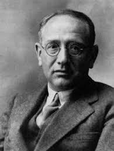
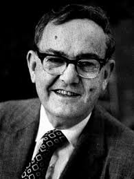
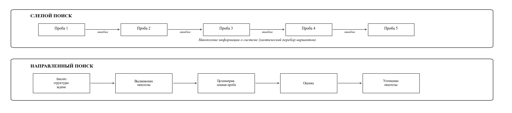
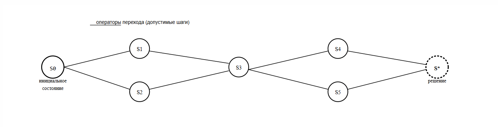
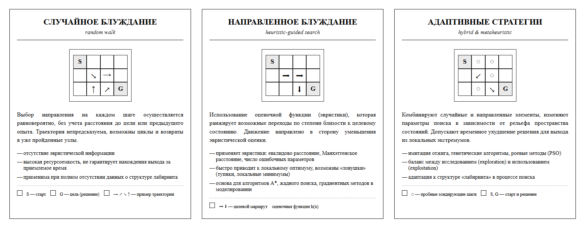
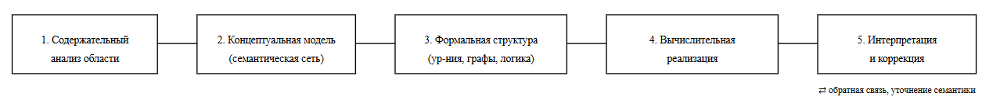

---
## Author
author:
  name: Бызова Мария Олеговна
## Title
title: "Доклад"
subtitle: "Эвристики"
license: "CC BY"
---

# Вводная часть

## Актуальность темы и проблема

Актуальность темы обусловлена необходимостью концептуального переосмысления роли эвристических методов в условиях стремительного развития искусственного интеллекта, когда формальные алгоритмы демонстрируют высокую эффективность в решении строго определенных задач, однако оказываются недостаточными для осуществления постановки проблемы, выбора методологии моделирования и содержательной интерпретации полученных результатов. 

Проблема исследования заключается в противоречии между объективной потребностью в интеграции эвристических подходов в процесс математического моделирования сложных систем и недостаточной формализацией принципов их применения, что затрудняет создание целостной методологии, учитывающей как возможности алгоритмических вычислений, так и уникальные когнитивные способности человека, связанные с выдвижением гипотез и смысловой обработкой информации.

## Объект и предмет исследования

Объектом исследования выступает процесс эвристической деятельности, направленный на поиск оригинального решения задач в рамках математического моделирования. Предметом исследования являются эвристические модели (слепого поиска, лабиринтная, структурно-семантическая), а также функциональное разграничение эвристических действий человека и алгоритмических процедур искусственных интеллектуальных систем на этапах постановки задачи, выбора методов, построения моделей и интерпретации результатов.

## Научная новизна

Научная новизна исследования заключается в систематизации и теоретическом обобщении типов эвристических моделей (слепого поиска, лабиринтной, структурно-семантической) применительно к контексту математического моделирования, что позволяет уточнить их методологический статус в структуре процесса решения задач. В работе впервые проводится комплексный анализ разграничения эвристической деятельности человека и алгоритмических процедур искусственных интеллектуальных систем не как противопоставления, а как взаимодополняющих компонентов единого цикла математического моделирования, выделяя ключевые этапы (постановка задачи, выбор методов, построение моделей, осмысление результатов и принятие решений), на которых эвристический компонент остается принципиально неформализуемым и сохраняет свою определяющую роль.

## Практическая значимость работы

Практическая значимость работы заключается в возможности применения предложенных теоретических положений для оптимизации процесса математического моделирования сложных систем путем обоснованного выбора эвристической модели (слепого поиска, лабиринтной либо структурно-семантической) на этапе проектирования алгоритма решения, что позволяет сократить временные и вычислительные затраты за счет осознанного использования эвристических стратегий. Полученные результаты могут быть использованы в учебном процессе при подготовке специалистов в области прикладной математики и системного анализа для формирования у них компетенций, связанных с постановкой задач, интерпретацией результатов моделирования и принятием решений в условиях неопределенности, а также внедрены в практику научно-исследовательских организаций, занимающихся разработкой гибридных систем, сочетающих эвристические методы человека с вычислительными возможностями искусственного интеллекта.

## Цель, гипотеза, задачи исследования

Цель исследования заключается в теоретическом обосновании роли эвристических моделей в процессе математического моделирования и определении функционального разграничения эвристической деятельности человека и алгоритмических процедур искусственных интеллектуальных систем.

Гипотеза исследования основывается на предположении о том, что эффективность математического моделирования сложных систем достигается при условии интеграции эвристических методов человека (на этапах постановки задачи, выбора методологии и интерпретации результатов) с формальными алгоритмическими процедурами, причем ведущая роль в определении смысловой структуры модели принадлежит эвристическому компоненту.

Задачи исследования

1. Провести анализ существующих типов эвристических моделей (слепого поиска, лабиринтной, структурно-семантической) и определить их применимость в контексте математического моделирования.
2. Выявить и систематизировать функции человека в процессе эвристической деятельности при решении задач моделирования.
3. Обосновать необходимость разграничения эвристических и алгоритмических компонентов в структуре процесса моделирования.
4. Определить методологические принципы интеграции эвристических подходов в практику математического моделирования.

## Материалы и методы и инструменты исследования, теоретическая база

Теоретическая база исследования основывается на фундаментальных работах в области эвристики (Дж. Пойа), теории ограниченной рациональности (Г. Саймон), когнитивной психологии (Д. Канеман, А. Тверски), а также на концепции «адаптивного инструментария» (Г. Гигеренцер). Методологическую основу составляют труды отечественных и зарубежных ученых в области математического моделирования, теории принятия решений и методологии научного познания.

Материалы и методы исследования включают анализ научной литературы по проблеме эвристики и математического моделирования. В работе применены методы теоретического анализа: системный анализ, позволяющий рассматривать процесс моделирования как целостную структуру, включающую эвристические и алгоритмические компоненты; структурно-функциональный метод, направленный на выявление роли каждого типа эвристических моделей; метод классификации и типологизации для систематизации существующих подходов; а также методы синтеза и обобщения, обеспечивающие формулирование выводов о принципах интеграции эвристических методов в практику моделирования.

Инструменты исследования представлены категориально-понятийным аппаратом философии науки, психологии мышления и теории математического моделирования, а также методологическими схемами анализа процесса решения задач.

# Введение

Эвристика как наука, изучающая закономерности творческого мышления в условиях неопределенности, занимает междисциплинарное положение на стыке психологии, философии и кибернетики. В контексте математического моделирования обращение к эвристическим методам приобретает особую значимость, поскольку процесс создания и исследования моделей сложных систем включает этапы, не поддающиеся полной формализации: постановку задачи, выбор методологии, интерпретацию результатов и принятие решений. Стремительное развитие искусственного интеллекта обостряет вопрос о разграничении функций человека и вычислительных систем в процессе моделирования, а также о сохранении уникальной роли эвристического мышления в тех аспектах деятельности, где требуется смысловая обработка информации, выдвижение гипотез и учет контекстуальных факторов.

В рамках настоящего исследования рассматриваются три типа эвристических моделей: модель слепого поиска, опирающаяся на метод проб и ошибок; лабиринтная модель, трактующая процесс решения как блуждание в пространстве состояний; и структурно-семантическая модель, основанная на построении системы взаимосвязанных моделей, отражающих семантические отношения между объектами задачи. Особое внимание уделяется определению сфер эвристической деятельности, остающихся исключительной прерогативой человека: постановка задачи, выбор методов и разработка моделей, выдвижение гипотез, осмысление результатов и принятие решений. Целостное понимание взаимодействия между эвристическими методами человека и формальными процедурами искусственных интеллектуальных систем позволяет повысить эффективность математического моделирования и определить методологические принципы его организации в условиях возрастающей сложности исследуемых объектов и неопределенности исходной информации.

# Эвристика как научная дисциплина: предмет и методы

## Определение эвристики 

Термин «эвристика» происходит от древнегреческого глагола, означающего «находить» или «открывать», и в современной научной литературе трактуется в двух основных значениях: как наука, изучающая закономерности творческого мышления и методы решения проблем, и как совокупность практических приемов, позволяющих находить решения в условиях неопределенности, когда применение строгих алгоритмических процедур невозможно или нецелесообразно [@romanycia1985heuristic].

Эвристика представляет собой прагматичный подход к решению задачи, не являющийся полностью оптимизированным, но позволяющий получить результат, который может быть охарактеризован как «достаточно хороший» [@chow2015many] Принципиальной характеристикой эвристического подхода выступает сознательное игнорирование части доступной информации с целью принятия решений более быстро, экономно и, в ряде случаев, точнее по сравнению со сложными методами. Как отмечает Ш. Чоу, отказ от полноты информации не снижает эффективность, а напротив, повышает ее в условиях неопределенности, когда избыточные данные затрудняют выявление существенных закономерностей.

Эвристическое рассуждение, согласно Дж. Пойа [@polya1945how], основывается на индукции, аналогии, обобщении и специализации. Г. Гигеренцер и В. Гайсмайер уточняют, что эвристики используют механизмы сокращения усилий: рассмотрение меньшего числа признаков, упрощение взвешивания информации и сокращение количества альтернатив. Наиболее фундаментальной эвристикой является метод проб и ошибок, находят применение также визуальные представления, прямой и обратный ход рассуждений и упрощение [@gigerenzer2011heuristic].

Важно подчеркнуть двойственную природу эвристик: будучи адаптивными инструментами, сформированными для эффективного функционирования в условиях ограниченных ресурсов, они в большинстве случаев приводят к ожидаемым результатам, однако могут порождать систематические ошибки, что составляет предмет изучения когнитивной психологии и теории принятия решений.

| Тип эвристики | Определение | Пример в математическом моделировании |
|---------------|-------------|---------------------------------------|
| **Метод проб и ошибок** | Использование последовательного перебора вариантов с коррекцией действий на основе ошибок | Подбор параметров модели итерационными расчетами |
| **Индукция** | Выведение общих закономерностей из частных наблюдений | Обобщение результатов вычислительных экспериментов в эмпирические формулы |
| **Аналогия** | Перенос знаний из одной области в другую на основе сходства признаков | Применение математического аппарата одной физической системы к другой |
| **Обобщение** | Расширение области применения метода от частного к общему | Перенос численного метода с одномерного случая на многомерные задачи |
| **Специализация** | Рассмотрение частного случая общей задачи для упрощения | Исследование линейного приближения нелинейной модели |
| **Упрощение** | Исключение второстепенных факторов для снижения сложности | Линеаризация зависимостей, агрегирование переменных |
| **Визуальное представление** | Использование графических форм для интерпретации задачи | Построение фазовых портретов, геометрическая интерпретация оптимизации |
| **Обратный ход рассуждений** | Движение от желаемого результата к необходимым условиям | Решение обратных задач, параметрическая идентификация |

: Основные типы эвристик и их характеристика {#tbl-std-dir}

**Примечание к таблице:** представленные типы эвристик не являются взаимоисключающими — в реальной практике решения задач они часто применяются в комбинации друг с другом, образуя комплексные эвристические стратегии.

## Исторический контекст

Формирование эвристики как научного направления представляет собой процесс междисциплинарного синтеза, объединившего математическую традицию решения задач, психологию мышления и кибернетический подход к моделированию интеллектуальной деятельности. Истоки эвристического метода восходят к античности: в труде Паппа Александрийского (IV в. н.э.) содержались описания методов анализа и синтеза как эвристических процедур, однако систематическое научное осмысление эвристики начинается лишь в XX столетии [@polya1945how].

Основополагающий вклад в развитие эвристики внес американский математик Джордж Пойа (George Polya) (рис. 1), опубликовавший в 1945 году труд «How to Solve It» («Как решать задачу») [@polya1945how]. Пойа предложил систематизированное описание эвристических методов (анализ и синтез, аналогия, обобщение, движение от цели к условию), акцентировав внимание на правдоподобных операциях, направляющих мысль к открытию. Его работы заложили фундамент для понимания эвристики как дисциплины, изучающей динамику процесса поиска решения.

{#fig:001 width=50%}

Следующий значимый этап связан с именем Герберта Саймона (Herbert Simon) (рис. 2), лауреата Нобелевской премии. В 1950–1960-х годах он ввел концепцию ограниченной рациональности (*bounded rationality*), согласно которой способности человека к обработке информации ограничены когнитивными и временными ресурсами [@simon1955behavioral; @simon1956rational]. Саймон предложил понятие «удовлетворительности» (*satisficing*) — механизма, при котором индивид прекращает поиск, найдя вариант, отвечающий приемлемому уровню требований [@simon1955behavioral]. Его работы заложили основы для моделирования эвристических процессов в искусственных интеллектуальных системах.

{#fig:002 width=50%}

Качественно новое направление открыли в 1970–1980-х годах психологи Дэниел Канеман (Daniel Kahneman) и Амос Тверски (Amos Tversky) [@kahneman1973availability; @tversky1974judgment] (рис. 3). В рамках программы «эвристики и смещения» (*heuristics and biases*) они выделили три типа когнитивных эвристик: доступности (оценка вероятности по легкости воспоминания), репрезентативности (оценка по степени сходства с типичным представителем) и привязки и корректировки (непропорциональное влияние исходной информации). Исследования показали, что эвристики — не дефекты мышления, а адаптивные механизмы, эффективные в большинстве ситуаций.

{#fig:003 width=70%}

Совокупность трех исследовательских традиций — математической (Пойа), кибернетико-экономической (Саймон) и когнитивно-психологической (Канеман и Тверски) — сформировала современное понимание эвристики как междисциплинарной области знания. Эвристика предстает как синтетическая дисциплина, интегрирующая достижения математики, психологии, экономики, кибернетики и философии науки, что обусловливает ее методологическую значимость для математического моделирования, теории принятия решений и проектирования искусственного интеллекта.

# Типы эвристических моделей в процессе решения задач

В рамках настоящего исследования рассматриваются три типа эвристических моделей, различающихся по способу организации поиска решения и степени структурированности этого процесса: модель слепого поиска, лабиринтная модель и структурно-семантическая модель. Каждая из них отражает определенный подход к преодолению неопределенности, характерной для задач, не имеющих заранее известного алгоритмического решения, и может быть интерпретирована с позиций математического моделирования как способ организации вычислительного или мыслительного процесса. Последовательный анализ этих моделей позволяет выявить их методологическую специфику, условия применимости и потенциальные ограничения, что составляет необходимое основание для обоснованного выбора эвристической стратегии в практике построения и исследования математических моделей сложных систем.

| Тип модели | Основной принцип | Ключевой вопрос | Характер эвристики |
|------------|------------------|-----------------|--------------------|
| Модель слепого поиска | Перебор вариантов, метод проб и ошибок | Как перебирать варианты? | Правила отсечения, возвраты |
| Лабиринтная модель | Навигация в пространстве состояний | Как ориентироваться в пространстве? | Оценочные функции, метаэвристики |
| Структурно-семантическая модель | Выявление смысловых связей, иерархия моделей | Что именно мы ищем? Каковы критерии осмысленности? | Семантические сети, онтологии, аналогии, изоморфизмы |

: Сопоставление эвристических моделей {#tbl-std-met}

## Модель слепого поиска (метод проб и ошибок)

Модель слепого поиска представляет собой наиболее фундаментальный тип эвристической стратегии, в основе которой лежит метод проб и ошибок (*trial and error*) [@romanycia1985heuristic]. Данная модель не предполагает наличия у субъекта предварительной информации о структуре решаемой задачи или о способах достижения искомого результата. Процесс поиска строится по принципу последовательного выдвижения и проверки гипотетических решений, каждое из которых либо приближает к цели, либо позволяет исключить неперспективные направления. При этом результат каждой пробы служит основанием для коррекции последующих действий, что обеспечивает постепенное накопление информации о свойствах проблемной области (рис. 4)

{#fig:004 width=100%}

Характерной особенностью модели слепого поиска является отсутствие целенаправленной стратегии выбора очередного действия — пробы могут осуществляться хаотично, по принципу «от противного» или на основе простейших эвристик упорядочивания. В математическом моделировании данный подход находит применение в ситуациях, когда аналитическое решение отсутствует, а вычислительный эксперимент выступает единственным доступным инструментом исследования. Классическими примерами служат подбор начальных приближений в итерационных методах, калибровка эмпирических коэффициентов моделей, поиск областей сходимости численных схем, а также решение обратных задач, где прямое построение модели затруднено неполнотой или зашумленностью исходных данных.

Метод проб и ошибок обладает очевидными ограничениями, связанными с ресурсоемкостью и отсутствием гарантий нахождения решения. Однако его ценность заключается в универсальности: применимость не зависит от специфики задачи, а сам процесс поиска позволяет выявить скрытые свойства моделируемой системы. В сочетании с другими эвристическими стратегиями (например, с введением критериев остановки или использованием результатов предыдущих проб для направленного сужения области поиска) модель слепого поиска трансформируется в более эффективные адаптивные процедуры, сохраняя при этом свою методологическую основу — обучение на ошибках как источник нового знания о структуре задачи.

Характерные примеры использования:

* Подбор коэффициентов в дифференциальных уравнениях
* Калибровка имитационных моделей
* Поиск области сходимости численных методов 
* Настройка гиперпараметров нейронных сетей
* Решение обратных задач геофизики 

## Лабиринтная модель

Лабиринтная модель представляет собой один из фундаментальных типов эвристических моделей, в рамках которого решаемая задача интерпретируется как лабиринт — сложное пространство возможных состояний, а процесс поиска решения — как блуждание по этому лабиринту [@gigerenzer1999simple]. Данная метафора позволяет формализовать процесс решения задачи в терминах теории графов и поиска в пространстве состояний, где каждому возможному варианту развития ситуации соответствует определенная точка (узел) пространства, а переходы между состояниями задаются допустимыми операциями или шагами решения. Целевое состояние (выход из лабиринта) соответствует искомому решению задачи, а траектория движения представляет собой последовательность промежуточных результатов, ведущих от исходных данных к конечному результату (рис. 5)

{#fig:005 width=100%}

В контексте математического моделирования лабиринтная модель приобретает особое методологическое значение, поскольку позволяет структурировать процесс поиска решения как последовательный переход между различными состояниями моделируемой системы. Пространство состояний при этом может быть как дискретным (например, комбинаторные конфигурации, наборы значений дискретных параметров), так и непрерывным (многомерное пространство варьируемых параметров), а переходы между состояниями задаются операторами преобразования, соответствующими допустимым изменениям параметров или структуры модели. Ключевая особенность лабиринтной модели заключается в том, что она не предполагает априорного знания оптимального маршрута — исследователь или вычислительный алгоритм вынуждены осуществлять навигацию по пространству состояний, используя эвристические ориентиры для выбора направления движения/

Характерной чертой лабиринтной модели является возможность использования различных стратегий блуждания, которые различаются по степени целенаправленности и объему используемой информации о структуре лабиринта. Простейшим вариантом выступает случайное блуждание, при котором выбор очередного перехода осуществляется без учета удаленности от цели — такая стратегия соответствует методу слепого поиска, но помещенному в структурированное пространство. Более эффективными являются направленные стратегии, использующие эвристические функции оценки (оценочные функции), которые позволяют ранжировать возможные переходы по степени их перспективности. В математическом моделировании такие оценочные функции могут строиться на основе значений целевого функционала, близости к известным решениям, соблюдении ограничений или иных критериях, отражающих содержательную специфику задачи (рис. 6).

{#fig:006 width=100%}

Особое значение лабиринтная модель приобретает при решении многомерных оптимизационных задач, где пространство параметров модели образует сложный рельеф с множеством локальных экстремумов. В этом случае процесс поиска решения интерпретируется как движение по многомерному лабиринту, где высота «стен» определяется значениями целевой функции и ограничениями модели. Эвристические методы оптимизации — такие как градиентный спуск, метод имитации отжига, генетические алгоритмы и роевые методы — могут быть рассмотрены как различные стратегии блуждания по лабиринту пространства параметров, каждая из которых предлагает свой способ преодоления локальных препятствий и выбора направления движения к глобальному оптимуму.

| Метод / Алгоритм | Интерпретация в лабиринтной модели | Способ преодоления локальных препятствий |
|------------------|-----------------------------------|------------------------------------------|
| Градиентный спуск | Движение в направлении наискорейшего убывания целевой функции (локальный рельеф) | Выбор шага на основе производных, возможен застой в локальных экстремумах |
| Метод имитации отжига | Стохастическое блуждание с вероятностью принятия ухудшающих решений, снижаемой по мере «охлаждения» | Вероятностные переходы через «стены» на начальных этапах |
| Генетические алгоритмы | Популяция агентов, пересекающих лабиринт; операторы кроссовера и мутации исследуют новые области пространства | Комбинаторный обмен признаками, сохранение разнообразия |
| Роевые методы (PSO) | Коллективное блуждание с обменом информацией о лучших найденных позициях | Баланс когнитивной и социальной компонент, выход из локальных зон |

: Эвристические методы оптимизации как навигация в лабиринте параметров {#tbl-std-lab}

В практике математического моделирования лабиринтная модель находит применение в широком спектре задач. К ним относятся: поиск оптимальных решений в задачах линейного и нелинейного программирования, где пространство допустимых планов образует многомерный лабиринт ограничений; задачи маршрутизации и управления, где необходимо найти последовательность управляющих воздействий, переводящих систему из начального состояния в целевое; задачи распознавания образов и классификации, где пространство признаков может быть структурировано как лабиринт с областями, соответствующими различным классам; а также задачи автоматического проектирования, где требуется осуществить перебор комбинаторных конфигураций, удовлетворяющих заданным техническим требованиям.

Следует отметить, что эффективность применения лабиринтной модели в значительной степени зависит от способности исследователя адекватно формализовать пространство состояний и выбрать эвристическую стратегию навигации, соответствующую структуре конкретной задачи. Как и в реальном лабиринте, успешность поиска решения определяется не только интенсивностью перебора, но и качеством ориентиров, позволяющих отличать перспективные направления от тупиковых. В этом контексте лабиринтная модель служит не столько инструментом формального описания, сколько эвристической рамкой, организующей мыслительный и вычислительный процесс и позволяющей применить накопленный опыт решения сходных задач для навигации в новых, еще не исследованных пространствах.

## Структурно-семантическая модель

Структурно-семантическая модель представляет собой наиболее сложный тип эвристических моделей, в основе которого лежит принцип построения системы взаимосвязанных моделей, отражающих семантические (смысловые) отношения между объектами задачи [@gigerenzer2002bounded]. В отличие от модели слепого поиска и лабиринтной модели, она ориентирована не на перебор вариантов, а на выявление и организацию смысловых связей между элементами проблемной области. Ключевая идея заключается в том, что решение достигается через построение такой репрезентации предметной области, в которой существенные отношения между объектами становятся явными и могут быть использованы для вывода нового знания.

В контексте математического моделирования структурно-семантическая модель позволяет преодолеть ограничения формальных подходов, ориентированных исключительно на вычислительные процедуры. Математическая модель в рамках данного подхода не сводится к набору уравнений или алгоритмов, а представляет собой иерархическую структуру — от физической интерпретации явления до формального аппарата и вычислительной реализации. Семантические отношения (причинно-следственные связи, отношения подчинения, функциональные зависимости, изоморфизмы) выступают в качестве эвристических ориентиров, направляющих процесс построения и исследования модели (рис. 7).

{#fig:007 width=100%}

Фундаментальным принципом является построение системы моделей, каждая из которых фиксирует определенный аспект изучаемой реальности. Модели не существуют изолированно, а образуют взаимосвязанную систему, в которой семантические отношения исходной задачи транслируются в отношения между элементами различных модельных представлений. При моделировании физического процесса могут быть построены: концептуальная модель (существенные факторы и допущения); математическая модель (дифференциальные уравнения); численная модель (вычислительный алгоритм); интерпретационная модель (осмысление результатов). Связи между ними носят семантический характер, отражая содержательное соответствие между различными способами описания одного объекта.

Структурно-семантическая модель применяется в задачах, требующих глубинного понимания структуры явления: построение имитационных моделей социально-экономических и экологических систем; концептуальное проектирование технических систем; анализ междисциплинарных проблем; задачи экспертного прогнозирования и принятия решений.

Важной особенностью модели является ориентация на содержательную интерпретацию. В отличие от формальных подходов, оперирующих символами, структурно-семантическая модель требует постоянного соотнесения формальных конструкций с предметным содержанием. Это выражается в семантическом ранжировании факторов, построении концептуальных графов и онтологий, выявлении изоморфизмов, использовании метафор и аналогий.

Реализация подхода предполагает последовательные этапы: содержательный анализ проблемной области и выделение ключевых объектов; построение концептуальной модели (семантической сети); трансляция концептуальной модели в формальную математическую структуру; вычислительная реализация и интерпретация результатов как активный процесс соотнесения данных с исходной концептуальной схемой и ее коррекции.

Структурно-семантическая модель не противопоставляется модели слепого поиска и лабиринтной модели, а дополняет их, задавая смысловую рамку для организации поисковой деятельности. Если модель слепого поиска отвечает на вопрос «как перебирать варианты», а лабиринтная — «как ориентироваться в пространстве состояний», то структурно-семантическая отвечает на вопрос «как понять, что мы ищем и каковы критерии осмысленности результата». Именно способность к смысловой организации проблемной области составляет специфику человеческой эвристической деятельности и отличает ее от формальных алгоритмических процедур, не обладающих механизмами содержательной интерпретации и целеполагания.

# Разграничение человеческой эвристики и искусственного интеллекта

## Уникальность эвристической деятельности человека

Уникальность эвристической деятельности человека обусловлена его способностью функционировать в условиях принципиальной неопределенности и ограниченной рациональности (*bounded rationality*), что отличает его от формальных алгоритмических систем [@simon1955behavioral; @simon1956rational]. В отличие от искусственного интеллекта, оперирующего заданными правилами в рамках четко определенного пространства состояний, человек обладает способностью к смыслообразованию, целеполаганию и контекстуальной интерпретации информации, что позволяет ему находить решения там, где формальные алгоритмы бессильны.

Фундаментальным отличием человеческой эвристики является способность работать с неполной, противоречивой и качественно разнородной информацией в ситуациях, где задача еще не сформулирована, критерии успеха не определены, а исходные данные носят экспертный характер. Эта способность опирается на ассоциативное мышление, метафорический перенос знаний и интуитивное схватывание структуры проблемы.

Важнейшим аспектом является феномен ограниченной рациональности, введенный Гербертом Саймоном [@simon1955behavioral]. Реальный человек, в отличие от модели «экономического человека», сталкивается с когнитивными ограничениями (объем памяти, скорость обработки, время принятия решений). Эвристики выступают не как «дефекты» мышления, а как адаптивные механизмы, позволяющие искать не недостижимый оптимум, а «достаточно хорошее» (*satisficing*) решение [@simon1955behavioral].

Способность к эвристической деятельности также связана с включенностью в культурный контекст. Накопленный опыт формирует «адаптивный инструментарий» (*adaptive toolbox*) — набор эвристических стратегий, которые человек усваивает и применяет в зависимости от контекста. Как показывают исследования Г. Гигеренцера, эти стратегии подбираются в соответствии с экологической рациональностью — соответствием структуры эвристики структуре среды [@gigerenzer1999simple; @gigerenzer2002bounded].

Принципиальным отличием является наличие субъективной смысловой позиции: человек решает задачу «для чего-то», руководствуясь ценностями и мотивами, что позволяет ему осуществлять эвристические «озарения» (*insight*) — скачкообразное схватывание решения, не выводимое логически из предшествующих шагов. Наконец, важнейшим компонентом выступает способность к рефлексии и самооценке — «мышление о мышлении», позволяющее контролировать процесс решения, корректировать стратегии и извлекать уроки из ошибок.

Уникальность эвристической деятельности человека определяется комплексом факторов: способностью функционировать в условиях неопределенности и ограниченной рациональности; использованием контекстуально-зависимых стратегий; включенностью в культурно-исторический опыт; наличием субъективной смысловой позиции; рефлексивным контролем. Эти характеристики не могут быть полностью воспроизведены в искусственных интеллектуальных системах, что сохраняет за человеком ключевую роль в деятельности, требующей понимания, интерпретации и ценностного выбора.

## Ключевые функции человека в цикле математического моделирования

Математическое моделирование представляет собой циклический процесс, в котором эвристическая деятельность человека выступает системообразующим фактором. Ключевые функции — постановка задачи, выбор методологии и интерпретация результатов — остаются исключительной прерогативой человека, поскольку требуют понимания, смысловой оценки и ценностного выбора.

Постановка задачи является первым этапом, на котором человек осуществляет переход от реальной проблемы к формальной постановке [@gigerenzer2002bounded]. Этап включает три функции. Первая — формулировка целей: человек определяет, для чего создается модель, какие вопросы должны быть на нее получены ответы и какой уровень детализации достаточен. В отличие от алгоритмических систем, человек способен к самостоятельному целеполаганию. Вторая — выделение существенных факторов: из многообразия свойств объекта человек отбирает определяющие, сознательно отвлекаясь от второстепенных. Эта процедура идеализации требует глубокого понимания предметной области. Третья — упрощение реальности: человек вводит допущения (линейность, стационарность, однородность), делающие задачу математически разрешимой, но не искажающие ее сущностных характеристик. Без этого этапа модель оказывается либо бессмысленной, либо неразрешимой.

Выбор методов и построение моделей представляет собой эвристический этап, на котором человек определяет инструментарий, адекватный задаче. Выбор между аналитическими, численными и имитационными методами не может быть осуществлен на основе строгих алгоритмов. Аналитические методы предпочтительны, но их применимость ограничена. Численные методы требуют решений о дискретизации, шаге интегрирования, критериях сходимости — решений, опирающихся на опыт и интуицию. Имитационное моделирование требует решений о степени детализации и агрегации результатов. Сам выбор типа модели (детерминированная или стохастическая, непрерывная или дискретная) представляет собой эвристический акт, основанный на понимании природы явления и накопленном опыте.

Осмысление результатов и принятие решений завершает цикл моделирования. Полученные результаты не имеют значения вне контекста интерпретации — эвристической процедуры перевода формальных выкладок в содержательные утверждения. Человек осуществляет проверку модели на адекватность, включающую формальные процедуры (верификация, валидация) и неформализуемые операции: оценку соответствия физическому смыслу, ожидаемым закономерностям и экспертным представлениям. Интерпретация — активный процесс смыслопорождения, выявления скрытых зависимостей и формулирования качественных выводов. Принятие решений осуществляется в условиях принципиальной неполноты информации: человек, в отличие от алгоритмической системы, способен учитывать риск, взвешивать последствия и принимать решения, опираясь на интуицию, экспертный опыт и ценностные ориентации.

Три рассмотренные функции образуют эвристическое ядро цикла математического моделирования. Они не могут быть полностью автоматизированы, поскольку требуют целеполагания, контекстуальной оценки, смысловой интерпретации и ответственного выбора в условиях неопределенности. Именно эти функции сохраняют за человеком определяющую роль в процессе математического моделирования, где искусственный интеллект выступает инструментом, расширяющим возможности, но не заменяющим понимание.

# Эвристические стратегии и их значение для моделирования

В современной теории эвристики выделяется широкий спектр когнитивных стратегий, которые человек использует для решения сложных задач в условиях ограниченного времени и неполной информации. Данные стратегии, получившие в исследовательской традиции наименование «адаптивного инструментария» (*adaptive toolbox*), представляют собой не произвольные умственные методы, а эволюционно и культурно сформированные механизмы, эффективность которых обусловлена их соответствием структуре решаемой задачи — принцип, известный как экологическая рациональность. В контексте математического моделирования обращение к эвристическим стратегиям приобретает особое значение, поскольку они позволяют исследователю не только компенсировать ограниченность вычислительных ресурсов и неполноту исходных данных, но и осуществлять содержательное структурирование проблемной области, выделяя в ней ключевые факторы и отношения, подлежащие формализации. Анализ конкретных типов эвристик — таких как эвристика узнавания, эвристика «бери лучшее» (*take-the-best*) и принцип удовлетворительности (*satisficing*) — позволяет выявить те механизмы, посредством которых человек преобразует неопределенность в знание и осуществляет переход от качественного понимания задачи к ее количественному описанию, что составляет сущность математического моделирования как особого вида эвристической деятельности.

## «Адаптивный инструментарий» (Adaptive Toolbox)

Концепция адаптивного инструментария, разработанная Гердом Гигеренцером (рис. 8) и его коллегами, предлагает принципиально иной взгляд на природу эвристик, трактуя их не как источник систематических ошибок, а как эволюционно сформированные механизмы, эффективность которых обусловлена их простотой и экономностью [@gigerenzer1999simple; @gigerenzer2002bounded]. Согласно данному подходу, человек располагает не одной универсальной стратегией принятия решений, а целым набором специализированных эвристик, выбор которых определяется структурой окружающей среды — принцип, получивший название экологической рациональности (*ecological rationality*).

{#fig:008 width=50%}

Центральным понятием выступают «быстрые и экономные эвристики» (*fast and frugal heuristics*), характеризующиеся тремя свойствами: они быстры (требуют минимального времени), экономны (используют лишь часть доступной информации) и просты (основаны на простых правилах поиска, остановки и принятия решения) [@gigerenzer1999simple]. Классическим примером служит эвристика узнавания: если из двух альтернатив узнаваема только одна, человек делает вывод, что она имеет более высокое значение по интересующему критерию [@goldstein2002recognition]. Фундаментальным открытием в рамках данной концепции стал феномен «меньше — значит больше» (*less-is-more effect*): в условиях неопределенности простые эвристики, игнорирующие часть данных, могут превосходить по точности сложные статистические модели, что объясняется соотношением смещения и дисперсии (*bias-variance tradeoff*) [@gigerenzer2009homo].

В контексте математического моделирования концепция адаптивного инструментария обосновывает использование упрощенных, но робастных методов в ситуациях, где точные данные недоступны. Выбор модели с минимальным числом параметров (бритва Оккама), применение асимптотических приближений и линеаризации, использование агрегированных показателей вместо детализированного учета всех факторов — все эти практики находят теоретическое обоснование в принципах «быстрых и экономных» эвристик. Ключевым выводом является утверждение о том, что отказ от полноты информации и вычислительной сложности не является недостатком, а представляет собой рациональную стратегию, эффективность которой в условиях неопределенности может превосходить сложные методы, обеспечивая устойчивость результатов и надежность прогнозов.

## Примеры эвристик в моделировании

Применение эвристических стратегий в математическом моделировании позволяет исследователю эффективно действовать в условиях неопределенности, ограниченных ресурсов и неполноты исходных данных. Ниже рассматриваются три эвристики, выделенные в рамках концепции адаптивного инструментария, которые находят непосредственное приложение в практике построения и исследования моделей.

Эвристика узнавания (Recognition heuristic). Данная эвристика, формализованная Д. Гольдштейном (рис. 9) и Г. Гигеренцером, гласит: если из двух альтернатив одна узнаваема, а другая нет, то узнаваемая альтернатива имеет более высокое значение по интересующему критерию [@goldstein2002recognition]. В математическом моделировании эта эвристика проявляется в выборе знакомой структуры модели в ситуациях, когда отсутствуют достаточные данные для построения сложной или специализированной модели. Исследователь, сталкиваясь с новой задачей, часто обращается к апробированным, хорошо изученным математическим структурам (линейные модели, экспоненциальные зависимости, дифференциальные уравнения определенного типа), даже если они не идеально соответствуют природе изучаемого явления. Такой выбор обоснован тем, что свойства знакомой модели известны, методы ее исследования разработаны, а интерпретация результатов опирается на накопленный опыт. Например, при моделировании динамики популяции или распространения инноваций исследователь, даже не имея точных данных о механизмах взаимодействия, часто выбирает логистическое уравнение — не потому, что оно доказанно адекватно описывает процесс, а потому, что его поведение хорошо изучено, а параметры поддаются содержательной интерпретации. Эвристика узнавания позволяет сократить время на разработку модели и снизить риски, связанные с использованием непроверенных математических конструкций.

Satisficing (удовлетворительность). Термин, введенный Гербертом Саймоном, обозначает стратегию, при которой человек ищет не оптимальное, а «достаточно хорошее» решение, отвечающее некоторому приемлемому уровню требований [@simon1955behavioral]. В математическом моделировании эта эвристика является доминирующей в широком классе практических задач, особенно в технико-экономическом моделировании, где стремление к глобальному оптимуму либо невозможно в силу вычислительной сложности, либо нецелесообразно из-за высокой чувствительности решения к неточностям исходных данных. Принцип satisficing реализуется, когда исследователь задает пороговые значения критериев качества модели (допустимую погрешность, уровень доверия) и прекращает дальнейшее уточнение после их достижения. В многокритериальной оптимизации это проявляется в поиске не единственного «идеального» решения, а области компромиссов, в которой все критерии находятся в приемлемых границах. В имитационном моделировании — в использовании агрегированных показателей вместо детализированного учета всех факторов, если агрегирование не выводит результаты за пределы требуемой точности. Важно подчеркнуть, что удовлетворительность не является уступкой ограниченности, а представляет собой рациональную стратегию в условиях, где цена достижения оптимума превышает выгоду от его получения.

Эвристика «бери лучшее» (Take-the-best). Данная эвристика, разработанная Г. Гигеренцером и Д. Гольдштейном (рис. 9), представляет собой правило принятия решений, основанное на ранжировании признаков по их валидности (прогностической силе) и выборе по первому же признаку, позволяющему различить альтернативы [@gigerenzer1999simple]. В математическом моделировании эта эвристика находит применение при построении регрессионных моделей, факторном анализе и отборе переменных. Вместо того чтобы включать в модель все потенциально значимые факторы и оценивать их веса (что требует большого объема данных и чревато переобучением), исследователь ранжирует факторы по их предполагаемому влиянию на результат и последовательно вводит их в модель, останавливаясь, когда достигнуто приемлемое качество аппроксимации. Эвристика «бери лучшее» обосновывает практику использования моделей с небольшим числом предикторов, которые зачастую демонстрируют не меньшую, а иногда и большую прогностическую способность по сравнению со сложными многофакторными моделями. В инженерном моделировании это проявляется в выделении доминирующих факторов (например, при расчете конструкций на прочность учет только основных нагрузок), а в экономико-математическом моделировании — в использовании ограниченного набора индикаторов для прогнозирования вместо построения сложных эконометрических систем.

{#fig:008 width=50%}

Приведенные примеры демонстрируют, что эвристические стратегии не являются «упрощенчеством» или отступлением от строгости, а представляют собой методологически обоснованные подходы, эффективность которых подтверждается как теоретическими исследованиями, так и практикой моделирования. Каждая из рассмотренных эвристик — узнавание, удовлетворительность, ранжирование по важности — отражает фундаментальный принцип: ограничение сложности является не недостатком, а условием устойчивости и применимости модели в условиях неопределенности. В этом контексте искусство математического моделирования состоит в умении осознанно применять эти эвристики, выбирая для каждой задачи тот уровень упрощения, который сохраняет существенные свойства системы, отсекая то, что не влияет на ответы на поставленные вопросы.

# Выводы

Проведенное исследование позволяет сформулировать следующие выводы. Эвристика как научная дисциплина представляет собой междисциплинарную область, интегрирующую достижения математики, психологии и теории принятия решений, что обусловливает ее методологическую значимость для математического моделирования. Анализ трех типов эвристических моделей — слепого поиска, лабиринтной и структурно-семантической — показывает, что именно последняя наиболее адекватно отражает творческий характер человеческой деятельности, поскольку ориентирована на построение системы взаимосвязанных моделей, отражающих смысловые отношения между объектами задачи. Установлено, что ключевые функции в цикле математического моделирования (постановка задачи, выбор методов, построение моделей, осмысление результатов и принятие решений) остаются исключительной прерогативой человека, так как требуют способности к целеполаганию, контекстуальной оценке и смысловой интерпретации, что принципиально отличает человеческую эвристику от формальных алгоритмических процедур. Концепция адаптивного инструментария и выделенные в ее рамках эвристические стратегии (узнавание, удовлетворительность, «бери лучшее») обосновывают использование в моделировании упрощенных, но робастных методов, демонстрируя, что в условиях неопределенности отказ от избыточной сложности повышает устойчивость и надежность результатов. Таким образом, осознанное применение эвристических стратегий выступает необходимым условием эффективного математического моделирования, сохраняя за человеком определяющую роль в тех аспектах деятельности, где требуется понимание, интерпретация и ценностный выбор.

# Список литературы{.unnumbered}

::: {#refs}
:::
